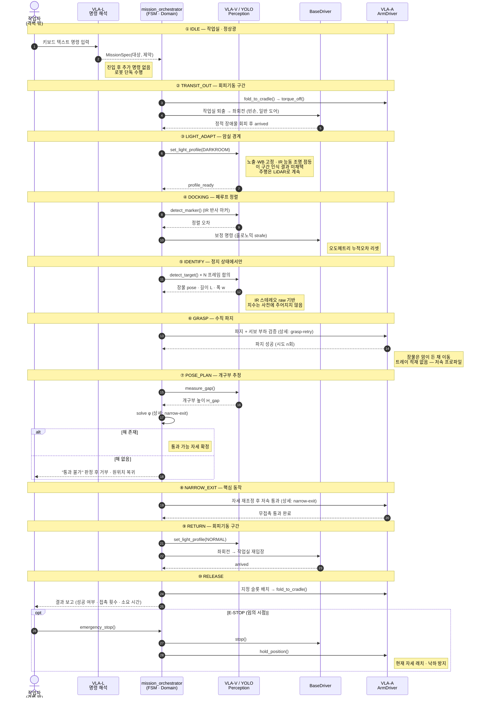
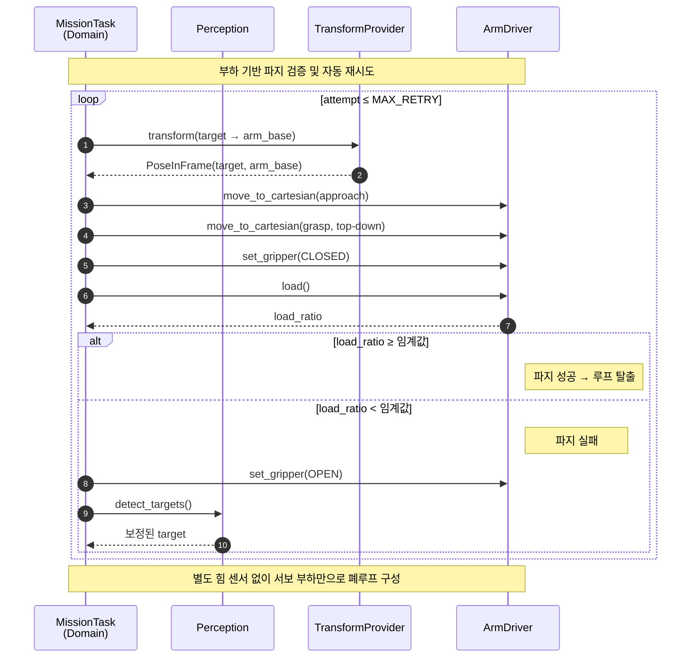
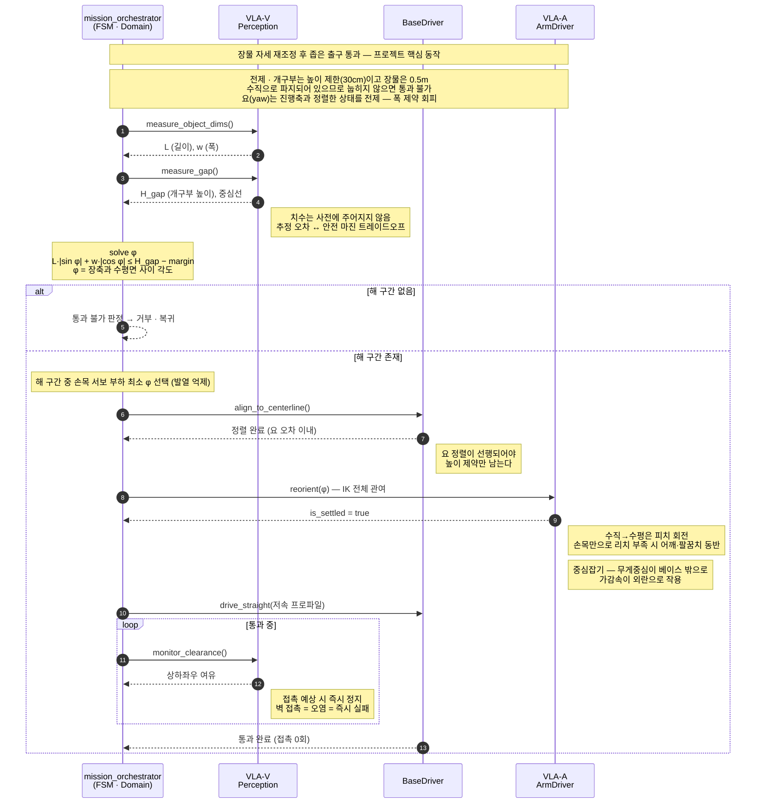

<div align="center">

# 🤖 Grippers

**바닥에 흩어진 물건을 스스로 정리하고, 요청하면 가져다주는 모바일 매니퓰레이터**

⭐ 팀 프로젝트입니다 — 이슈와 제안 환영합니다 🙏

</div>

---

> [!IMPORTANT]
> **주제 변경 (8/12)** — *무인 멸균 암실 장물 반출* → *바닥 물건 정리 + 요청 배달*.
> 하드웨어·아키텍처는 유지, 미션 시나리오와 FSM 구조가 바뀌었습니다.
>
> ⚠️ **`domain/` 코드는 아직 이전 주제 기준입니다.** 이 README는 to-be 설계이며
> 코드 마이그레이션은 [`class_diagram.md` §5](docs/class_diagram.md) 의 PR 10건으로 진행합니다 (M2, 8/22).
>
> 📅 **일정 조정 (8/13)** — M1 재시작으로 **범위 축소**. 파지 정책 학습을 Stretch로 강등하고
> freeze를 2단으로 분리했습니다. → [`milestones.md`](docs/milestones.md)

## Table of Contents

- [🚀 About](#-about)
- [📖 Documentation](#-documentation)
- [🎯 Mission](#-mission)
- [✨ Key Features](#-key-features)
- [🧱 Architecture](#-architecture)
- [🔩 Hardware](#-hardware)
- [📁 Repository Structure](#-repository-structure)
- [⚡ Quick Start](#-quick-start)
- [📅 Milestones](#-milestones)
- [👥 Team](#-team)
- [🤝 Contributing](#-contributing)
- [📃 License](#-license)
- [📚 References](#-references)

> **파일명 규약** — `docs/` 하위 문서는 **snake_case(언더스코어)** 로 통일합니다.
>
> **용어** — **Grippers**는 시스템 전체(모바일 매니퓰레이터)를 가리킵니다.
> 팔 끝단 부품은 **엔드이펙터**로 표기해 구분합니다.

---

## 🚀 About

> **확정 문장**
>
> 사용자가 노트북 관제 콘솔에서 **음성 또는 텍스트로 명령**하면, 로봇이 바닥을 스스로 관측해 흩어진 물건을 찾고,
> **범주에 맞는 색 상자**에 넣어 정리한다. **형상이 달라도 같은 범주면 같은 상자로 간다.**
> 사용자가 특정 물건을 요청하면 그것을 찾아 **가져다준다.**

### 왜 이 문제인가

정리는 로봇 태스크로서 특이한 성질이 하나 있습니다 — **목표 상태가 목록으로 주어지지 않습니다.**

"A를 B로 옮겨라"는 목표가 명시된 문제이고, 경로만 풀면 됩니다. 반면 "정리해라"는 **무엇이 몇 개 있는지조차 모르는 상태에서 시작**하고,
로봇이 물체 하나를 옮길 때마다 바닥 상태가 바뀝니다. 그래서 **관측 → 판단 → 행동이 매 사이클 닫혀야** 하고,
이것이 이 프로젝트가 선형 시퀀스가 아니라 **루프 FSM**을 쓰는 이유입니다.

한 번 실행하고 끝나는 대본은 이 문제를 풀 수 없습니다. 그 차이가 시연에서 그대로 드러납니다.

### AI가 필요한 이유

세 가지가 겹칩니다.

| 조건 | 규칙 기반으로 안 되는 이유 |
|---|---|
| **물체 종류를 형상으로 분류** | 목적지가 종류에 따라 갈리므로 분류가 판단의 근거. 색으로 풀면 학습이 필요 없어짐 |
| **범주 내 형상이 다양함** | 정육면체·육각기둥·원기둥이 전부 `gabe`. 개별 형상을 외우는 방식으로는 처음 보는 형상에서 실패 |
| **자연어가 미션 파라미터를 변경** | "블록은 파란 상자에 넣어줘" → 배치 규칙 자체가 바뀜. 고정 대본과 구분되는 지점 |

> [!NOTE]
> **물체 색과 상자 색을 일부러 맞추지 않습니다.** 맞추면 색 세그멘테이션만으로 전체 문제가 풀려
> 학습 기반 인식의 명분이 사라집니다. **물체는 형상·종류로 분류(학습), 상자는 색 랜드마크로 탐색(견고성 우선)** —
> 두 축을 의도적으로 분리했습니다.

### 정직한 서술 — end-to-end VLA가 아닙니다

이 프로젝트는 **Vision-Language-Action을 모듈형으로 분해한 파이프라인**입니다.

| | 본 프로젝트 | end-to-end VLA |
|---|---|---|
| 모듈 간 전달 | **심볼** (`gabe`, `BLUE`) | 학습된 특징 벡터 |
| 행동 결정 | 상태 머신 + 기하 계획 | 모델 가중치 |
| 학습 대상 | 검출기 · 파지 정책 | 정책 전체 |

발표에서 "VLA 모델을 구현했다"고 말하지 않습니다. 5주 안에 정책 학습 데이터를 모을 수 없었고,
모듈형이 **부분 검증과 병목 측정에 유리해 의도적으로 분해**했습니다. 모듈 명칭도 `VLA-V/L/A` 에서
**`perception` / `language` / `action`** 으로 바꿔, 이름이 실제보다 큰 주장을 하지 않게 했습니다.

---

---

## 📖 Documentation

README는 개요만 담고, 상세는 아래 문서로 나눠져 있습니다.

| 문서 | 내용 |
|---|---|
| [`objects.md`](docs/objects.md) | 물체 구성 · 클래스 체계 · 3D 프린팅 체스말 · 시연 구성 |
| [`perception.md`](docs/perception.md) | 인식 구성 — **해상도 요구사항 · 호모그래피 · 검정 상자 · 가림** |
| [`console.md`](docs/console.md) | 노트북 관제 콘솔 — GUI · 음성 · **네트워크 리스크** |
| [`ai_components.md`](docs/ai_components.md) | 학습 범위 · 데이터 · 가속기 선택 근거 · HEF 파이프라인 |
| [`setup.md`](docs/setup.md) | 설치 · 실행 · 테스트 · 트러블슈팅 |
| [`milestones.md`](docs/milestones.md) | 일정 · 미결 사항 · 리스크 · 측정 결과 |
| [`pose_planning.md`](docs/pose_planning.md) | ⏸ 보류된 자세 재조정 설계 (재도입 절차 포함) |
| **설계 다이어그램** | |
| [`state_machine.md`](docs/state_machine.md) | **FSM 전이 단일 소스** |
| [`class_diagram.md`](docs/class_diagram.md) | 값 객체 · 포트 · State · 노드 계층 · 마이그레이션 |
| [`sequences.md`](docs/sequences.md) | 시퀀스 다이어그램 |
| [`architecture.puml`](docs/architecture.puml) | PlantUML 버전 |

기여 방법은 [CONTRIBUTING](CONTRIBUTING.md), 행동 규범은 [CODE_OF_CONDUCT](CODE_OF_CONDUCT.md) 참고.

---

## 🎯 Mission

| 모드 | 행동을 결정하는 것 | 진입 명령 |
|---|---|---|
| **TIDY** | 규칙 (`placement_rule`) | "장난감 정리해줘" |
| **FETCH** | 사람의 지시 | "체스말 가져와" |

두 모드는 **같은 하드웨어·포트·파지 로직**을 쓰고, **파지 이후 목적지 결정에서만 갈라집니다.**
분기는 `GraspState.execute()` 의 마지막 한 줄입니다.

### 작업 공간

```
        2 m
  ┌───────────────┐
  │ ⬜          🔵 │   상자 4개 — 검정 · 빨강 · 파랑 · 초록
  │               │
  │   ▪  ⬡   ■    │2 m 🟢 가베      (정육면체·원기둥·육각기둥·팔각기둥)
  │        ♞      │   🔵 체스말     (3D 프린팅, 스케일 확대)
  │ 🟢          ⬜ │   ⬜ 2개는 **미배정** — 추가 예정
  └───────────────┘   상자는 코너 · 벽에서 30~40cm 이격 (팔 도달성)
```

### 클래스 체계

| 클래스 | 포함 개체 | 상자 | 상태 |
|---|---|---|---|
| `gabe` | 정육면체 · 원기둥 · 육각기둥 · 팔각기둥 | 🟢 초록 | **확정** |
| `chess_piece` | 폰 · 나이트 · 비숍 · 룩 · 퀸 · 킹 (스케일 확대) | 🔵 파랑 | **확정** |
| *(미배정)* | — | ⚫ 검정 · 🔴 빨강 | **추가 예정** |

> **`gabe` 안에 형상이 다른 개체가 여러 개 있는 것이 핵심 주장입니다.** 정육면체와 육각기둥은
> 실루엣이 다른데 같은 상자로 갑니다 — 색 매칭이나 대본으로는 만들 수 없는 장면이며,
> 모델이 **범주를 배웠다는 증거**입니다.

상세 → [`objects.md`](docs/objects.md)

### FSM — 루프 구조

```
IDLE → SCAN ─┬─ (미처리 대상 0개) ──────────────────────→ DONE
             │
             └─ SELECT → APPROACH → GRASP ─┬─ TIDY  → TRANSPORT → POSE_PLAN ─┬─ INSERT ─┐
                                            │                                 └─ REJECT ─┤
                                            └─ FETCH → DELIVER → HANDOVER ───────────────┤
                          ┌──────────────────────────────────────────────────────────────┘
                          └──→ SCAN 복귀 (루프)
```

**루프가 핵심입니다.** 로봇 자신의 행동으로 바뀐 바닥 상태를 매 사이클 재관측하며,
파지에 실패해도 미션이 끝나지 않고 다음 물체로 진행합니다.

전이 그래프의 단일 소스는 [`docs/state_machine.md`](docs/state_machine.md) 입니다.

### 유즈케이스

| # | 시나리오 | 검증 대상 |
|---|---|---|
| 1 | 정상 정리 — N개 모두 올바른 상자에 | 전체 파이프라인 + **반복 루프** |
| 2 | **범주 내 형상 변화** — 처음 보는 가베 형상 / 다른 기물 | **범주를 배웠다는 증거** ★ |
| 3 | 파지 실패 후 복구 | 재시도 루프, **실패해도 미션 계속** |

> **유즈케이스 2가 이 프로젝트의 중심 주장입니다.** 자세 재조정이 보류되면서
> "판단하는 능력"의 근거가 기하 계산에서 **범주 일반화**로 옮겨갔습니다.
> 색 매칭·대본·하드코딩 어느 것으로도 만들 수 없는 유일한 장면입니다.

### 성공 기준 (M4 측정 대상)

| 지표 | 목표 | 측정 방법 |
|---|---|---|
| 정리 완료율 | **90% 이상** | **20 인스턴스**(4개 × 5회) 중 올바른 상자에 들어간 개수 |
| 오배치 횟수 | **0회** | 상자 4개 → **무작위 기준선 25%.** 최대 위협은 원기둥 가베 ↔ 체스말 혼동 |
| 가구·상자 접촉 | **0회** | 🔴 측정 수단 미정 |
| 물체당 사이클 시간 | 60초 이내 | 2×2 m 기준 추정 58초 |
| FETCH 대상 정확도 | 미정 | 지시한 종류를 가져온 비율 |
| 음성 명령 인식률 | 미정 | STT 결과가 의도와 일치한 비율 |
| **오실행률 (음성)** | **0%** | STT 오인식이 **확인 없이** 실행된 횟수 |

> **오배치 0회에 무작위 기준선을 병기하는 이유** — 상자가 4개이므로 아무렇게나 넣어도 25%는 맞습니다.
> 기준선 없이 "정확도 90%"라고 쓰면 성능 주장이 성립하지 않습니다.
>
> **완료율은 20 인스턴스(4개 × 5회) 기준**입니다. 4개 단회로는 90%를 측정할 수 없습니다.

### 성공 등급

| 등급 | 범위 | 목표 시점 |
|---|---|---|
| 🥉 **Minimum** | 가베 1개 · 고정 위치 → 파지 → 상자 투입 | M2 종료 (8/23) |
| 🥈 **Target** | 4개 자율 반복 정리 + **범주 일반화(가베 형상 2종 · 체스 기물 2종)** + 파지 재시도 + FETCH + 음성 | M3–M4 (8/30–9/4) |
| 🥇 **Stretch** | **파지 정책 시연 학습**, 학습에 쓰지 않은 체스 세트 투입, **3~4번째 범주 추가(자세 재조정 부활)**, 밀집·겹침, 동적 장애물, 자유 문형, 웨이크워드 | 여유 시 |

---

<<<<<<< HEAD
=======
## 🔀 Sequence Diagrams

<details open>
<summary><b>① 전체 미션 흐름</b></summary>



</details>

<details>
<summary><b>② 파지 검증 및 자동 재시도</b></summary>

엔드이펙터를 닫은 뒤 **서보 부하값으로 물체 유무를 판정**합니다. 별도의 힘/토크 센서 없이 폐루프를 구성하는 것이 핵심입니다.



| 항목 | 내용 |
|---|---|
| 감지 방식 | 엔드이펙터 서보 부하 비율 (`load_ratio`) |
| 임계값 | |
| 재시도 상한 | `MAX_RETRY` — 초과 시 상위 상태로 실패 보고 |
| 실패 시 동작 | 개방 → 재인식 → 목표 자세 보정 |

</details>

<details>
<summary><b>③ 장물 자세 재조정 통과 (핵심 동작)</b></summary>



**전제 — 요(yaw)는 진행축과 정렬한다.** 높이만 구속하면 장물이 진행 방향과 수직으로 놓였을 때 개구부 폭에 걸립니다. 요 정렬을 `align_to_centerline()`에서 선행 처리하여 **높이 제약만 남기는** 방식을 채택합니다. 폭 제약까지 동시에 푸는 2자유도 최적화는 5주 범위 밖입니다.

```
H_proj(φ) = L·|sin φ| + w·|cos φ|   ≤   H_gap − margin

  L      : 물체 길이 (0.5 m, 추정값)
  w      : 물체 폭 (추정값)
  φ      : 장축과 수평면 사이 각도 (파지 시 90°)
  H_gap  : 개구부 높이 (약 0.3 m, 추정값)
  margin : 안전 마진 — 추정 오차에 따라 결정
```

**설계 기준값** — `L = 0.5`, `H_gap = 0.3`, `margin = 0.03`, `w ≈ 0.02` 일 때

```
0.5·sin φ + 0.02·cos φ ≤ 0.27   →   φ ≲ 30°
```

즉 **거의 눕혀야** 통과합니다. 이 값이 마운트 높이와 리치 설계의 기준선입니다.

> [!NOTE]
> **"손목 자유도"는 피치 축입니다.** 수직(φ=90°)에서 눕히려면 피치 회전이 필요하며, 로드 축 방향 롤만으로는 불가능합니다. 또한 손목만 돌리면 물체 끝단이 개구부 밖으로 나가므로, 실제로는 **어깨·팔꿈치가 함께 움직이는 IK 전체가 관여**합니다.

해 구간 중 **손목 서보 부하가 최소가 되는 φ** 를 선택합니다(발열 억제). **해 구간이 없으면 통과 불가로 판정하고 거부**합니다 — 유즈케이스 2에 해당합니다.

</details>

> 다이어그램 원본은 [`docs/sequences.md`](docs/sequences.md)에도 있습니다.

---

## 🧠 AI Components

### VLA 3분할

| 파트 | 역할 | 담당 |
|---|---|---|
| **V (Vision)** | 암실 장물·개구부 인식. YOLO를 프론트엔드로 배치 | 김동혁 |
| **L (Language)** | 키보드 텍스트 명령 해석·인코딩 | 이승용 |
| **A (Action)** | 파지·자세 전환 액션 시퀀스 | 임성혁 |

> [!IMPORTANT]
> **V → L → A 사이의 텐서 shape과 좌표계를 8/14까지 문서로 고정합니다.** 여기가 어긋나면 통합 단계에서 전부 무너집니다. 변경은 PR + 3인 합의로만 가능합니다.

### 구성 요소

| 구성 | 역할 | 기법 | 실행 위치 |
|---|---|---|---|
| 자연어 명령 해석 | 텍스트 → `MissionSpec` | VLA-L | **CPU (Pi 5)** — Hailo 오프로드는 M2 검증 후 |
| 물체 검출 | 장물 식별, 바운딩박스 | YOLO 파인튜닝 | **Hailo-10H** (AI HAT+ 2, 보유) — Model Zoo 레퍼런스 존재 |
| 조명 도메인 적응 | 정상광 / IR 도메인 | RGB 사전학습 → IR 파인튜닝 | **Hailo-10H** (YOLO 백본에 포함) |
| 치수·자세 추정 | `L`, `w`, `H_gap`, 주축 각도 | 세그멘테이션 + 기하 | Hailo (세그) + CPU (기하 계산) |
| 자세 전환 정책 | 마진 결정 및 액션 | 강화학습 (김희수) | **CPU** — 소형 정책망, 가속 불필요 |

> [!NOTE]
> **"온디바이스"와 "Hailo 가속"은 다릅니다.** 전 구성 요소가 온디바이스(= 네트워크 의존 없음)로 돌지만, **Hailo 가속 대상은 YOLO 계열 CNN 뿐**입니다. VLA 계열은 트랜스포머 기반이라 Hailo 연산자 지원이 제한적일 가능성이 높아, **CPU 추론을 기준선으로 설계**합니다. Hailo 상주는 M2에서 컴파일이 확인되면 얻는 업사이드로 취급합니다 — 이 전제가 M3 통합에서 틀린 게 드러나면 되돌릴 시간이 없습니다.

### 데이터

| 도메인 | 수집 방법 | 규모 |
|---|---|---|
| 정상광 RGB | 실제 촬영 | |
| 암실 IR | **RealSense IR 스테레오 raw** 취득 | |
| 시연 에피소드 | **리더/팔로워 텔레오퍼레이션** | |

리더/팔로워 암이 교육장에 있으므로 텔레오퍼레이션으로 시연 데이터를 직접 수집할 수 있습니다. **VLA 학습의 핵심 경로**입니다.

### 가속기 선택 근거

> 가산점 항목 — 선택 근거 문서화

| 단계 | 위치 | 근거 |
|---|---|---|
| **학습** | AI training server GPU | 데이터셋 규모·에폭 반복. 온디바이스로는 불가 |
| **추론** | 온디바이스 | 시연 시 네트워크 의존 제거, 지연 시간 확보 |

온디바이스 추론 가속기는 **Hailo-10H 채택을 확정**했으며, **교수님이 공수해주신 Raspberry Pi AI HAT+ 2 실물을 이미 보유**하고 있습니다 (2026-08-12 확인). 발주 항목이 아닙니다. 세부 성능 수치는 M1 벤치마크로 검증합니다.

| 후보 | 성능 | 장점 | 단점 | 판정 |
|---|---|---|---|---|
| Raspberry Pi 5 CPU only | — | 추가 부품 없음 | 실시간 추론 불가 | 기준선 |
| **Hailo-10H (Raspberry Pi AI HAT+ 2)** | 40 TOPS (INT4) | **8GB 온보드 LPDDR4X — 트랜스포머·생성형 계열 모델(~6B급)의 가속기 상주를 시도할 수 있음** (확정은 M2 컴파일 검증 후). Pi 5 PCIe 리본 직결·OS 자동 인식, **단일 품목** | 8L 대비 소비전력·발열 증가. **비전 처리량은 40 TOPS 표기와 다름 — 벤더 기준 26 TOPS(Hailo-8)급.** 40 TOPS는 INT4 LLM/VLM 기준 수치. Pi 5의 단일 PCIe 포트를 점유 | **✅ 채택 · 실물 보유** |
| Hailo-8L (Raspberry Pi AI HAT+) | 13 TOPS | 저전력, AI HAT+ 원보드 구성, 레퍼런스 풍부 | **온보드 메모리 없음 → 매 추론마다 호스트에서 가중치 스트리밍.** VLA 상주 시도 자체가 불가, 지원 모델 제한 | 미채택 (10H 확보로 검토 종료) |
| Intel NPU + OpenVINO | 가변 | 성숙한 툴체인, 팀 내 INT8 양자화 경험 | **Pi에 직접 연결 불가 — 별도 x86 보드 필요.** 무게·전력·배선·전원 도메인이 전부 바뀜 | 제외 (비용 과다) |

**Hailo-8L이 아니라 10H인 이유** — ① YOLO 계열 검출은 8L로도 가속되지만, ② VLA-L(자연어 명령 해석)은 트랜스포머 계열이라 파라미터 상주 메모리가 필요한데 8L은 온보드 메모리가 없어 **상주 시도 자체가 불가능**합니다. 10H의 8GB 온보드 DRAM은 이 구간을 없애 **경량화 후 상주를 시도할 여지**를 남깁니다. 반대로 **순수 비전 처리량만 보면 10H는 8L 대비 업그레이드지만 26 TOPS급 Hailo-8과 동급**이므로, "40 TOPS니까 검출이 3배 빨라진다"는 기대는 §8.2 성능 예산에 넣지 않습니다.

즉 10H는 "VLA 3분할 동시 상주"를 **전제로** 고른 것이 아니라, 그 가능성을 닫지 않으려고 고른 것입니다. **설계 기준선은 YOLO만 Hailo, VLA는 CPU 추론**이며(§ [AI Components](#-ai-components)), Hailo 상주 여부는 M2 컴파일 검증 결과로 판단합니다 → [HLD §9 #10](docs/hld.md).

> [!IMPORTANT]
> **가속기 확보 완료 · 이전 기재 정정 (2026-08-12).** 교수님이 **[Raspberry Pi AI HAT+ 2](https://www.raspberrypi.com/news/introducing-the-raspberry-pi-ai-hat-plus-2-generative-ai-on-raspberry-pi-5/)** (2026-01-15 출시, $130) 실물을 공수해주셨습니다. Hailo-10H · 40 TOPS(INT4) · **8GB 온보드 LPDDR4X** · Pi 5 PCIe 리본 직결 · 알루미늄 히트싱크 · GPIO 스태킹 헤더 · 스페이서 동봉. **가속기 관련 발주 항목은 전부 없어집니다.**
>
> 이전 판의 *"AI HAT+로는 10H를 못 쓴다 → M.2 HAT+ + Hailo-10H M.2 모듈 2품목 발주"* 기재는 **사실과 다르므로 폐기**합니다. AI HAT+ 2가 10H를 보드에 실장한 공식 제품입니다.

> [!CAUTION]
> **"HAT에서 10H 모듈만 빼서 우리 Pi 5에 붙인다"는 계획은 성립하지 않습니다.** AI HAT+ 2는 **Hailo-10H와 8GB LPDDR4X 두 IC가 HAT 기판에 직접 실장**된 구조로, 분리할 M.2 모듈 자체가 없습니다 (M.2 소켓 방식이던 초기 AI Kit과 다릅니다).
>
> **그리고 뺄 이유도 없습니다.** HAT 본체가 **16핀 PCIe FFC 리본 케이블로 우리 Pi 5에 그대로 연결**됩니다 — 별도 캐리어도, 다른 부품도 필요 없습니다. ① Pi 5의 PCIe FFC 커넥터에 리본 → ② 스페이서로 HAT 안착 → ③ 동봉 히트싱크 푸시핀 부착 순서로 **8/11 장착 완료**했습니다.

> ⚠️ **M1에서 확인할 것** — ① **비전 처리량은 26 TOPS급으로 가정**하고 §8.2 예산을 세울 것 (40 TOPS는 INT4 LLM 기준) ② 기존 AI HAT+ 소프트웨어 스택은 대체로 그대로 쓰이지만 **HEF는 H10용으로 다시 컴파일해야 함** — 8L용 `.hef` 재사용 불가 ③ 8L/8 대비 늘어난 소비전력이 로직 전원 도메인 예산 안에 들어오는지 (`vcgencmd get_throttled`) ④ **PCIe 포트 점유** — Pi 5의 PCIe는 1포트뿐이라 HAT을 물리면 NVMe SSD를 같이 달 수 없습니다. 저장장치 여유가 부족하면(→ [Getting Started](#-getting-started)) microSD/eMMC 정리로 해결해야 합니다 ⑤ **MentorPi 상판·배선과의 기구 간섭** — HAT 스택 높이와 동봉 GPIO 스태킹 헤더로 기존 확장 보드가 살아나는지.

| 항목 | Hailo-10H (HEF, INT8) | 기준선 (Pi 5 CPU, FP32) |
|---|---|---|
| 추론 지연 (ms) | | |
| 소비 전력 (W) | | |
| 추가 중량 (g) | | |
| 정확도 손실 (mAP Δ) | | — |

### 모델 컴파일 파이프라인 (HEF)

학습한 모델을 Hailo에 **그대로 올릴 수 없습니다.** 가중치를 Hailo Dataflow Compiler(DFC)로 `.hef` 바이너리로 컴파일해야 하고, 이 과정에 지원 연산자 확인과 INT8 양자화 캘리브레이션이 들어가 **며칠 단위**로 걸립니다. M2 태스크로 선행합니다.

```
[ x86_64 Ubuntu 호스트 ] ── DFC는 여기서만 실행 (ARM 불가)      [ Pi 5 · ARM ]

  학습 (training server GPU)
        │
        ▼
   ONNX export  →  Hailo DFC
                     ├─ 지원 연산자 검사 (미지원 → 치환 또는 CPU 폴백)
                     ├─ INT8 양자화 (캘리브레이션셋: 정상광 RGB + 암실 IR)
                     └─ .hef 컴파일  ──── scp ───►  HailoRT 추론 검증
```

> [!WARNING]
> **DFC는 Pi에서 네이티브로 돌지 않습니다.** Hailo Dataflow Compiler는 **x86_64 Ubuntu 전용**(20.04/22.04, 신버전은 22.04/24.04 · WSL2 가능)이며 ARM 미지원입니다. 요구 사양은 **RAM 16GB 이상(32GB 권장)**, 양자화·최적화 일부 기능은 **NVIDIA GPU**가 있어야 동작합니다.
> → **팀에 x86_64 Ubuntu 호스트가 없으면 HEF 컴파일 일정 자체가 성립하지 않습니다.** AI training server를 DFC 호스트로 겸용할 수 있는지가 1순위 확인 사항입니다 (→ [HLD §9 #11](docs/hld.md)). 8/18 데드라인은 이 확인 결과에 종속됩니다.

- `.onnx`, `.hef` 는 `.gitignore` 대상입니다. **산출물은 저장소에 넣지 않고**, 컴파일 이력·연산자 이슈·측정치를 [`docs/measurements.md`](docs/measurements.md) §3 에 기록합니다.
- 캘리브레이션셋은 위 [데이터](#데이터) 절에서 수집한 IR 데이터셋 일부를 재사용합니다 — 정상광만으로 캘리브레이션하면 암실에서 양자화 손실이 커집니다.
- 지연·소비 전력·정확도 손실 측정 결과는 [HLD §8.2 성능 예산](docs/hld.md)으로 올립니다.

>>>>>>> origin/main
---

## ✨ Key Features

<<<<<<< HEAD
| | 기능 | 상세 |
|---|---|---|
| 🎲 | **범주 일반화** — 형상이 달라도 같은 범주면 같은 상자 | [objects](docs/objects.md) |
| 🔁 | **재관측 루프** — 행동으로 바뀐 바닥을 매 사이클 다시 관측, 실패해도 미션 계속 | [state_machine](docs/state_machine.md) |
| 🗣️ | **명령이 미션 파라미터를 변경** — "체스말은 검은 상자에" → `placement_rule` 갱신 | [console](docs/console.md) |
| 🦾 | **부하 기반 파지 검증** — 힘센서 없이 서보 부하로 판정, 실패 시 재스캔 후 재시도 | [sequences](docs/sequences.md) |
| 🖥️ | **노트북 관제 콘솔** — GUI + 음성. 실행 위치를 옮겨도 도메인 diff 0줄 | [console](docs/console.md) |
| 📷 | **단안 인식** — 모서리 웹캠 + 바닥면 호모그래피. 깊이 카메라 없음 | [perception](docs/perception.md) |
| 🔌 | **전원 도메인 분리** — 팔 서보는 3S LiPo 전용, GND만 스타 접지 | — |
=======
### 🗣️ 자연어 텍스트 명령 (VLA-L)

격벽 밖 작업자가 키보드로 명령을 입력하면 로봇이 무인 멸균실에 **단독 진입**합니다. 진입 후 추가 명령은 없습니다. 명령 문형은 최소 10종 확보하며, 동의어와 제약조건("세워서", "천천히", "짧은 쪽부터")을 포함합니다.

### 🔦 조명 도메인 전이에 강건한 인식

- 카메라 **오토 노출·오토 화이트밸런스 비활성화** 후 도메인별 고정값 적용
- 암실: **IR 능동 조명 + IR 스테레오 raw** 기반 인식
- 전환 직후 **정착 대기 구간**을 FSM 상태로 명시 — 이 구간 인식 결과 미채택
- 주행은 LiDAR로 계속 — **조명과 무관하게 동작**

| 도메인 | 노출 | 화이트밸런스 | 조명 | 주 판별 방식 |
|---|---|---|---|---|
| 정상광 | | | 환경광 | |
| 암실 | | — | IR 프로젝터 | |
| 옐로우 룸 | | | 환경광 | |

### 🎯 마커 기반 정밀 도킹

메카넘 휠은 롤러 슬립으로 오도메트리 누적 오차가 큽니다. 진입 마지막 구간은 마커 기준 **폐루프 정렬**로 오차를 리셋합니다. 암실에서는 RGB 마커가 보이지 않으므로 **IR 반사 재질 마커**를 사용합니다.

### 🦾 부하 기반 파지 검증 및 자동 재시도

엔드이펙터를 닫은 뒤 **서보 부하값으로 물체 유무를 판정**합니다. 별도 힘센서 없이 폐루프를 구성합니다.

### 📐 장물 자세 재조정 통과 (핵심 동작)

0.5m 장물을 높이 30cm 개구부로 통과시키기 위해 **물체의 각도만 변경**합니다(파지점 이동·핸드오버 없음). 요는 진행축과 정렬한 상태를 전제하며, 피치 회전은 손목 단독이 아니라 **IK 전체**로 수행합니다. 설계 기준값 기준 `φ ≲ 30°` — 거의 눕혀야 합니다. 통과 중 여유 거리를 감시하며 **접촉 0회**를 성공 기준으로 삼습니다.

**파지 변경 3방식 — 범위 결정 근거**

| 방식 | 내용 | 필요 조건 / 걸림돌 | 판정 |
|---|---|---|---|
| **자세 재조정** | 손목 회전으로 물체 각도만 변경 | 손목 자유도만 있으면 가능 | **MVP 채택** |
| 파지점 이동 | 내려놓고 다른 지점을 다시 파지 | 거치대 필요. **내려놓기 = 오염** | 확장 과제 (M3 여유 시) |
| 핸드오버 | 두 그리퍼 간 물체 전달 | 두 번째 암 필요. 인핸드 조작은 미해결 연구 영역 | 제외 |

### ⚖️ 중심잡기

메카넘 카 위에서 장물을 파지하면 무게중심이 베이스 밖으로 나갑니다. 주행 가감속과 자세 전환이 모두 외란으로 작용하므로, 저속 프로파일 + 가감속 제한 + 자세 안정화 제어를 병행합니다.

### 🔌 전원 도메인 분리

팔 서보 6축은 **3S LiPo 전용 팩**에서 급전하고, GND만 스타 접지로 공통입니다. 미분리 시 6축 동시 기동 순간 전류로 Pi가 리셋됩니다.

### 🧰 Transport Pose & 크래들

주행 중(빈손 구간)에는 팔을 접어 크래들에 물리 안착시키고 토크를 차단합니다. 무게중심 하강, 서보 발열·전류 제거.
>>>>>>> origin/main

---

## 🧱 Architecture

### Ports & Adapters

도메인 로직을 하드웨어에서 분리합니다. 태스크 로직은 ROS2도 서보 SDK도 알지 못합니다.

| Port | 책임 | Real Adapter | Fake Adapter |
|---|---|---|---|
| `BaseDriver` | 주행, 상자 정렬, 오도메트리 | `Ros2MecanumBase` | `FakeBase` |
| `ArmDriver` | 관절/직교 이동, 엔드이펙터, 부하, 자세 재조정 | `FeetechArm` | `FakeArm` |
| `Perception` | **바닥 스캔**, 검출, 치수, 상자 색 탐색 | `LearnedPerception` | `ScriptedPerception` |
| `CommandInterpreter` | 텍스트 → `MissionSpec` | `LanguageAdapter` | `ScriptedInterpreter` |

- 각 포트는 **Real 어댑터와 Fake 어댑터를 둘 다** 가집니다
- **CI는 매 push마다 Fake 어댑터로 전체 미션 파이프라인을 실행**합니다 — 인터페이스 불일치를 통합 시점이 아니라 커밋 시점에 검출
- 로봇 1대를 5명이 나눠 쓰는 병목을 구조로 해소하기 위한 설계입니다

> `Perception.scan_floor()` 는 **목록을 반환**하므로 원소 타입(`Detection`) 정의가 선행되어야 합니다.
> **음성은 포트를 추가하지 않습니다** — `voice_io` 가 기존 명령 토픽에 발행할 뿐입니다.

### ROS2 노드 분할

> [!WARNING]
> **기능 축으로 나누지 않습니다.** 주행·검출·파지는 동시에 도는 것이 아니라 **순차 단계**입니다.
> 순차 단계를 노드로 쪼개면 동시성 이득 없이 직렬화 지연·분산 상태·브레이크포인트 불가만 남습니다.
>
> **분할 기준은 둘 — 동시에 도는가, 하드웨어를 소유하는가.**

| 노드 | 실행 위치 | 책임 | 분리 근거 | 오너 |
|---|---|---|---|---|
| `mission_orchestrator` | 로봇 | FSM 전체. 포트를 호출해 순차 로직 진행 | 순차 로직은 한 프로세스에 — 디버거 추적 가능 | 이승용 |
| `perception` | 로봇 | **웹캠 2대 소유**, 바닥면 호모그래피, 상자 색 탐색, 클리어런스 | 상시 구동 + 디바이스 소유 | 김동혁 · 김희수 |
| `inference` | 로봇 | 검출 추론 전담 | **Hailo-10H 독점 소유** | 김동혁 |
| `arm_driver` | 로봇 | Feetech SDK, 관절/직교 이동, 엔드이펙터, 부하 | 상시 구동 + 디바이스 소유 | 임성혁 |
| `base_driver` | 로봇 | 메카넘 주행, LiDAR | 상시 구동 + 디바이스 소유 | 조현우 |
| **`voice_io`** | **노트북** | STT → `/command` 발행, `/mission/state` → TTS | **노트북 오디오 장치 소유** | 김희수 |
| `hud` | 노트북 | 대시보드 — `/mission/state` 만 구독 | 시연 중 끊겨도 미션에 영향 없어야 함 | 김희수 |

> [!CAUTION]
> **`/cmd_vel` 발행 주체는 언제나 `base_driver` 하나뿐입니다.** 둘이 되면 명령이 경합해
> 로봇이 떨리거나 타이밍에 따라만 재현되는 버그가 납니다.

### 관측성 3원칙

- **상태 전이를 토픽으로 발행** — `/mission/state` 를 `transient_local` QoS로. 중간에 붙어도 현재 상태 즉시 파악. HUD·TTS 모두 이 토픽 하나만 구독
- **포트 호출을 전부 로깅** — 인자와 반환값을 남기면 그것이 곧 재현 가능한 시나리오
- **`ros2 bag record -a` 습관화** — 실기 시행은 되돌릴 수 없고, 로봇 1대를 5명이 나눠 쓰므로 **녹화가 곧 시간**

### 코드 리뷰 기준

| 제약 | 목적 |
|---|---|
| 원시값(`float`, `tuple`) 직접 전달 금지 | 단위·좌표계 혼동 차단 |
| `else` 사용 지양 | 조건 분기 대신 State 객체가 다음 상태를 반환 |
| 클래스당 인스턴스 변수 2개 이하 지향 | God Node 방지 (루프 상태는 `MissionContext` 하나로 묶음) |
| **호모그래피 입력은 바운딩 박스 아래쪽 모서리** | 비스듬한 시점에서 중심점 사용 시 5~19 cm 위치 오차 |

### 단위 규약

```
각도: radian (필드명 _rad)      길이: m (_m)
개구 폭: mm (_mm) — 각도 아님    부하: 0.0~1.0
GUI 표시·문서만 도(°) 허용 — 변환은 경계에서 한 번
```

### 운영 규칙

- 파라미터 선언은 **launch 또는 노드 중 한 쪽에서만** — 중복 시 `ParameterAlreadyDeclaredException`
- `ROS_DOMAIN_ID` 는 팀 전체 동일값 고정 (노트북·로봇 간 통신 전제)
- 노드 경계 = 파일 경계 = 오너 경계

---

---

## 🔩 Hardware

**예산 30만원.** 주요 장비는 교육장 보유이며 발주는 웹캠·상자·물체·소모품 중심입니다.

| 구분 | 사양 | 상태 |
|---|---|---|
<<<<<<< HEAD
| 이동 베이스 | **MentorPi** (메카넘 4륜) | ✅ 보유 |
| 컴퓨트 | **Raspberry Pi 5** / Ubuntu 24.04 · 빌드는 `IntelPi` 컨테이너 | ✅ 보유 |
| AI 가속기 | **Raspberry Pi AI HAT+ 2** (Hailo-10H, 8GB) | ✅ **8/11 장착** |
| 로봇 암 | **SO-ARM101** 리더/팔로워 2대 · Feetech STS3215 ×6 | ✅ 보유 |
| **모서리 웹캠** | USB **1080p 이상 · HFOV 60~70°** · 높이 2.2~2.5 m | 발주 |
| **로봇 탑재 웹캠** | USB — 근거리 파지 확인 · 클리어런스 | 발주 |
| **상자 4개** | ⚫🔴🔵🟢 · 입구 짧은 변 0.40 m · **검정은 밝은 테두리 필수** | 발주 |
| **가베 교구** | **한 변 5 cm 이상** · 목재 경량 | 발주 |
| **체스말** | 3D 프린팅 · 스케일 3종 × 색 3~4종 | 자작 (실측 후) |
| 시연용 노트북 | 관제 콘솔 + STT/TTS. ROS 2 통신 가능해야 함 | ⚠️ 사양 확인 |
| 접촉 감지 · E-STOP | 성공 기준 측정 · 안전 | 🔴 결정 필요 |
| 팔 전용 전원 · 크래들 | 3S LiPo · Transport Pose 안착 | 발주 / 자작 |
| 전용 라우터 / 핫스팟 | 시연장 WiFi AP 격리 대비 | ⚠️ 권장 |

**발주 전 확인 필수**

- **웹캠 1080p** — 640×480은 먼 모서리에서 9 px로 검출 불가 → [perception](docs/perception.md)
- **가베 5 cm 이상** — 기본형 3~5 cm는 검출 하한 미달
- **바닥 파지 리치 · 그리퍼 개구 폭** — 체스말 STL이 여기 종속. 리더암 텔레오퍼레이션 30분

전원 도메인·실측 항목 → [`milestones.md`](docs/milestones.md)
=======
| 이동 베이스 | **MentorPi** (메카넘 휠 카) — 전방향 이동, 게걸음으로 좁은 통로 진입 유리 | ✅ 교육장 보유 |
| 컴퓨트 | **Raspberry Pi 5** / Ubuntu 24.04 (호스트 ROS 2 **Jazzy**) — 단, **빌드·실행은 `IntelPi` 컨테이너의 ROS 2 Humble**에서 수행 (→ [Getting Started](#-getting-started)). ⚠️ 이원화 상태이므로 기준 배포판 확정 필요 ([HLD §9 #13](docs/hld.md)) | ✅ 교육장 보유 |
| AI 가속기 | **Raspberry Pi AI HAT+ 2** (Hailo-10H 실장, 40 TOPS INT4 / 비전은 26 TOPS급, 8GB 온보드 LPDDR4X) — YOLO 검출 가속. 온보드 DRAM으로 VLA 상주 여지 확보(M2 검증) | ✅ **보유 (교수님 공수) · Pi 5 PCIe 물리 장착 완료 (8/11)** — 드라이버/런타임 인식은 8/14 확인 |
| 가속기 캐리어 | **불필요** — 10H·8GB가 HAT 기판에 실장되어 있어 분리할 모듈이 없고, HAT 자체가 16핀 PCIe FFC로 우리 Pi 5에 직결. 히트싱크·스태킹 헤더·스페이서 동봉. ~~M.2 HAT+ 별도 발주~~ 전제 폐기 (2026-08-12 정정) | ✅ 해소 · 발주 불필요 |
| 로봇 암 | **SO-ARM101** 리더 / 팔로워 2대 — 텔레오퍼레이션 데이터 수집 | ✅ 교육장 보유 |
| 서보 | **Feetech STS3215** 버스 서보 × 6축/암 | ✅ 보유 |
| 카메라 | **Intel RealSense** — 액티브 IR 깊이 + RGB, 640×480 | 🔴 **회신 기한(8/7) 경과 · 8/14 재확인** — 미확보 확정 시 예산으로 즉시 구매 |
| 엔드이펙터 핑거 | 기본 2지 + **V홈 핑거(검토)** — 원통 자기정렬. **핑거 팁만 교체** | 🔴 결정 기한(8/7) 경과 · 8/13 결정 |
| LiDAR | 360° 2D — 조명과 무관하게 동작. 팔 차폐 섹터 마스킹 필요 | ⚠️ MentorPi 기본 탑재 여부 확인 |
| **접촉 감지 수단** | 성공 기준 1순위(접촉 0회) 측정용. 접촉 센서 / 도전성 테이프 / 영상 판독 중 택 1 | 🔴 **기한(8/7 결정 · 8/11 발주) 경과 · 8/13 재확인** |
| **비상 정지(E-STOP)** | 물리 버튼 우선. 관객 앞 시연이므로 소프트웨어 단독은 불가 | 🔴 **기한(8/7 결정 · 8/11 발주) 경과 · 8/13 재확인** |
| 라인 레이저 | 백업안 — RealSense 미확보 시. **클래스 2 이하(1mW 미만)** | ⚠️ 미정 |
| 운반 물체 | **길이 0.5m 원통형** — 수수깡 / 빨대 / 배관 스티로폼 (경량) | 발주 |
| 통로 개구부 | **높이 약 30cm** — 물체 길이의 60%. 가변 구조 | 발주 |
| 암실 구조물 | 암막 파티션 + 좁은 출구. **벽면은 접촉 판독 가능 재질** | 발주 |
| 팔 전용 전원 | **3S LiPo** — 전원 도메인 분리 필수 | 발주 |
| 크래들 | 자작 — Transport Pose 물리 안착 | 자작 |
| 도킹 마커 | ArUco — **암실용 IR 반사 재질 필요** | 발주 |

> [!NOTE]
> **암실 구조가 통과형(입구 ≠ 출구)인지는 아직 미결입니다** (8/7 안건, 미종결). 현재 미션 시나리오는 진입 도어와 퇴출 개구부가 분리된 통과형을 전제로 작성되어 있습니다. 왕복형으로 확정되면 `TRANSIT_OUT` / `NARROW_EXIT` 경로를 수정해야 합니다.

> 🔴 **부품 구매요청 마감 8/11 경과.** 위 표의 🔴 항목을 반영해 **8/13까지 재제출** · 담당 김동혁 · 비품 DB와 동기화 필요.
> **가속기 관련 품목은 발주 대상에서 전부 빠집니다** — AI HAT+ 2 실물 보유(교수님 공수), 캐리어 불필요. 기존 "M.2 HAT+ + M.2 모듈" 2품목 기재는 폐기.

### 전원 도메인

```
MentorPi 배터리  ──┬──► Pi 5 / AI HAT+ 2 (Hailo-10H) / LiDAR / RealSense   (로직)
                   └──► 메카넘 모터 드라이버           (구동)

3S LiPo (전용)    ─────► 팔 서보 6축                  (매니퓰레이터)
                         └─ GND만 스타 접지로 공통
```

검증 명령: `vcgencmd get_throttled` → `0x0` (6축 동시 기동 + 급가속 조건에서)

### 실측 데이터

| 항목 | 값 | 판정 기준 |
|---|---|---|
| 결합 중량 | | |
| 무게중심 높이 (장물 파지 시) | | |
| 최소 휠 하중 비율 | | ≥ 15% |
| 팔 실용 리치 | | |
| 어깨 서보 온도 (3분 유지) | | < 60°C |
| `get_throttled` (최악 조건) | | `0x0` |
| 파지 신뢰도 (미끄러짐·자전) | | M2 초반 단독 측정 |
>>>>>>> origin/main

---

## 📁 Repository Structure

```
grippers/
├── README.md               # 개요 + 문서 지도
├── CONTRIBUTING.md         # 브랜치·PR·품질 기준        ← 이슈/PR 화면에 자동 링크
├── CODE_OF_CONDUCT.md      # 행동 규범                  ← GitHub 탭 생성
├── LICENSE                 # MIT (+ LeRobot Apache 2.0 고지)  ← GitHub 탭 생성
├── pyproject.toml          # ruff / black 설정 — 벤더 코드는 lint 대상에서 제외
├── .gitignore
├── .gitmodules             # third_party/soarm_provided_d
├── .github/
│   ├── CODEOWNERS          #   경로별 리뷰어 자동 지정
│   ├── pull_request_template.md
│   ├── ISSUE_TEMPLATE/     #   task.yml, bug.yml, config.yml
│   └── workflows/
│       └── ci.yml          #   lint → test → colcon build → docker build
├── domain/                 # 순수 Python. 하드웨어 의존성 없음 (ROS2 import 금지)
│   ├── task/               #   State 제너레이터 기반 루프 FSM
│   ├── values.py           #   Detection, BoxObservation, MissionSpec, MissionContext 등
│   ├── ports/              #   인터페이스 정의 (ABC) — 포트 4종
│   └── adapters/
│       ├── real/           #   ROS2 액션/서비스 클라이언트
│       └── fake/           #   테스트용 구현 (CI에서 사용)
├── ros2_ws/
│   └── src/
│       ├── grippers_interfaces/  # 공통 msg/srv/action (노드 간 유일한 접점)
│       ├── grippers_base/        # base_driver_node
│       ├── grippers_arm/         # arm_driver_node — soarm_lab(third_party) 래핑
│       ├── grippers_perception/  # perception_node — 카메라 소유, 검출, 상자 탐색
│       ├── grippers_inference/   # inference_node — Hailo-10H 전담
│       ├── grippers_mission/     # mission_orchestrator_node — domain FSM을 스레드 분리 실행
│       ├── grippers_console/     # ⭐ 노트북 실행 — voice_io_node, hud_node
│       ├── grippers_bringup/     # launch 재조합
│       └── (app/ bringup/ driver/ interfaces/ navigation/ peripherals/
│            simulations/ slam/ yolov5_ros2/ 등 — MentorPi 벤더 소스 보존. lint 제외)
├── third_party/
│   └── soarm_provided_d/   # git submodule — soarm_lab (FK/IK/시뮬/실물 백엔드)
├── tests/                  # pytest — 하드웨어·ROS2 불필요, domain/ + Fake 어댑터만 사용
├── docs/                   # snake_case 통일
│   │  ── 설계 다이어그램 ──
│   ├── state_machine.md    #   ⭐ FSM 전이 단일 소스
│   ├── class_diagram.md    #   클래스 다이어그램 (Mermaid) + 마이그레이션 계획
│   ├── sequences.md        #   시퀀스 다이어그램
│   ├── architecture.puml   #   같은 구조의 PlantUML 버전
│   │  ── 서브시스템 ──
│   ├── objects.md          #   물체 구성 · 클래스 체계 · 3D 프린팅 · 시연 구성
│   ├── perception.md       #   인식 — 해상도 · 호모그래피 · 검정 상자 · 가림
│   ├── console.md          #   노트북 관제 콘솔 — GUI · 음성 · 네트워크
│   ├── ai_components.md    #   학습 범위 · 데이터 · 가속기 근거 · HEF 파이프라인
│   ├── pose_planning.md    #   ⏸ 보류된 자세 재조정 (재도입 절차 포함)
│   │  ── 운영 ──
│   ├── setup.md            #   설치 · 실행 · 테스트 · 트러블슈팅
│   ├── milestones.md       #   일정 · 미결 사항 · 리스크 · 측정 결과
│   ├── hld.md              #   High Level Design — 인터페이스 명세 ⚠️ 갱신 대기
│   ├── error_budget.md     #   오차 전파 분석 ⚠️ 갱신 대기
│   ├── measurements.md     #   실측 리포트
│   ├── purchase_ledger.md  #   구매 장부
│   └── rejected_designs.md #   채택하지 않은 설계와 근거
└── hardware/               # 마운트·크래들 도면, BOM, 배선도
```

> **`grippers_console` 이 노트북에서 도는 유일한 패키지입니다.** 나머지는 전부 로봇 온보드입니다.
> 이 경계가 곧 "노트북이 다 하는 것 아니냐"에 대한 답입니다.

<<<<<<< HEAD
> **루트 3개 파일은 GitHub가 특별 취급합니다.** `LICENSE` 와 `CODE_OF_CONDUCT.md` 는 저장소 첫 화면
> README 위에 **탭으로 표시**되고, `CONTRIBUTING.md` 는 이슈·PR 생성 화면에 자동 링크됩니다.
> 그래서 이 셋만 `docs/` 가 아니라 루트에 둡니다.

> ⚠️ **`docs/vla_interface.md` 는 삭제 대상입니다.** 모듈 명칭을 `VLA-V/L/A` 에서
> `perception` / `language` / `action` 으로 바꾸면서 내용이 무효가 되었고,
> 인터페이스 명세는 `hld.md` 로 일원화합니다.

> **lint 범위**: `pyproject.toml` 이 MentorPi 벤더 패키지와 `third_party/` 를 ruff·black 대상에서 제외합니다.
> 검사 대상은 `domain/`, `tests/`, `ros2_ws/src/grippers_*` 입니다.

---

=======
> **lint 범위**: `pyproject.toml`이 `ros2_ws/src`의 MentorPi 벤더 패키지와 `third_party/`를 ruff·black 대상에서 제외합니다. 검사 대상은 `domain/`, `tests/`, `ros2_ws/src/grippers_*` 입니다. 벤더 코드까지 검사하면 963건이 잡히지만, 우리 코드만 보면 자동수정으로 전부 해소됩니다.

---

## 🔧 Getting Started

### Prerequisites

- **Linux** (개발 환경 기준. 불가능한 모듈은 사유를 명시)
- **ROS 2 Humble** — `IntelPi` Docker 이미지(`ros:humble-export`)로 통일. 호스트 Pi 5의 OS 레벨 ROS2(Jazzy)는 사용하지 않음 — 반드시 컨테이너 안에서만 `ros2` 명령 실행
- **Python 3.10** (실제 `IntelPi` 컨테이너 내장 버전 — Humble/Ubuntu 22.04 기준. ⚠️ CI(`ros2-build`, `test` job)는 `ubuntu-24.04` + Python 3.12로 도는데, `domain/` 순수 파이썬 코드는 버전 특이 문법을 쓰지 않아 지금까진 문제없었습니다. 3.10 전용 문법(예: `match` 구문 이하 버전 미지원 없음, 최신 `typing` 문법 등)은 피해주세요)
- Git (submodule 지원 — `third_party/soarm_provided_d` clone에 필요)
- `MACHINE_TYPE=MentorPi_Mecanum` 환경변수 — `IntelPi` 이미지에 이미 설정되어 있음(`env | grep -i machine`으로 확인). `controller/odom_publisher_node`가 이 값으로 mecanum 역기구학 경로를 타므로, 다른 이미지로 새로 빌드하는 경우 반드시 유지해야 함
- **Hailo 런타임** — 하드웨어는 **8/11에 PCIe로 장착 완료**했지만 **소프트웨어 경로는 미검증(8/14 확인 예정)**. 라즈베리파이 공식 `hailo-all` 패키지 경로는 **Raspberry Pi OS 기준**인데 우리 Pi 5는 **Ubuntu 24.04**이므로, PCIe 커널 드라이버 + HailoRT를 별도로 설치해야 할 가능성이 높습니다. 게다가 노드는 `IntelPi` **컨테이너 안에서** 도므로 **`/dev/hailo0` 디바이스 패스스루**를 `ros_start.sh`에 추가해야 합니다. 설치 절차가 확정되면 이 절에 단계로 적습니다
- **디스크 여유 공간 확인 필수**: Pi 5의 기본 저장장치(microSD/eMMC)가 ROS2 Humble + MentorPi 패키지 15개 + Docker 레이어로 쉽게 90%+ 찹니다. **PCIe는 AI HAT+ 2가 점유하므로 NVMe 증설로는 해결할 수 없습니다.** 설치 전 `df -h /`로 확인하고, 부족하면 Pi 호스트에서 `docker builder prune -a`로 빌드 캐시부터 정리하세요. 여유 없이 `pip install`이나 `colcon build`를 돌리면 `OSError: No space left on device`로 조용히 실패합니다

### Installation

**1. [Pi 5 호스트] 저장소 clone (서브모듈 포함)**

```bash
mkdir -p ~/docker/shared
git clone --recurse-submodules https://github.com/grippers-intel/grippers.git ~/docker/shared/grippers
```
`--recurse-submodules`를 빼먹으면 `third_party/soarm_provided_d`(SO-ARM101 제어 라이브러리)가 빈 폴더로 받아집니다. 이미 clone했는데 비어있다면:
```bash
cd ~/docker/shared/grippers
git submodule update --init --recursive
```

**2. [Pi 5 호스트] `IntelPi` 컨테이너 스크립트(`ros_start.sh`)의 마운트 경로 확인**

`ros_start.sh`가 아래 세 경로를 컨테이너 안으로 마운트하도록 되어 있어야 합니다:
```bash
-v ${HOME}/docker/shared/grippers/ros2_ws:/ros2_ws \
-v ${HOME}/docker/shared/grippers:/grippers \
-v ${HOME}/docker/shared/grippers/third_party:/third_party \
```

**3. [Pi 5 호스트] 컨테이너 기동 → 진입**

```bash
./ros_start.sh
./exec_shell.sh
```

**4. [IntelPi 컨테이너] Python 의존성 설치**

```bash
pip3 install --no-cache-dir pyserial mujoco numpy pytest
```

**5. [IntelPi 컨테이너] PYTHONPATH 등록 (매 세션 반복 방지)**

```bash
echo 'export PYTHONPATH="/grippers:/third_party/soarm_provided_d:${PYTHONPATH}"' >> ~/.zshrc
source ~/.zshrc
```

**6. [IntelPi 컨테이너] 빌드**

```bash
cd /ros2_ws
sudo rosdep init 2>/dev/null
rosdep update
rosdep install --from-paths src --ignore-src -r -y
colcon build --symlink-install
source install/setup.zsh
```

`Summary: N packages finished`가 뜨고 실패한 패키지가 없으면 완료입니다.

### Run — 시뮬레이션 (하드웨어 불필요)

가장 빠른 검증은 `domain/task`의 FSM을 Fake 어댑터로 끝까지 돌리는 것입니다 (ROS2도 필요 없음):

```bash
cd /grippers
python3 -m pytest tests/ -v
```
`IDLE → TRANSIT_OUT → ... → RELEASE`까지 전체 미션 파이프라인이 통과하면 도메인 로직은 정상입니다.

ROS2 프로세스 3개(`base_driver`/`arm_driver`/`mission_orchestrator`)가 실제로 액션/서비스로 통신하는 것까지 하드웨어 없이 보고 싶다면, `mission_orchestrator_node.py`에서 `Ros2MecanumBase`/`Ros2ArmDriver` 대신 `FakeBase`/`FakeArm`을 임시로 주입하고 3개 노드를 각 터미널에서 띄우면 됩니다. (상시 지원되는 launch 인자화는 TODO — 지금은 코드를 임시로 바꿔서 확인)

### Run — 실기

MentorPi 베이스와 SO-ARM101이 모두 시리얼로 연결된 상태를 전제로 합니다. 터미널 4개가 필요합니다 (모두 `./exec_shell.sh`로 진입).

```bash
# 터미널 1 — MentorPi 저수준 드라이버 (odom, ekf, 모터)
cd /ros2_ws && source install/setup.zsh
export need_compile=False
ros2 launch controller controller.launch.py

# 터미널 2 — base_driver (grippers_base)
cd /ros2_ws && source install/setup.zsh
ros2 run grippers_base base_driver

# 터미널 3 — arm_driver (grippers_arm)
cd /ros2_ws && source install/setup.zsh
ros2 run grippers_arm arm_driver

# 터미널 4 — mission_orchestrator (grippers_mission)
cd /ros2_ws && source install/setup.zsh
ros2 run grippers_mission mission_orchestrator
```

상태 흐름 확인:
```bash
ros2 topic echo /mission/state
```

> **주의**: `mission_orchestrator`가 `TRANSIT_OUT`에 들어가는 순간 실제로 `/cmd_vel`이 발행되어 베이스가 움직입니다. 처음 실행 시 바퀴를 들어두거나 충분한 공간을 확보하세요.

`grippers_bringup`(위 4개를 하나의 launch로 묶은 것)은 아직 하드웨어 상시 연결 상태에서 검증 전이라, 지금은 터미널을 나눠 개별 실행하는 걸 권장합니다. 검증되면 아래로 대체됩니다:
```bash
ros2 launch grippers_bringup bringup.launch.py
```

### Troubleshooting

| 증상 | 확인 사항 |
|---|---|
| 주행 중 Pi 리셋 | `vcgencmd get_throttled` — 전원 도메인 분리 여부 |
| 로봇이 제자리에서 정지 | LiDAR 스캔에 팔이 장애물로 검출 — 각도 마스킹 확인 |
| 조명 전환 후 인식 실패 | 오토 노출·AWB 비활성화, 도메인 프로파일 전환 여부 |
| 암실에서 마커 미검출 | IR 반사 마커 사용 여부, IR 프로젝터 점등 확인 |
| 주행 중 로봇이 떨림 | `/cmd_vel` 발행 주체가 2개 이상인지 확인 |
| 장물이 그리퍼 안에서 자전 | 마찰 패드 또는 V홈 핑거 적용 여부 |
| `ParameterAlreadyDeclaredException` | launch와 노드 양쪽 파라미터 중복 선언 |
| `ros_robot_controller`가 `/dev/rrc` 못 찾음 | MentorPi 베이스 보드 자체가 시리얼로 미연결. `ls /dev/ttyUSB* /dev/ttyACM*`로 실제 연결된 장치 확인 |
| `git push` 시 `.../vscode-server/.../node: Permission denied` | VS Code Remote-SSH가 넣은 `credential.helper`가 root 경로를 가리켜서 `ubuntu` 유저로는 실행 불가. `sudo git config --system --unset-all credential.helper` 후 `git config --global credential.helper store`로 교체, push 시 비밀번호 자리에 GitHub Personal Access Token(classic, `repo` 스코프) 입력 |

>>>>>>> origin/main
---

## ⚡ Quick Start

```bash
# 하드웨어 없이 도메인 로직 검증 (ROS2도 불필요)
git clone --recurse-submodules https://github.com/grippers-intel/grippers.git
cd grippers && export PYTHONPATH="$PWD:$PYTHONPATH"
python3 -m pytest tests/ -v
```

`IDLE → SCAN → ... → DONE` 루프가 **유한 스텝 안에 종료되면** 도메인 로직은 정상입니다.

실기 실행·컨테이너 설정·트러블슈팅 → [`setup.md`](docs/setup.md)

---

## 📅 Milestones

> **최종 발표: 2026년 9월 8일 (화)**

<<<<<<< HEAD
| 마일스톤 | 기간 | 핵심 완료 조건 |
|---|---|---|
| **M1 · 설계 (축소)** | ~8/14 | 바닥 파지 리치 실측(게이트) · 발주 · 배포판 확정 · Tier-1 freeze |
| **M2 · 기반 재구축** | 8/15–8/22 | 마이그레이션 10 PR · 호모그래피 · 2범주 검출 · CI 그린 |
| **M3 · 실기 통합** | 8/23–8/30 | **1개 End-to-end 성공** · 네트워크 실측 · 컷오프 |
| **M4 · 확장 + 측정** | 8/31–9/4 | **4개 반복 정리** · FETCH · 측정 20회 · 9/4 freeze |
| **M5 · 발표 준비** | 9/1–9/8 | 9/6 포스터 제출 · **9/8 발표** |

담당별 작업·미결 사항·리스크 → [`milestones.md`](docs/milestones.md)
=======
| 마일스톤 | 기간 | 완료 조건 (Exit criteria) | 리드 |
|---|---|---|---|
| **M0 · 킥오프 + 주제 확정** | 8/4 – 8/7 | ~~주제·환경·명령방식·카메라·물체 규격 확정~~ ✅, RealSense 확보 확인, Repo + README, 역할 확정, issue 티켓 생성, Discord 링크 업로드 | 이승용 |
| **M1 · 설계** | 8/8 – 8/14 | 유즈케이스·성공 기준 수치화, HLD 확정, **VLA V/L/A 인터페이스 freeze**, UML 2종, 부품 발주 완료 | 이승용 |
| **M2 · 모듈 프로토타입** | 8/15 – 8/23 | YOLO 탐지 동작, VLA 각 파트 단독 추론, **ONNX→HEF 컴파일**(Pi 5 상 추론 검증은 8/25로 이월 — 아래 조정안 참조), 암 단독 파지, 메카넘 주행·중심잡기 단독 검증, 시연 데이터 1차 수집, CI 그린 | 각 담당 |
| **M3 · 통합** | 8/24 – 8/30 | ROS2 상에서 End-to-end 1회 성공 (명령 → 동작). 하드웨어 연동 완료. **HEF 추론 검증 마무리(8/25)**, **확장 기능 컷오프 결정** | 조현우 · 임성혁 |
| **M4 · MVP 완성** | 8/31 – 9/4 | 성공 기준 충족 및 측정 기록, 버그 수정, 데모 리허설, README + 향후 계획 작성 | 전원 |
| **M5 · 발표 준비** | 9/1 – 9/8 | 포스터 → **9/6 인쇄물 제출**, 9/7 최종 점검, **9/8 발표** | 김희수 |

> M4와 M5는 의도적으로 병행합니다. 포스터·발표 자료 작업은 MVP 안정화와 동시에 진행하며, 9/4 feature freeze 이후 전원이 M5로 합류합니다.

### 고정 데드라인

- [x] **8/4 (화)** — 주제 확정 (F안) + 환경 확정 (암실 겸 멸균실 왕복) + 명령 방식 확정 (키보드 입력) · 전원
- [ ] 🔴 **8/7 (금) — 기한 경과** — RealSense 확보 확인 + Repo·README·issue 티켓 완료 + Discord 업로드 · 이승용 → **8/13 재확인**
- [ ] 🔴 **8/7 (금) — 기한 경과** — AI training server 계정 요청 · 이승용 → **동 서버를 x86_64 DFC 호스트로 겸용 가능한지 함께 확인**
- [ ] 🔴 **8/11 (화) — 기한 경과** — 부품 구매요청 양식 제출 · 김동혁 → **가속기 품목 제외**(AI HAT+ 2 보유)하고 나머지 🔴 항목으로 **8/13 재제출**
- [ ] **8/13 (수)** — IR 스테레오 raw 파이프라인 · 김동혁 — **8/18 IR 데이터셋의 선행 조건. 같은 구간 작업 중 최우선**
- [ ] **8/14 (금)** — HLD 확정 + VLA V/L/A 인터페이스 freeze · 이승용
- [ ] **8/18 (화)** — IR 데이터셋 1차 확보 · 김희수 *(선행: 8/13)*
- [ ] **8/18 (화)** — **x86_64 Ubuntu DFC 호스트 확보 여부 확인**(설치·컴파일 아님, 환경 유무 판정만) · 김동혁
- [x] **8/11 (월)** — **AI HAT+ 2 → Pi 5 PCIe 물리 장착 완료** (리본·스페이서·히트싱크)
- [ ] **8/14 (금)** — **Ubuntu 24.04에서 Hailo 인식 확인**(드라이버 + HailoRT + `/dev/hailo0`) **+ `IntelPi` 컨테이너 디바이스 패스스루** · 담당 *(제안: 조현우 — 8/14 스탠드업에서 확정)* — **우리 HEF를 기다릴 필요 없음**: Hailo Model Zoo의 H10용 기성 `.hef` 하나로 런타임 생존만 먼저 확인
- [ ] **8/21 (금)** — Hailo DFC 환경 구성 + YOLO ONNX→HEF 컴파일 성공 · ⚠️ **담당 미확정 — 8/14 스탠드업에서 확정**
- [ ] **8/23 (토)** — 치수 추정 오차 실측 → `docs/error_budget.md` · 김동혁
- [ ] **8/23 (토)** — 모듈별 단독 데모 (팀 내부 시연) · 전원
- [ ] **8/25 (월)** — Pi 5 상 HEF 추론 검증 + 지연·전력·정확도 손실 측정 → HLD §8.2 · ⚠️ **담당 미확정 (위와 동일)**
- [ ] **8/30 (토)** — End-to-end 1회 성공 + 확장 기능 컷오프 · 전원
- [ ] **9/4 (금)** — MVP feature freeze, 이후 버그 수정만 · 전원
- [ ] **9/6 (일)** — 포스터 인쇄물 제출 (D-2) · 김희수
- [ ] **9/7 (월)** — 프로젝트 최종 점검 · 전원
- [ ] **9/8 (화)** — 프로젝트 발표 (D-day) · 전원

> [!NOTE]
> **8/13–8/23 부하 재배분 (2026-08-12 조정안).** 기존 일정은 김동혁에게 8/13(IR raw 파이프라인) · 8/18(DFC 환경) · 8/20(HEF 추론 검증) · 8/23(치수 오차 실측)이 겹쳐 있었습니다. **8/13 IR raw 파이프라인은 8/18 IR 데이터셋(김희수)의 선행 조건이라 우선순위가 더 높아**, DFC 작업을 뒤로 미뤘습니다.
>
> - 8/18에는 **"x86 호스트가 있는가"만 판정**합니다 — 저비용이라 IR 작업과 병행 가능하고, 없으면 그 시점에 일정 전체를 다시 짜야 하므로 늦출 수 없습니다.
> - **Hailo 런타임 확인(8/14)은 HEF 일정과 분리했습니다.** 하드웨어는 8/11에 이미 장착됐고, 기성 `.hef`로 검증할 수 있어 DFC를 기다릴 이유가 없습니다. 오히려 Ubuntu 24.04 드라이버가 말썽이면 며칠이 날아가므로 **가장 먼저** 확인합니다.
> - DFC 환경 구성(8/21)·HEF 추론 검증(8/25)은 **날짜를 미루거나 담당을 재배정하거나 둘 중 하나**가 필요합니다. 위 목록은 "날짜를 미룬" 안이며, **담당을 재배정하면 원래 날짜(8/18·8/20)로 복귀 가능**합니다. 8/14 스탠드업 결정 안건.
> - 그 결과 **HEF 추론 검증이 M2 종료(8/23)를 넘어 M3 초반으로 이월**됩니다. HLD §8.2 성능 예산 확정도 같이 밀립니다.

### 주간 리듬

- **매주 월 저녁** — 스탠드업: 지난주 완료 / 이번주 목표 / 블로커
- **매주 금 저녁** — 마일스톤 progress 업데이트, issue 티켓 추가·할당 (이승용)
- **격주** — 강사 consultation 예약 (가산점 항목)

### 가산점 체크리스트

- [ ] Hardware와 입/출력 연계
- [ ] GitHub 협업 관리 — Milestone 선언, PR review 이력
- [ ] CI/CD + unittest + 정적분석(lint) 활용
- [ ] 강사 consultation 활용 (최소 2회, 기록 남기기)
- [ ] 효율적인 가속기 선택 및 사용 근거 명시
- [ ] Linux 개발 환경

---

## 🚨 Risks

| 리스크 | 영향 | 대응 |
|---|---|---|
| **주행 중 자세 흔들림 / 전복** | 통과 실패, 벽 접촉 | 0.5m 경량 원통으로 확정해 모멘트 최소화. 저속 프로파일 + 가감속 제한 |
| **RealSense 미확보** | 암실 실험 불가 → 미션 자체 불가 | 🔴 8/7 회신 기한 경과 — 8/13 재확인. 미확보 확정 시 예산으로 즉시 구매 |
| **DFC 실행 환경(x86_64 Ubuntu) 미확보** | HEF 컴파일 불가 → Hailo 가속 전면 무효, 8/18·8/21 일정 붕괴 | DFC는 ARM 미지원 — 8/18까지 x86 호스트 유무만 먼저 판정. AI training server 겸용 검토 → 불가 시 팀원 개인 x86 랩탑(WSL2 포함) 또는 클라우드 x86 인스턴스. 끝내 없으면 **YOLO 경량화 + Pi 5 CPU 추론**으로 계획 전환 |
| **Ubuntu 24.04에서 Hailo 런타임 미동작** | 하드웨어는 붙어 있는데 추론이 안 됨 → Hailo 가속 전면 무효 | 공식 `hailo-all`은 Raspberry Pi OS 경로라 Ubuntu에서는 드라이버·HailoRT 수동 설치 가능성. **8/14에 기성 `.hef`로 런타임만 먼저 검증**(우리 HEF 대기 불필요). 컨테이너 `/dev/hailo0` 패스스루까지 확인. 끝내 안 되면 추론만 호스트 프로세스로 분리 |
| **AI HAT+ 2 장착 후 전원·발열·기구 간섭** | Pi 5 리셋, 스로틀링, MentorPi 상판 조립 불가 | 8/11 장착 완료 — M1에 결합 상태로 실측: 동봉 히트싱크 부착 후 `vcgencmd get_throttled` = `0x0`(6축 동시 기동 조건), 스택 높이·GPIO 스태킹 헤더로 기존 확장 보드 생존 확인. PCIe 1포트 점유로 NVMe 병행 불가 → 저장장치는 microSD/eMMC 정리로 대응 |
| **LiDAR 미탑재** | 자율주행 전체가 LiDAR SLAM 전제 → 주행 불가 | MentorPi 기본 탑재 여부 확인(8/7 기한 경과 → 8/13). 미탑재 시 8/13 재제출 발주에 포함. 임시 대안은 RealSense 깊이 기반 주행이나 암실 성능 미검증 |
| **접촉 감지 수단 미정** | 성공 기준 1순위를 측정할 수 없음 | 8/7 결정 기한 경과 → 8/13 결정 후 재제출 발주에 포함. 최소한 영상 판독 프로토콜(카메라 배치·판정 기준)이라도 문서화 |
| **암실 IR 영상 YOLO 학습 데이터 부족** | 핵심 구간 IDENTIFY 실패 | RGB 사전학습 후 IR 파인튜닝. 마커/형상 기반 폴백 유지 |
| **HEF 컴파일 실패 / 미지원 연산자** | Hailo 가속 전면 무효 → 실시간 추론 불가 | DFC 환경을 8/21까지 선행 구성(호스트 확보 확인은 8/18). 미지원 연산자는 대체 연산으로 치환하거나 해당 레이어만 CPU 폴백. 최악의 경우 YOLO 경량화 + CPU 추론 |
| **INT8 양자화 정확도 손실** | 암실 IR 검출률 하락 → IDENTIFY 실패 | 캘리브레이션셋에 IR 도메인 포함. FP32 대비 mAP Δ 측정, 허용선 초과 시 부분 양자화 |
| **VLA가 Hailo 연산자 미지원으로 CPU에 남음** | 추론 지연 초과 → 미션 시간 미달 | 설계 기준선을 처음부터 CPU 추론으로 잡음(가속은 업사이드). M2에 지연 실측, 초과 시 모델 경량화·입력 해상도 축소 |
| **암실에서 ArUco 미검출** | 도킹 불가 → 파지 정밀도 붕괴 | IR 반사 마커 재질 테스트. M1에 실측 |
| **장물 파지 미끄러짐 / 자전** | 자세 전환 중 낙하 → 핵심 동작 실패 | 마찰 패드 우선, 불충분 시 V홈 핑거 3D 프린트. M2 초반 단독 측정 |
| **VLA 3분할 인터페이스 충돌** | M3 통합 실패 | 8/14 freeze, 변경은 PR + 3인 합의. 더미 데이터로 조기 결합 테스트 |
| 조명 경계 재수렴 지연 | 경계 구간 오인식 | 오토 노출·AWB 비활성화. 정착 대기를 FSM 상태로 명시 |
| LiDAR가 팔을 장애물로 오인식 | 제자리 정지 | 팔 차폐 섹터 실측 후 각도 마스킹 |
| 텍스트 명령 표현력 부족 | VLA-L이 키워드 파서로 축소 | 명령 문형 10종 이상 확보 |
| 부품 배송 지연 / 미승인 | M2 전체 지연 | 8/11까지 발주, 대체 부품 2안, 시뮬레이션 선행 개발 |
| 학습 데이터 부족 | 모델 성능 미달 | 사전학습 모델 zero-shot 폴백, 규칙 기반 백업 경로 |
| 강화학습 미수렴 | 제어 품질 미달 | 보상 단순화, PID 등 고전 제어 백업 |
| 공용 장비 점유 충돌 | 데이터 수집·테스트 지연 | 메카넘 카·암 사용 시간 팀 단위 예약 |
| 발표 당일 하드웨어 고장 | 시연 불가 | 백업 영상 사전 촬영, 예비 부품 확보 |
>>>>>>> origin/main

---

## 👥 Team

| 이름 | GitHub | 핵심 롤 | 세부 담당 |
|---|---|---|---|
| **이승용** | [@sysy009](https://github.com/sysy009) | Git Master · Language · 전체 설계 총괄 | Milestone 선언, issue 발행·할당, HLD, 명령 해석·문형 설계 |
| **김동혁** | [@Feroninn](https://github.com/Feroninn) | Git Slave · Vision · 발주 | Conflict 해결, `git blame` 추적, 검출 모델, 부품 발주·장부 |
| **임성혁** | [@alex7663](https://github.com/alex7663) | Action · 하드웨어 총괄 | 파지 정책, 액션 시퀀스, 기구부/전장, 조립·배선 |
| **조현우** | [@kica927](https://github.com/kica927) | 중심잡기 · 코드 수장 · ROS2 | 구조 설계, 자세 안정화, ROS2 노드·통신, 코드 리뷰 |
| **김희수** | [@Hease](https://github.com/Hease) | Perception · 데이터 · UI/UX · 음성 | 데이터셋, 검출 학습, **노트북 관제 콘솔**, STT/TTS, 시각화 |

**공통 책임** — 본인 영역 unittest 작성 · 타인 PR 1일 내 review · 금요일 마일스톤 progress 업데이트 · 막히면 24시간 내 공유

---

---

## 🤝 Contributing

`main` 직접 push 금지, topic branch → PR → review → merge.
브랜치·품질 기준·Git 운영 체계 → [CONTRIBUTING.md](CONTRIBUTING.md)

---

## 📃 License

본 프로젝트 코드는 MIT License로 배포합니다. 자세한 내용은 [LICENSE](LICENSE) 참고.

LeRobot 기반 구성 요소는 **Apache License 2.0** 을 따릅니다. 해당 코드를 포함하거나 파생한 파일에는 원 라이선스 고지를 유지합니다.

---

---

## 📚 References

- [LeRobot / SO-ARM101](https://github.com/huggingface/lerobot)
<<<<<<< HEAD
- [ROS 2 Jazzy](https://docs.ros.org/en/jazzy/) · [ROS 2 Humble](https://docs.ros.org/en/humble/)
- [ROS 2 DDS 튜닝](https://docs.ros.org/en/jazzy/How-To-Guides/DDS-tuning.html)
- [Raspberry Pi AI HAT+ 2](https://www.raspberrypi.com/documentation/accessories/ai-hat-plus.html)
- [Hailo Model Zoo — DFC 요구 사양](https://github.com/hailo-ai/hailo_model_zoo/blob/master/docs/GETTING_STARTED.rst)
- [whisper.cpp](https://github.com/ggerganov/whisper.cpp) · [Vosk](https://alphacephei.com/vosk/)
- [rosbridge_suite](https://github.com/RobotWebTools/rosbridge_suite)
=======
- [ROS 2 Jazzy Documentation](https://docs.ros.org/en/jazzy/) — Pi 5 호스트 OS 레벨 배포판 (Ubuntu 24.04)
- [ROS 2 Humble Documentation](https://docs.ros.org/en/humble/) — 실제 빌드·실행이 일어나는 `IntelPi` 컨테이너(`ros:humble-export`) 기준
- [Raspberry Pi AI HAT+ / AI HAT+ 2 문서](https://www.raspberrypi.com/documentation/accessories/ai-hat-plus.html)
- [Raspberry Pi AI HAT+ 2 발표 (2026-01-15)](https://www.raspberrypi.com/news/introducing-the-raspberry-pi-ai-hat-plus-2-generative-ai-on-raspberry-pi-5/)
- [Hailo-10H (생성형 AI 가속기)](https://hailo.ai/products/ai-accelerators/hailo-10h-m2-generative-ai-acceleration-module/)
- [Hailo Model Zoo — DFC 요구 사양 (x86_64 Ubuntu)](https://github.com/hailo-ai/hailo_model_zoo/blob/master/docs/GETTING_STARTED.rst)
- [Intel RealSense SDK](https://github.com/IntelRealSense/librealsense)
- [PlantUML Sequence Diagram](https://plantuml.com/sequence-diagram)
- [PlantUML Class Diagram](https://plantuml.com/class-diagram)
>>>>>>> origin/main

<div align="center">

[⬆ Back to top](#-grippers)

</div>
