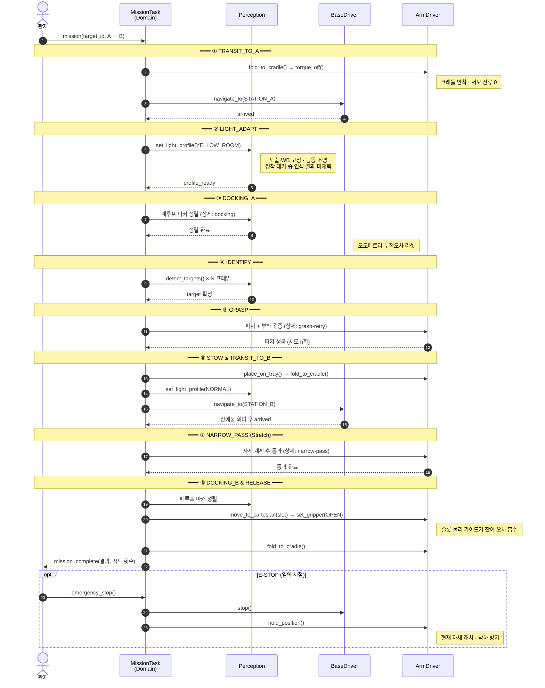
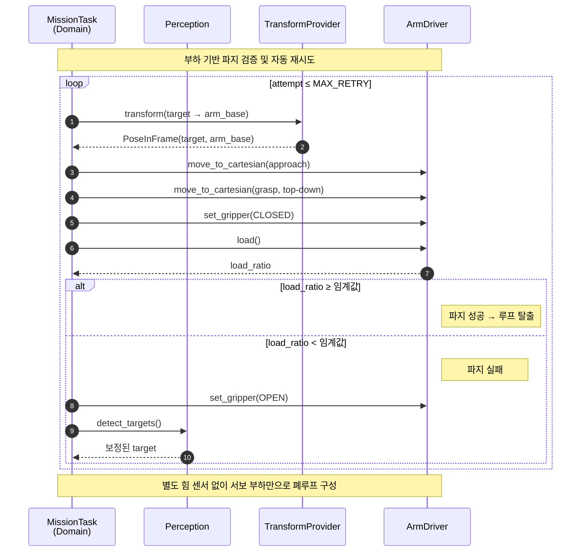
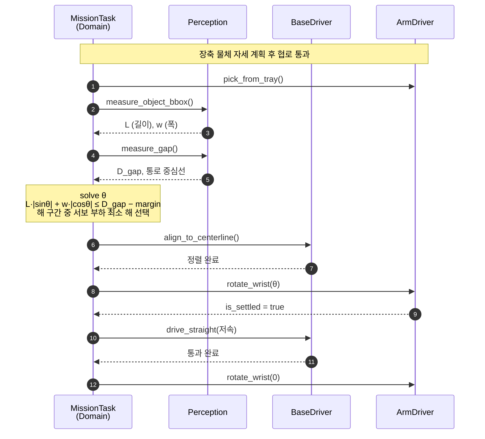
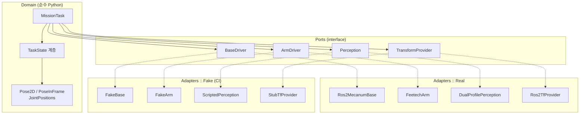

<div align="center">

# 🤖 Gripper

*조명이 제한된 공간에서 물품을 꺼내오는 레일 없는 이송 로봇*

⭐ 팀 프로젝트입니다 — 이슈와 제안 환영합니다 🙏

</div>

---

## Table of Contents

- [🚀 About](#-about)
- [🎯 Mission Scenario](#-mission-scenario)
- [🔀 Sequence Diagrams](#-sequence-diagrams)
- [✨ Key Features](#-key-features)
- [🏗️ Architecture](#️-architecture)
- [🤖 Hardware](#-hardware)
- [📁 Repository Structure](#-repository-structure)
- [🛠️ Getting Started](#️-getting-started)
- [🧪 Testing](#-testing)
- [📊 Results](#-results)
- [🗓️ Roadmap](#️-roadmap)
- [👥 Team](#-team)
- [🤝 Contributing](#-contributing)
- [📃 License](#-license)
- [🗨️ Contacts](#️-contacts)

---

## 🚀 About

반도체 팹의 물류 자동화는 천장 레일을 따라 움직이는 **OHT(Overhead Hoist Transfer)** 가 담당합니다. 검증된 기술이지만, 레일은 **고정 인프라**입니다. 레일을 깔 수 없거나 깔 만큼 물량이 나오지 않는 공간 — 후공정 라인, 소량 다품종 생산, 연구시설 — 에서는 여전히 사람이 직접 드나듭니다.

그중에서도 **조명이 제한된 구역**은 사람의 출입 부담이 특히 큽니다.

| 환경 | 조명 조건 | 사람 출입이 부담스러운 이유 |
|---|---|---|
| **옐로우룸** | 단파장(UV·청색) 차단, 호박색 조명만 | 감광재 노출 위험, 파티클 유입, 가운·에어샤워 절차 |
| **암실** | 거의 무광 | 시야 확보 불가, 안전사고 위험, 감광 소재 보호 |

**Gripper는 이 구역에 사람 대신 들어가 물품을 꺼내오는 최소 시스템입니다.**

레일 없는 이동 플랫폼(메카넘 AMR) 위에 6-DOF 매니퓰레이터를 얹어, 조명 조건이 전혀 다른 두 공간을 왕복하며 물품을 회수합니다.

> [!NOTE]
> 이 프로젝트의 목표는 상용 수준 시스템 구현이 아닙니다. **레일 없는 이송·이재에서 무엇이 진짜 어려운 문제인지 측정하고 기록하는 것**이 목표입니다. 시도했으나 채택하지 않은 설계와 그 근거는 [`docs/rejected-designs.md`](docs/rejected-designs.md)에 정리합니다.

### 왜 조명 제약이 기술적으로 어려운가

일반적인 색상 기반 인식(HSV segmentation)은 **조명의 스펙트럼이 일정하다는 암묵적 가정** 위에 서 있습니다. 이 가정이 두 번 깨집니다.

- **옐로우룸** — 단파장 성분이 제거되어 있어 파란색 물체가 거의 검게 보입니다. 색상(H) 채널 자체가 붕괴하므로, 일반 환경에서 튜닝한 임계값이 그대로 통하지 않습니다.
- **암실** — 가시광 자체가 없어 RGB 파이프라인이 성립하지 않습니다.
- **경계 통과 순간** — 조도가 급변하면서 카메라 오토 노출·오토 화이트밸런스가 재수렴하는 0.5~2초 동안 인식 결과가 신뢰할 수 없게 됩니다.

Gripper는 이 문제를 **조명 도메인별 프로파일 전환 + 능동 조명 + 형상 기반 보조 인식**의 조합으로 다룹니다.

---

## 🎯 Mission Scenario

```
   [ 일반 환경 ]                          [ 제한 조명 구역 ]
   ┌─────────────┐        통로/도어         ┌─────────────┐
   │  Station B  │ ◄──────────────────────► │  Station A  │
   │  (반출 지점) │                          │ (암실/옐로우룸)│
   └─────────────┘                          └─────────────┘
```

| # | Phase | 동작 | 성공 판정 |
|---|---|---|---|
| 1 | `IDLE` | 관제 지시 수신 (대상 물품 ID) | 명령 파싱 |
| 2 | `TRANSIT_TO_A` | 팔을 크래들에 안착 후 A로 주행 | |
| 3 | `LIGHT_ADAPT` | 조명 프로파일 전환, 능동 조명 점등 | |
| 4 | `DOCKING_A` | ArUco 기반 정밀 도킹 | |
| 5 | `IDENTIFY` | 대상 물품 식별 | |
| 6 | `GRASP` | Top-down 파지 + 부하 기반 검증 | |
| 7 | `STOW` | 차체 트레이 적재 후 팔 접기 | |
| 8 | `TRANSIT_TO_B` | B로 주행 (장애물 회피 포함) | |
| 9 | `NARROW_PASS` | 장축 물체 자세 계획 후 협로 통과 | |
| 10 | `DOCKING_B` → `RELEASE` | 도킹 후 지정 슬롯 배치 | |

> 성공 판정 기준(수치)은 1주차 실측 후 확정합니다.

### 성공 등급

프로젝트 기간이 제한되어 있어, 달성 목표를 3단계로 사전 정의했습니다.

| 등급 | 범위 | 달성 |
|---|---|---|
| 🥉 **Minimum** | 도킹 → 파지 → 반대편 배치 (조명 전환 없음, 고정 경로) | |
| 🥈 **Target** | 조명 전환 구간 왕복 + 장애물 회피 + 파지 실패 복구 | |
| 🥇 **Stretch** | 장축 물체 자세 계획 협로 통과, 다품목 선택 회수 | |

---

## 🔀 Sequence Diagrams

모든 상호작용은 도메인(`MissionTask`)과 **포트** 사이에서만 일어납니다. ROS2 노드, Feetech 서보 SDK, OpenCV는 다이어그램에 등장하지 않습니다 — 어댑터 뒤에 숨어 있기 때문입니다.

<details open>
<summary><b>① 전체 미션 흐름</b></summary>

일반 환경(Station B) ↔ 제한 조명 구역(Station A) 왕복 회수 미션의 단계별 흐름입니다.



</details>

<details>
<summary><b>② 파지 검증 및 자동 재시도</b></summary>

그리퍼를 닫은 뒤 **서보 부하값으로 물체 유무를 판정**합니다. 별도의 힘/토크 센서 없이 폐루프를 구성하는 것이 핵심입니다.



| 항목 | 내용 |
|---|---|
| 감지 방식 | 그리퍼 서보 부하 비율 (`load_ratio`) |
| 임계값 | |
| 재시도 상한 | `MAX_RETRY` — 초과 시 상위 상태로 실패 보고 |
| 실패 시 동작 | 그리퍼 개방 → 재인식 → 목표 자세 보정 |

</details>

<details>
<summary><b>③ 장축 물체 협로 통과 (Stretch)</b></summary>

긴 물체를 든 채 좁은 통로를 지날 때, 그리퍼 요(yaw) 회전으로 진행 방향 투영 폭을 줄입니다.



```
W_proj(θ) = L·|sin θ| + w·|cos θ|   ≤   D_gap − margin

  L      : 물체 길이
  w      : 물체 폭
  θ      : 진행축 대비 물체 요 각도
  D_gap  : 통로 유효 폭
  margin : 안전 여유
```

해 구간이 여러 개일 경우, **손목 서보 부하가 최소가 되는 θ** 를 선택합니다. 장시간 유지 시 발열을 억제하기 위함입니다.

</details>

> 다이어그램 원본과 상세 설명은 [`docs/sequences.md`](docs/sequences.md)에도 있습니다.

---

## ✨ Key Features

> 아래 항목은 설계 기준이며, 구현 상태는 [Roadmap](#️-roadmap)을 참고하세요.

### 🔦 조명 도메인 전이에 강건한 인식

조명 조건별로 **인식 프로파일을 분리**하고, 공간 경계를 넘을 때 명시적으로 전환합니다.

- 카메라 **오토 노출·오토 화이트밸런스 비활성화** 후 도메인별 고정값 적용
- 옐로우룸: 색상(H) 대신 **명도 대비와 형상** 위주 판별 + ArUco 폴백
- 암실: 로봇 탑재 **능동 조명(LED)** 또는 IR 기반 뎁스 센싱 활용
- 전환 직후 **정착 대기 구간**을 상태 머신에 명시 — 이 구간에서는 인식 결과를 채택하지 않음

> [!IMPORTANT]
> 주행 중에는 비전 판단을 수행하지 않습니다. **도킹 완료 후 정지 상태에서만** 물체를 식별합니다. 모션 블러와 조도 변동을 동시에 배제하기 위한 설계입니다.

**도메인별 인식 파라미터**

| 도메인 | 노출 | 화이트밸런스 | 주 판별 방식 | HSV 임계 |
|---|---|---|---|---|
| 일반 | | | | |
| 옐로우룸 | | | | |
| 암실 | | | | |

### 🎯 ArUco 기반 정밀 도킹

메카넘 휠은 롤러 슬립으로 오도메트리 누적 오차가 큽니다. 스테이션 진입 마지막 구간은 오도메트리를 신뢰하지 않고, 마커 기준 **폐루프 visual servoing**으로 정렬합니다.

메카넘의 홀로노믹 특성을 활용해 자세를 유지한 채 횡방향(strafe) 보정이 가능합니다.

### 🤏 부하 기반 파지 검증 및 자동 재시도

그리퍼를 닫은 뒤 **서보 부하값으로 물체 유무를 판정**합니다. 파지 실패 시 재인식 → 위치 보정 → 재시도 루프로 진입합니다.

열린 제어(open-loop)가 아니라는 점을 보여주는 핵심 기능이며, 별도 힘 센서 없이 구현합니다.

### 📐 장축 물체 자세 계획 (Narrow Passage Traversal)

긴 물체를 든 채로 좁은 통로를 지날 때, **그리퍼 요(yaw) 회전으로 진행 방향 투영 폭을 줄여** 통과합니다.

진행 방향에 수직한 투영 폭은 다음과 같습니다.

```
W_proj(θ) = L·|sin θ| + w·|cos θ|   ≤   D_gap − margin

  L : 물체 길이     w : 물체 폭
  θ : 진행축 대비 물체 요 각도
  D_gap : 통로 유효 폭
```

파이프라인:

1. 비전으로 물체의 최소 외접 사각형 추정 → `L`, `w` 산출
2. LiDAR로 통로 양측 직선 피팅 → `D_gap`, 통로 중심선 계산
3. 부등식을 만족하는 `θ` 구간을 구하고, 서보 부하가 최소가 되는 해 선택
4. 통로 진입 전 정지 상태에서 회전 → 저속 직진 통과 → 통과 후 복귀

### 🔌 팔·베이스 전원 도메인 분리

6축 동시 기동 시 순간 전류로 공통 전원 레일이 강하하면 제어보드가 리셋됩니다. 팔 서보는 **전용 배터리 팩**에서 급전하고, 접지만 한 점에서 공통으로 묶습니다.

### 🧰 Transport Pose & 크래들

주행 중에는 팔을 접어 섀시 크래들에 **물리적으로 안착**시키고 서보 토크를 차단합니다. 무게중심 하강, 진동 억제, 서보 발열·전류 소비 제거를 동시에 달성합니다.

---

## 🏗️ Architecture

도메인 로직을 하드웨어와 완전히 분리한 **Ports & Adapters (헥사고날) 구조**입니다. 태스크 로직은 ROS2도, 서보 SDK도 알지 못합니다.



### Ports

| Port | 책임 | Real Adapter | Fake Adapter |
|---|---|---|---|
| `BaseDriver` | 병진·회전 명령, 오도메트리 | `Ros2MecanumBase` | `FakeBase` |
| `ArmDriver` | 관절/직교 이동, 그리퍼, 부하 조회 | `FeetechArm` | `FakeArm` |
| `Perception` | 물체 검출, 마커 검출, 조명 프로파일 | `DualProfilePerception` | `ScriptedPerception` |
| `TransformProvider` | 프레임 간 좌표 변환 | `Ros2TfProvider` | `StubTfProvider` |

> 포트 시그니처는 2주차 리팩터링 세션에서 확정합니다.

### 설계 제약

팀 내 코드 리뷰 기준으로 다음 세 가지를 적용합니다.

| 제약 | 목적 |
|---|---|
| 원시값(`float`, `tuple`) 직접 전달 금지 | 단위·좌표계 혼동 차단 (`PoseInFrame`이 프레임 ID를 보유) |
| `else` 사용 지양 | 조건 분기 대신 State 객체가 다음 상태를 반환 |
| 클래스당 인스턴스 변수 2개 이하 지향 | 비대한 God Node 방지 |

---

## 🤖 Hardware

| 구분 | 사양 |
|---|---|
| **모바일 베이스** | MentorPi (메카넘 4륜, 홀로노믹) |
| **컴퓨트** | Raspberry Pi 5 / Ubuntu 24.04 / ROS 2 Jazzy |
| **매니퓰레이터** | SO-ARM101 Follower, 6-DOF, STS3215 버스 서보 |
| **팔 전원** | 3S LiPo 전용 팩 (동작 전압 9–12.6V) |
| **베이스 전원** | MentorPi 기본 배터리 |
| **거리 센서** | 360° 2D LiDAR (팔 차폐 섹터 마스킹 적용) |
| **비전** | 뎁스 카메라 (eye-to-hand) + 능동 LED 조명 |
| **마커** | ArUco (스테이션 도킹 기준) |
| **마운트** | |
| **크래들** | |

### 전원 도메인

```
Domain A ── MentorPi 배터리 ──► Pi / LiDAR / 카메라
Domain B ── MentorPi 배터리 ──► 메카넘 모터 드라이버
Domain C ── 3S LiPo (전용)  ──► 팔 서보 6축
                              └─ GND만 스타 접지로 공통
```

> [!WARNING]
> 팔 서보와 제어보드의 전력선을 공유하면 서보 기동 시 언더볼티지로 Pi가 리셋됩니다. 검증 명령: `vcgencmd get_throttled` → `0x0`

### 실측 데이터

| 항목 | 값 | 판정 기준 |
|---|---|---|
| 결합 중량 | | |
| 무게중심 높이 | | |
| 최소 휠 하중 비율 | | ≥ 15% |
| 팔 실용 리치 | | |
| 어깨 서보 온도 (3분 유지) | | < 60°C |
| `get_throttled` (최악 조건) | | `0x0` |

---

## 📁 Repository Structure

```
gripper/
├── domain/                 # 순수 Python. 하드웨어 의존성 없음
│   ├── task/               #   MissionTask, TaskState 계층
│   ├── values/             #   Pose2D, PoseInFrame, JointPositions
│   └── planning/           #   협로 통과 자세 계획, 오차 모델
├── ports/                  # 인터페이스 정의 (ABC)
├── adapters/
│   ├── real/               #   ROS2 / Feetech / OpenCV 구현
│   └── fake/               #   테스트용 구현
├── ros2_ws/                # ROS2 노드, launch, 파라미터
├── hud/                    # 실시간 상태 대시보드 (web)
├── tests/                  # pytest — 하드웨어 불필요
├── docs/
│   ├── architecture.puml
│   ├── sequences.md        #   미션 및 기능별 시퀀스 다이어그램
│   ├── error-budget.md     #   오차 전파 분석
│   ├── measurements.md     #   실측 리포트
│   └── rejected-designs.md #   채택하지 않은 설계와 근거
└── hardware/               # 마운트·크래들 도면, BOM, 배선도
```

---

## 🛠️ Getting Started

### Prerequisites

- Ubuntu 24.04 / ROS 2 Jazzy
- Python 3.12+
- (실기 구동 시) MentorPi + SO-ARM101 조립 및 전원 도메인 분리 완료

### Installation

```bash
git clone https://github.com/<org>/gripper.git
cd gripper
```

<!-- TODO: 의존성 설치 및 빌드 절차 -->

### Run — 시뮬레이션 (하드웨어 불필요)

<!-- TODO -->

### Run — 실기

<!-- TODO -->

### Troubleshooting

| 증상 | 확인 사항 |
|---|---|
| 주행 중 Pi 리셋 | `vcgencmd get_throttled` — 전원 도메인 분리 여부 |
| 로봇이 제자리에서 정지 | LiDAR 스캔에 팔이 장애물로 검출 — 각도 필터 설정 확인 |
| 조명 전환 후 인식 실패 | 카메라 오토 노출·AWB 비활성화 여부 확인 |
| Strafe 시 경로 휘어짐 | 휠 하중 균등성 — 각 바퀴 ≥ 총중량의 15% |
| `ParameterAlreadyDeclaredException` | launch 파일과 노드 내 파라미터 중복 선언 |

---

## 🧪 Testing

도메인 로직은 **하드웨어 없이 전량 검증**하는 것을 목표로 합니다. 로봇 1대를 팀원이 대기하며 나눠 쓰는 병목을 제거하기 위한 설계입니다.

CI는 매 push마다 Fake 어댑터 기반 전체 미션 파이프라인을 실행합니다. 인터페이스 불일치를 통합 시점이 아니라 커밋 시점에 검출하는 것이 목적입니다.

<!-- TODO: 테스트 실행 명령 -->

---

## 📊 Results

> 상세 데이터는 [`docs/measurements.md`](docs/measurements.md) 참고. 성공률은 시행 횟수와 함께 이항분포 95% 신뢰구간을 병기합니다.

| 지표 | Week 2 | Week 3 | Week 4 |
|---|---|---|---|
| 도킹 위치 오차 (RMS) | | | |
| 파지 성공률 | | | |
| 조명 전환 후 인식 복구 시간 | | | |
| 왕복 미션 완주율 | | | |
| 협로 통과 성공률 | | | |

---

## 🗓️ Roadmap

**Week 1 — Spike**
- [ ] 마운트 인터페이스 플레이트 제작
- [ ] 전원 도메인 분리 및 언더볼티지 검증
- [ ] LiDAR 팔 차폐 섹터 측정 및 마스킹
- [ ] 조명 조건별(일반/옐로우룸/암실) 카메라 특성 실측
- [ ] 팔 실용 리치 및 서보 발열 한계 확인

**Week 2 — Refactor & Ports**
- [ ] Spike 코드 리팩터링 세션
- [ ] 포트 4종 시그니처 확정
- [ ] Fake 어댑터 구현 및 CI 구축
- [ ] Transport Pose 크래들 제작
- [ ] Minimum 등급 달성

**Week 3 — Integration**
- [ ] Real 어댑터 순차 투입
- [ ] 실기 통합 테스트
- [ ] 조명 전환 구간 검증
- [ ] 파지 실패 감지·재시도 구현
- [ ] Target 등급 도전

**Week 4 — Stabilize**
- [ ] 반복 성공률 개선
- [ ] HUD 대시보드 완성
- [ ] 협로 통과 기능 (Stretch)
- [ ] 시연 리허설 및 문서화

---

## 👥 Team

포트 경계를 기준으로 역할을 분담했습니다. 각 담당자는 다른 영역의 구현을 읽지 않고도 자기 몫을 완결할 수 있습니다.

| 역할 | 담당 영역 | 담당자 |
|---|---|---|
| **System / Integration** | 아키텍처, 포트 정의, ROS2 노드 통합 | |
| **Domain / Geometry** | IK 제약, 좌표 변환, 협로 자세 계획, 오차 전파 분석 | |
| **Measurement / Calibration** | 카메라·조명 특성화, 검증 실험 | |
| **Mechanical / Electrical** | 마운트·크래들, 전원 도메인, 하네스 | |
| **Interface / Visualization** | HUD 대시보드, 시연 연출, 문서 비주얼 | |

---

## 🤝 Contributing

### Branch Strategy

```
main        ← 시연 가능 상태만 유지
└─ develop  ← 통합 브랜치
   ├─ feat/<port-name>-<summary>
   ├─ fix/<summary>
   └─ docs/<summary>
```

### Rules

- `main` 직접 push 금지 — PR과 리뷰 1인 승인 필수
- 공유 브랜치에서는 `git reset` 대신 `git revert` 사용
- 도메인 코드 변경 시 대응 테스트 동반
- 의존성 추가 시 `requirements.txt` 갱신

---

## 📃 License

MIT License. 자세한 내용은 [LICENSE](LICENSE) 참고.

SO-ARM101 및 관련 설계는 원 저작자의 라이선스를 따릅니다.

---


**References**

- [SO-ARM101 (Hugging Face LeRobot)](https://github.com/huggingface/lerobot)
- [ROS 2 Jazzy Documentation](https://docs.ros.org/en/jazzy/)
- [Nav2](https://docs.nav2.org/)

<div align="center">

[⬆ Back to top](#-gripper)

</div>
