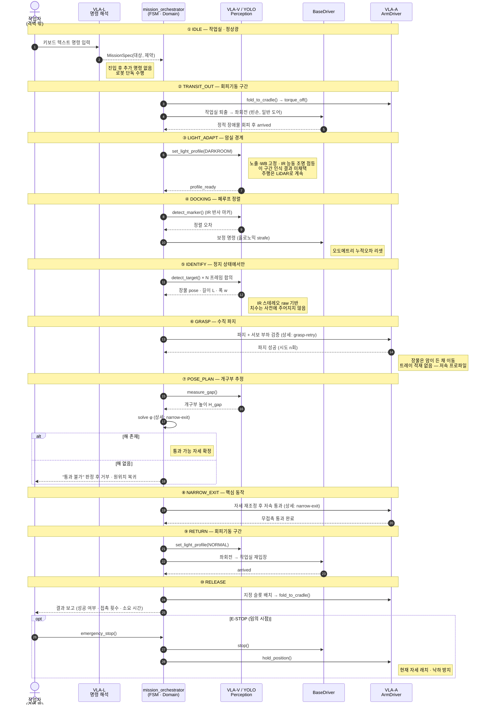
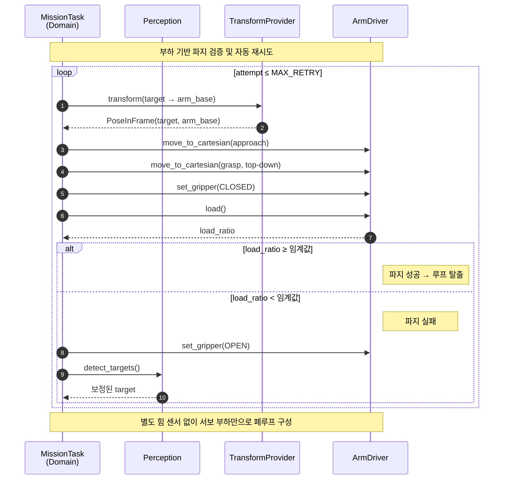
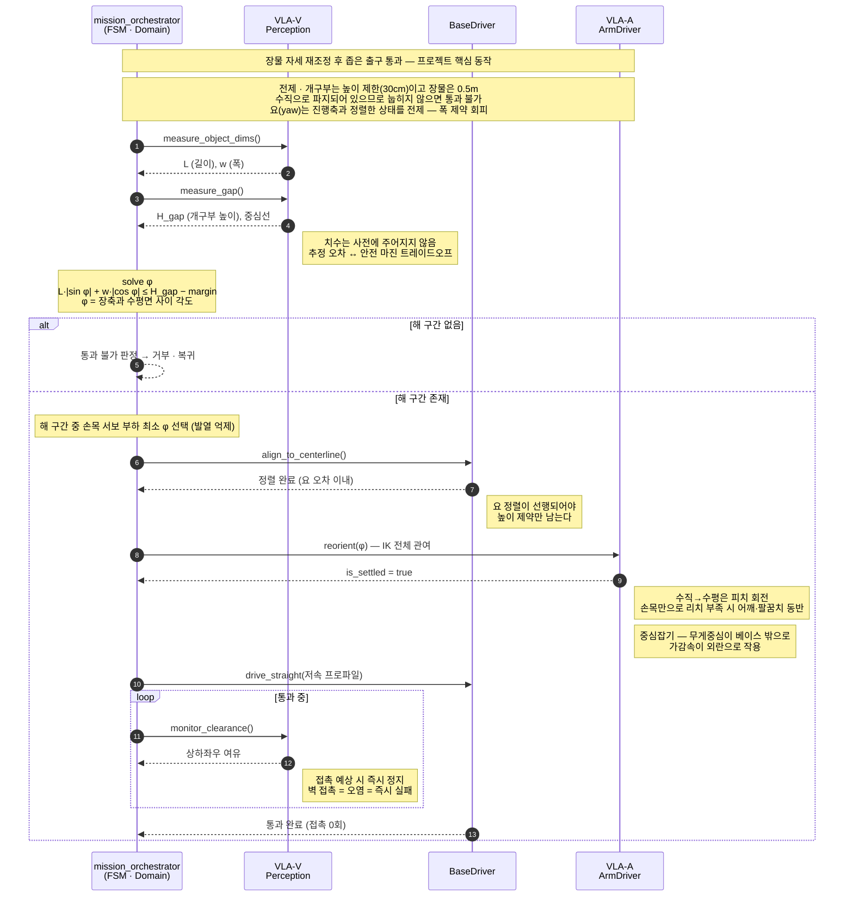

<div align="center">

# 🤖 Grippers

**특수환경 장물(長物) 통과 — 무인 멸균 암실에서 긴 물체를 꺼내오는 모바일 매니퓰레이터**

⭐ 팀 프로젝트입니다 — 이슈와 제안 환영합니다 🙏

</div>

---

## Table of Contents

- [🚀 About](#-about)
- [🎯 Mission Scenario](#-mission-scenario)
- [🔀 Sequence Diagrams](#-sequence-diagrams)
- [🧠 AI Components](#-ai-components)
- [✨ Key Features](#-key-features)
- [🧱 Architecture](#-architecture)
- [🔩 Hardware](#-hardware)
- [📁 Repository Structure](#-repository-structure)
- [🔧 Getting Started](#-getting-started)
- [🧪 Testing](#-testing)
- [📊 Results](#-results)
- [📅 Milestones](#-milestones)
- [🚨 Risks](#-risks)
- [👥 Team](#-team)
- [🤝 Contributing](#-contributing)
- [📃 License](#-license)
- [📚 References](#-references)

> **파일명 규약** — `docs/` 하위 문서는 **snake_case(언더스코어)** 로 통일합니다.
>
> **용어** — 이 문서에서 **Grippers**는 시스템 전체(모바일 매니퓰레이터)를 가리킵니다. 팔 끝단 부품은 **엔드이펙터**로 표기하여 구분합니다.

---

## 🚀 About

> **확정 문장**
>
> 작업실에서 키보드로 입력된 명령을 받은 로봇이 스스로 주행해 **사람이 들어갈 수 없는 무인 멸균 암실**에 진입하고, IR 기반 인식으로 장물을 찾아 파지한 뒤, **사전에 주어지지 않은** 좁은 출구의 개구부를 추정해 통과 가능한 자세로 파지 자세를 재조정하여, **어디에도 접촉하지 않고** 작업실로 반송한다.

### 왜 이 문제인가

반도체 팹의 물류 자동화는 천장 레일 위의 **OHT**가 담당합니다. 검증된 기술이지만 레일은 **고정 인프라**입니다. 레일을 깔 수 없는 공간 — 그중에서도 **사람이 들어갈 수 없는 구역** — 에서는 여전히 사람이 방호 절차를 거쳐 직접 드나듭니다.

암실 겸 멸균실은 사람이 못 들어가는 이유가 둘입니다. **시야 확보가 불가능하고, 사람 자체가 최대 오염원**입니다. 그래서 벽 접촉이 곧 오염이고, 성공 기준이 이진값으로 유지됩니다.

### AI가 필요한 이유

물체 길이와 통로 개구부 치수를 **사전에 주지 않습니다.** 그러면 비전 추정 오차와 안전 마진 사이에 트레이드오프가 생기고, 이 지점이 학습이 개입할 자리입니다.

반대로 치수를 미리 알면 고전 모션 플래닝으로 풀립니다. 따라서 **치수 미지(未知)를 전제로 문제를 정의**하는 것이 이 프로젝트의 설계 조건입니다.

여기에 명령이 **자연어 텍스트**로 들어오고, 인식 환경이 **열화된 조명(IR)** 이라는 조건이 겹칩니다. 규칙 기반으로는 성립하지 않습니다.

### 조명 도메인 전이

한 미션 안에서 두 조명 도메인을 왕복합니다. 조명 조건이 별도 실험이 아니라 **경로 자체에 내장**됩니다.

| 도메인 | 조명 | 이 구간에서 하는 일 | 인식 수단 | 난이도 |
|---|---|---|---|---|
| **작업실** | 정상광 | 명령 수신, 반송 후 장물 배치 | RGB + YOLO | 하 |
| **경계 (도어)** | 조도 급변 | 프로파일 전환 · 정착 대기. **이 구간 인식 결과 미채택** | — (주행은 LiDAR로 계속) | 중 |
| **암실 겸 멸균실** | 거의 무광 | **장물 식별 및 파지 — 미션의 핵심.** 접촉 0회 제약 | IR 스테레오 + IR 능동 조명. RGB 파이프라인 성립 안 함 | **상** |
| 옐로우 룸 | 단색광 | (여유 시) 색상 채널 붕괴 조건 추가 측정 | 명도·형상 위주 + 마커 폴백 | 상 |

> [!IMPORTANT]
> **능동 조명은 반드시 IR이어야 합니다.** 가시광 LED를 켜면 암실이라는 전제 자체가 깨집니다. IR은 감광성 소재를 노출시키지 않으면서 센서에만 보이므로, "사람은 못 보고 로봇만 보는" 구성이 성립합니다.

---

## 🎯 Mission Scenario

```
[ 작업실 · 정상광 ]                              [ 암실 겸 멸균실 · 무광 ]

┌──────────────┐   ① 진입 · 일반 도어 (빈손)    ┌──────────────┐
│  명령 입력    │ ═════════════════════════►   │   장물 파지    │
│              │                               │               │
│  장물 배치    │ ◄═════════════════════════   │               │
└──────────────┘   ② 퇴출 · 좁은 출구 (장물)    └──────────────┘
                      ↑ 높이 30cm · 자세 재조정 강제
```

**진입과 퇴출 경로가 다릅니다.** 진입은 일반 도어(빈손), 퇴출은 좁은 출구(장물 파지 상태). 따라서 **자세 재조정이 미션당 1회 강제**됩니다.

| # | 상태 | 동작 | 주 담당 |
|---|---|---|---|
| 1 | `IDLE` | 작업실에서 키보드 명령 수신 → 대상 물체 확정 | VLA-L |
| 2 | `TRANSIT_OUT` | 팔 크래들 안착·토크 차단 → 작업실 퇴출 → 좌회전. **회피기동 구간** | ROS2 / 주행 |
| 3 | `LIGHT_ADAPT` | 암실 경계 진입. 노출·WB 고정, **IR 능동 조명 점등**, 정착 대기 | VLA-V |
| 4 | `DOCKING` | 마커 기반 폐루프 정렬 → 오도메트리 누적오차 리셋 | VLA-V / 주행 |
| 5 | `IDENTIFY` | **정지 상태에서** IR 영상 기반 장물 검출 · N프레임 합의 | YOLO / VLA-V |
| 6 | `GRASP` | 파지 + **서보 부하값으로 검증** → 실패 시 재인식 후 재시도 | VLA-A |
| 7 | `POSE_PLAN` | 출구 개구부 추정 → 통과 가능 자세 φ 산출 | VLA-V / 기하 |
| 8 | `NARROW_EXIT` | **자세 재조정 후 좁은 출구 저속 통과 — 프로젝트 핵심 동작** | VLA-A / 중심잡기 |
| 9 | `RETURN` | 좌회전 → 조명 프로파일 복귀 → 작업실 재입장. **회피기동 구간** | ROS2 / 주행 |
| 10 | `RELEASE` | 지정 슬롯 배치 → 팔 접기 → 결과 보고 | VLA-A |

> [!WARNING]
> **장물을 차체 트레이에 싣지 않습니다.** 트레이에 실으면 좁은 출구를 그냥 지나가게 되어 자세 재조정의 존재 이유가 사라집니다. 장물은 **암이 든 채** 이동하며, 주행 안정성과 상충하므로 저속 프로파일이 필수입니다.

### 기하 제약

개구부는 **높이** 제한(30cm)이고 장물은 0.5m입니다. 따라서 물체를 **눕혀야** 통과합니다. 이를 강제하려면 초기 파지 자세가 **수직**이어야 합니다 (예: 랙에 세워진 것을 집음). 처음부터 수평으로 잡으면 자세를 바꿀 이유가 사라집니다.

### 유즈케이스

| # | 시나리오 | 검증 대상 |
|---|---|---|
| 1 | 정상 통과 | 전체 파이프라인 |
| 2 | **통과 불가 판정 후 거부** | "못 지나갑니다"라고 판단하는 능력 — 시스템 완결성 |
| 3 | 추정 실패 시 복구 | 재인식·재시도 루프 |

### 성공 기준 (M4 측정 대상)

| 지표 | 목표 | 측정 방법 |
|---|---|---|
| 통과 성공률 | **90% 이상** | 20회 시도 중 성공 횟수 |
| 벽 접촉 횟수 | **0회** (멸균실 = 접촉이 곧 오염) | 접촉 센서 또는 영상 판독 |
| 소요 시간 | 미정 — 주행 루트 확정 후 산정 | 명령 입력 → 반송 완료 |
| 개구부높이 / 물체길이 | **0.6** (30cm / 50cm) | 고정 파라미터 |

아래 지표를 **조명 조건 3종(정상광 / 암실 / 옐로우 룸)별로 반복 측정**하여 4×3 비교표를 만듭니다. 개구부/물체 비율은 고정 파라미터이므로 조명별 측정 대상에서 제외하고, 대신 인식 복구 시간을 넣습니다. 이 표가 포스터의 핵심 근거입니다.

| 지표 \\ 조명 | 정상광 | 암실 | 옐로우 룸 |
|---|---|---|---|
| 통과 성공률 | | | |
| 벽 접촉 횟수 | | | |
| 소요 시간 | | | |
| 인식 복구 시간 | | | |

### 성공 등급

| 등급 | 범위 | 목표 시점 |
|---|---|---|
| 🥉 **Minimum** | 정상광 범위, 고정 경로 주행 → Pick and Place → 복귀 · 조명 전환 없음 | M2 종료 (8/23) |
| 🥈 **Target** | 암실 왕복 + 조명 도메인 전환 + **좁은 출구 자세 재조정 통과** · 정적 장애물 회피 + 파지 실패 재시도 | M3–M4 (8/30–9/4) |
| 🥇 **Stretch** | 동적 장애물 회피, 다품목 선택 회수, 옐로우 룸 추가 측정, 자유 문형 자연어 | 여유 시 |

---

## 🔀 Sequence Diagrams

<details open>
<summary><b>① 전체 미션 흐름</b></summary>



</details>

<details>
<summary><b>② 파지 검증 및 자동 재시도</b></summary>

엔드이펙터를 닫은 뒤 **서보 부하값으로 물체 유무를 판정**합니다. 별도의 힘/토크 센서 없이 폐루프를 구성하는 것이 핵심입니다.



| 항목 | 내용 |
|---|---|
| 감지 방식 | 엔드이펙터 서보 부하 비율 (`load_ratio`) |
| 임계값 | |
| 재시도 상한 | `MAX_RETRY` — 초과 시 상위 상태로 실패 보고 |
| 실패 시 동작 | 개방 → 재인식 → 목표 자세 보정 |

</details>

<details>
<summary><b>③ 장물 자세 재조정 통과 (핵심 동작)</b></summary>



**전제 — 요(yaw)는 진행축과 정렬한다.** 높이만 구속하면 장물이 진행 방향과 수직으로 놓였을 때 개구부 폭에 걸립니다. 요 정렬을 `align_to_centerline()`에서 선행 처리하여 **높이 제약만 남기는** 방식을 채택합니다. 폭 제약까지 동시에 푸는 2자유도 최적화는 5주 범위 밖입니다.

```
H_proj(φ) = L·|sin φ| + w·|cos φ|   ≤   H_gap − margin

  L      : 물체 길이 (0.5 m, 추정값)
  w      : 물체 폭 (추정값)
  φ      : 장축과 수평면 사이 각도 (파지 시 90°)
  H_gap  : 개구부 높이 (약 0.3 m, 추정값)
  margin : 안전 마진 — 추정 오차에 따라 결정
```

**설계 기준값** — `L = 0.5`, `H_gap = 0.3`, `margin = 0.03`, `w ≈ 0.02` 일 때

```
0.5·sin φ + 0.02·cos φ ≤ 0.27   →   φ ≲ 30°
```

즉 **거의 눕혀야** 통과합니다. 이 값이 마운트 높이와 리치 설계의 기준선입니다.

> [!NOTE]
> **"손목 자유도"는 피치 축입니다.** 수직(φ=90°)에서 눕히려면 피치 회전이 필요하며, 로드 축 방향 롤만으로는 불가능합니다. 또한 손목만 돌리면 물체 끝단이 개구부 밖으로 나가므로, 실제로는 **어깨·팔꿈치가 함께 움직이는 IK 전체가 관여**합니다.

해 구간 중 **손목 서보 부하가 최소가 되는 φ** 를 선택합니다(발열 억제). **해 구간이 없으면 통과 불가로 판정하고 거부**합니다 — 유즈케이스 2에 해당합니다.

</details>

> 다이어그램 원본은 [`docs/sequences.md`](docs/sequences.md)에도 있습니다.

---

## 🧠 AI Components

### VLA 3분할

| 파트 | 역할 | 담당 |
|---|---|---|
| **V (Vision)** | 암실 장물·개구부 인식. YOLO를 프론트엔드로 배치 | 김동혁 |
| **L (Language)** | 키보드 텍스트 명령 해석·인코딩 | 이승용 |
| **A (Action)** | 파지·자세 전환 액션 시퀀스 | 임성혁 |

> [!IMPORTANT]
> **V → L → A 사이의 텐서 shape과 좌표계를 8/14까지 문서로 고정합니다.** 여기가 어긋나면 통합 단계에서 전부 무너집니다. 변경은 PR + 3인 합의로만 가능합니다.

### 구성 요소

| 구성 | 역할 | 기법 | 실행 위치 |
|---|---|---|---|
| 자연어 명령 해석 | 텍스트 → `MissionSpec` | VLA-L | 온디바이스 |
| 물체 검출 | 장물 식별, 바운딩박스 | YOLO 파인튜닝 | 온디바이스 |
| 조명 도메인 적응 | 정상광 / IR 도메인 | RGB 사전학습 → IR 파인튜닝 | 온디바이스 |
| 치수·자세 추정 | `L`, `w`, `H_gap`, 주축 각도 | 세그멘테이션 + 기하 | 온디바이스 |
| 자세 전환 정책 | 마진 결정 및 액션 | 강화학습 (김희수) | 온디바이스 |

### 데이터

| 도메인 | 수집 방법 | 규모 |
|---|---|---|
| 정상광 RGB | 실제 촬영 | |
| 암실 IR | **RealSense IR 스테레오 raw** 취득 | |
| 시연 에피소드 | **리더/팔로워 텔레오퍼레이션** | |

리더/팔로워 암이 교육장에 있으므로 텔레오퍼레이션으로 시연 데이터를 직접 수집할 수 있습니다. **VLA 학습의 핵심 경로**입니다.

### 가속기 선택 근거

> 가산점 항목 — 선택 근거 문서화

| 단계 | 위치 | 근거 |
|---|---|---|
| **학습** | AI training server GPU | 데이터셋 규모·에폭 반복. 온디바이스로는 불가 |
| **추론** | 온디바이스 | 시연 시 네트워크 의존 제거, 지연 시간 확보 |

온디바이스 추론 가속기는 **Hailo-10H 채택을 확정**했습니다. 세부 성능 수치는 M1 벤치마크로 검증합니다.

| 후보 | 성능 | 장점 | 단점 | 판정 |
|---|---|---|---|---|
| Raspberry Pi 5 CPU only | — | 추가 부품 없음 | 실시간 추론 불가 | 기준선 |
| **Hailo-10H (M.2 모듈)** | 최대 40 TOPS | **온보드 DRAM 탑재 — 트랜스포머·생성형 계열 모델을 가속기에 상주**시킬 수 있어 VLA-L 언어 파트까지 온디바이스로 감당. Pi 5 M.2 HAT+ 직결 | 8L 대비 소비전력·발열 증가, 캐리어 보드 별도 필요, 국내 수급·단가 확인 필요 | **✅ 채택** |
| Hailo-8L (Raspberry Pi AI HAT+) | 13 TOPS | 저전력, AI HAT+ 원보드 구성, 레퍼런스 풍부 | **온보드 메모리 없음 → 매 추론마다 호스트에서 가중치 스트리밍.** VLA-L 감당 어려움, 지원 모델 제한 | 폴백 (10H 수급 실패 시) |
| Intel NPU + OpenVINO | 가변 | 성숙한 툴체인, 팀 내 INT8 양자화 경험 | **Pi에 직접 연결 불가 — 별도 x86 보드 필요.** 무게·전력·배선·전원 도메인이 전부 바뀜 | 제외 (비용 과다) |

**Hailo-8L이 아니라 10H인 이유** — 이 프로젝트의 온디바이스 추론은 YOLO 검출 하나가 아니라 **VLA 3분할(V/L/A)을 동시에** 올려야 합니다. 특히 VLA-L(자연어 명령 해석)은 트랜스포머 계열이라 파라미터 상주 메모리가 필요한데, 8L은 온보드 메모리가 없어 매 추론마다 호스트 메모리에서 가중치를 끌어옵니다. 10H의 온보드 DRAM이 이 구간을 없애줍니다.

> [!WARNING]
> **AI HAT+로는 10H를 못 씁니다.** Raspberry Pi AI HAT+는 Hailo-8L/8이 보드에 실장된 제품이라 모듈 교체가 불가능합니다. 10H를 쓰려면 **Raspberry Pi M.2 HAT+**(범용 M.2 M-key 캐리어) + **Hailo-10H M.2 모듈**의 2개 품목으로 발주해야 합니다. 8/11 발주 전 반드시 반영하세요.
>
> ⚠️ **M1에서 확인할 것** — ① 40 TOPS·온보드 DRAM 용량 등 스펙을 벤더 데이터시트로 확정 ② Pi 5용 HailoRT / 드라이버가 10H를 지원하는 버전인지 ③ 8L 대비 늘어난 소비전력이 로직 전원 도메인 예산 안에 들어오는지.

| 항목 | Hailo-10H | 기준선 (Pi 5 CPU) |
|---|---|---|
| 추론 지연 (ms) | | |
| 소비 전력 (W) | | |
| 추가 중량 (g) | | |

---

## ✨ Key Features

### 🗣️ 자연어 텍스트 명령 (VLA-L)

격벽 밖 작업자가 키보드로 명령을 입력하면 로봇이 무인 멸균실에 **단독 진입**합니다. 진입 후 추가 명령은 없습니다. 명령 문형은 최소 10종 확보하며, 동의어와 제약조건("세워서", "천천히", "짧은 쪽부터")을 포함합니다.

### 🔦 조명 도메인 전이에 강건한 인식

- 카메라 **오토 노출·오토 화이트밸런스 비활성화** 후 도메인별 고정값 적용
- 암실: **IR 능동 조명 + IR 스테레오 raw** 기반 인식
- 전환 직후 **정착 대기 구간**을 FSM 상태로 명시 — 이 구간 인식 결과 미채택
- 주행은 LiDAR로 계속 — **조명과 무관하게 동작**

| 도메인 | 노출 | 화이트밸런스 | 조명 | 주 판별 방식 |
|---|---|---|---|---|
| 정상광 | | | 환경광 | |
| 암실 | | — | IR 프로젝터 | |
| 옐로우 룸 | | | 환경광 | |

### 🎯 마커 기반 정밀 도킹

메카넘 휠은 롤러 슬립으로 오도메트리 누적 오차가 큽니다. 진입 마지막 구간은 마커 기준 **폐루프 정렬**로 오차를 리셋합니다. 암실에서는 RGB 마커가 보이지 않으므로 **IR 반사 재질 마커**를 사용합니다.

### 🦾 부하 기반 파지 검증 및 자동 재시도

엔드이펙터를 닫은 뒤 **서보 부하값으로 물체 유무를 판정**합니다. 별도 힘센서 없이 폐루프를 구성합니다.

### 📐 장물 자세 재조정 통과 (핵심 동작)

0.5m 장물을 높이 30cm 개구부로 통과시키기 위해 **물체의 각도만 변경**합니다(파지점 이동·핸드오버 없음). 요는 진행축과 정렬한 상태를 전제하며, 피치 회전은 손목 단독이 아니라 **IK 전체**로 수행합니다. 설계 기준값 기준 `φ ≲ 30°` — 거의 눕혀야 합니다. 통과 중 여유 거리를 감시하며 **접촉 0회**를 성공 기준으로 삼습니다.

**파지 변경 3방식 — 범위 결정 근거**

| 방식 | 내용 | 필요 조건 / 걸림돌 | 판정 |
|---|---|---|---|
| **자세 재조정** | 손목 회전으로 물체 각도만 변경 | 손목 자유도만 있으면 가능 | **MVP 채택** |
| 파지점 이동 | 내려놓고 다른 지점을 다시 파지 | 거치대 필요. **내려놓기 = 오염** | 확장 과제 (M3 여유 시) |
| 핸드오버 | 두 그리퍼 간 물체 전달 | 두 번째 암 필요. 인핸드 조작은 미해결 연구 영역 | 제외 |

### ⚖️ 중심잡기

메카넘 카 위에서 장물을 파지하면 무게중심이 베이스 밖으로 나갑니다. 주행 가감속과 자세 전환이 모두 외란으로 작용하므로, 저속 프로파일 + 가감속 제한 + 자세 안정화 제어를 병행합니다.

### 🔌 전원 도메인 분리

팔 서보 6축은 **3S LiPo 전용 팩**에서 급전하고, GND만 스타 접지로 공통입니다. 미분리 시 6축 동시 기동 순간 전류로 Pi가 리셋됩니다.

### 🧰 Transport Pose & 크래들

주행 중(빈손 구간)에는 팔을 접어 크래들에 물리 안착시키고 토크를 차단합니다. 무게중심 하강, 서보 발열·전류 제거.

---

## 🧱 Architecture

### Ports & Adapters

도메인 로직을 하드웨어에서 분리합니다. 태스크 로직은 ROS2도 서보 SDK도 알지 못합니다.

| Port | 책임 | Real Adapter | Fake Adapter |
|---|---|---|---|
| `BaseDriver` | 병진·회전 명령, 오도메트리, 회피기동 | `Ros2MecanumBase` | `FakeBase` |
| `ArmDriver` | 관절/직교 이동, 엔드이펙터, 부하 조회 | `FeetechArm` | `FakeArm` |
| `Perception` | 검출, 치수 추정, 마커, 조명 프로파일 | `LearnedPerception` | `ScriptedPerception` |
| `TransformProvider` | 프레임 간 좌표 변환 | `Ros2TfProvider` | `StubTfProvider` |
| `CommandInterpreter` *(제안)* | 텍스트 → `MissionSpec` | `VlaLanguageAdapter` | `ScriptedInterpreter` |

- 각 포트는 **Real 어댑터와 Fake 어댑터를 둘 다** 가집니다
- **CI는 매 push마다 Fake 어댑터로 전체 미션 파이프라인을 실행**합니다 — 인터페이스 불일치를 통합 시점이 아니라 커밋 시점에 검출
- 로봇 1대를 5명이 나눠 쓰는 병목을 구조로 해소하기 위한 설계입니다

> `CommandInterpreter` 추가 여부는 M1에서 확정합니다.

### ROS2 노드 분할

> [!WARNING]
> **기능 축으로 나누지 않습니다.** 자율주행·회피기동·Pick and Place는 동시에 도는 것이 아니라 **순차 단계**입니다. 순차 단계를 노드로 쪼개면 동시성 이득은 없고 직렬화 지연·분산 상태·브레이크포인트 불가만 남습니다.
>
> **분할 기준은 둘 — 동시에 도는가, 하드웨어를 소유하는가.** 결과적으로 포트 경계와 거의 일치합니다.

| 노드 | 책임 | 분리 근거 | 오너 |
|---|---|---|---|
| `mission_orchestrator` | FSM 전체. 포트를 호출해 순차 로직 진행 | 순차 로직은 한 프로세스에 모음 — 디버거 추적 가능 | 이승용 |
| `perception` | 카메라 소유, 조명 프로파일 전환, YOLO, 마커 | 상시 구동 + 디바이스 소유 | 김동혁 · 김희수 |
| `vla_inference` | V/L/A 모델 추론 | 모델 로딩이 느리고 의존성이 다름 → 단독 재시작 필요 | 임성혁 · 이승용 · 김동혁 |
| `arm_driver` | Feetech SDK, 관절/직교 이동, 엔드이펙터, 부하 조회 | 상시 구동 + 디바이스 소유 | 임성혁 |
| `base_driver` | 메카넘 주행, LiDAR, **회피기동 포함** | 상시 구동 + 디바이스 소유 | 조현우 |
| `hud` | 대시보드 — `/mission/state`만 구독 | 시연 중 끊겨도 미션에 영향 없어야 함 | 김희수 |

> [!CAUTION]
> **회피기동을 별도 노드로 만들지 않습니다.** 독립 노드로 두면 `/cmd_vel` 발행 주체가 둘이 되고, 두 명령이 경합해 로봇이 떨리거나 타이밍에 따라만 재현되는 버그가 납니다. **`/cmd_vel` 발행 주체는 언제나 1개**입니다.

### 관측성 3원칙

디버깅은 노드 수가 아니라 경계에서 무엇이 보이느냐에 달려 있습니다.

- **상태 전이를 토픽으로 발행** — `/mission/state`를 `transient_local` QoS로. 중간에 붙어도 현재 상태 즉시 파악. HUD도 이 토픽 하나만 구독
- **포트 호출을 전부 로깅** — 인자와 반환값을 남기면 그것이 곧 재현 가능한 시나리오
- **`ros2 bag record -a` 습관화** — 실기 시행은 되돌릴 수 없고, 로봇 1대를 5명이 나눠 쓰므로 **녹화가 곧 시간**

### 코드 리뷰 기준

| 제약 | 목적 |
|---|---|
| 원시값(`float`, `tuple`) 직접 전달 금지 | 단위·좌표계 혼동 차단 |
| `else` 사용 지양 | 조건 분기 대신 State 객체가 다음 상태를 반환 |
| 클래스당 인스턴스 변수 2개 이하 지향 | God Node 방지 |

### 운영 규칙

- 파라미터 선언은 **launch 또는 노드 중 한 쪽에서만** — 중복 시 `ParameterAlreadyDeclaredException`
- 지연이 문제되면 **composable node**로 전환. 처음부터 도입할 필요는 없음
- 노드 경계 = 파일 경계 = 오너 경계

---

## 🔩 Hardware

**예산 50만원.** 주요 장비가 교육장에 보유되어 있으므로 실제 발주는 통로 구조물·마운트·물체·소모품 중심입니다.

| 구분 | 사양 | 상태 |
|---|---|---|
| 이동 베이스 | **MentorPi** (메카넘 휠 카) — 전방향 이동, 게걸음으로 좁은 통로 진입 유리 | ✅ 교육장 보유 |
| 컴퓨트 | **Raspberry Pi 5** / Ubuntu 24.04 / **ROS 2 Jazzy** | ✅ 교육장 보유 |
| AI 가속기 | **Hailo-10H** (M.2 모듈, 최대 40 TOPS) — 온보드 DRAM으로 VLA 3분할 상주. 성능 수치는 M1 벤치마크로 검증 | ✅ 채택 확정 |
| 가속기 캐리어 | **Raspberry Pi M.2 HAT+** — AI HAT+는 8L 실장형이라 10H 장착 불가. **별도 품목으로 발주 필요** | ⚠️ **8/11 발주 반영** |
| 로봇 암 | **SO-ARM101** 리더 / 팔로워 2대 — 텔레오퍼레이션 데이터 수집 | ✅ 교육장 보유 |
| 서보 | **Feetech STS3215** 버스 서보 × 6축/암 | ✅ 보유 |
| 카메라 | **Intel RealSense** — 액티브 IR 깊이 + RGB, 640×480 | ⚠️ 요청 중 (8/7 회신) |
| 엔드이펙터 핑거 | 기본 2지 + **V홈 핑거(검토)** — 원통 자기정렬. **핑거 팁만 교체** | ⚠️ 8/7 결정 |
| LiDAR | 360° 2D — 조명과 무관하게 동작. 팔 차폐 섹터 마스킹 필요 | ⚠️ MentorPi 기본 탑재 여부 확인 |
| **접촉 감지 수단** | 성공 기준 1순위(접촉 0회) 측정용. 접촉 센서 / 도전성 테이프 / 영상 판독 중 택 1 | ⚠️ **8/7 결정 · 8/11 발주** |
| **비상 정지(E-STOP)** | 물리 버튼 우선. 관객 앞 시연이므로 소프트웨어 단독은 불가 | ⚠️ **8/7 결정 · 8/11 발주** |
| 라인 레이저 | 백업안 — RealSense 미확보 시. **클래스 2 이하(1mW 미만)** | ⚠️ 미정 |
| 운반 물체 | **길이 0.5m 원통형** — 수수깡 / 빨대 / 배관 스티로폼 (경량) | 발주 |
| 통로 개구부 | **높이 약 30cm** — 물체 길이의 60%. 가변 구조 | 발주 |
| 암실 구조물 | 암막 파티션 + 좁은 출구. **벽면은 접촉 판독 가능 재질** | 발주 |
| 팔 전용 전원 | **3S LiPo** — 전원 도메인 분리 필수 | 발주 |
| 크래들 | 자작 — Transport Pose 물리 안착 | 자작 |
| 도킹 마커 | ArUco — **암실용 IR 반사 재질 필요** | 발주 |

> [!NOTE]
> **암실 구조가 통과형(입구 ≠ 출구)인지는 8/7 미결 안건입니다.** 현재 미션 시나리오는 진입 도어와 퇴출 개구부가 분리된 통과형을 전제로 작성되어 있습니다. 왕복형으로 확정되면 `TRANSIT_OUT` / `NARROW_EXIT` 경로를 수정해야 합니다.

> ⚠️ **부품 구매요청 마감: 8/11** · 담당 김동혁 · 비품 DB와 동기화 필요

### 전원 도메인

```
MentorPi 배터리  ──┬──► Pi 5 / M.2 HAT+ (Hailo-10H) / LiDAR / RealSense   (로직)
                   └──► 메카넘 모터 드라이버           (구동)

3S LiPo (전용)    ─────► 팔 서보 6축                  (매니퓰레이터)
                         └─ GND만 스타 접지로 공통
```

검증 명령: `vcgencmd get_throttled` → `0x0` (6축 동시 기동 + 급가속 조건에서)

### 실측 데이터

| 항목 | 값 | 판정 기준 |
|---|---|---|
| 결합 중량 | | |
| 무게중심 높이 (장물 파지 시) | | |
| 최소 휠 하중 비율 | | ≥ 15% |
| 팔 실용 리치 | | |
| 어깨 서보 온도 (3분 유지) | | < 60°C |
| `get_throttled` (최악 조건) | | `0x0` |
| 파지 신뢰도 (미끄러짐·자전) | | M2 초반 단독 측정 |

---

## 📁 Repository Structure

```
grippers/
├── README.md
├── LICENSE                 # MIT (+ LeRobot Apache 2.0 고지)
├── pyproject.toml          # ruff / black 설정 — 벤더 코드는 lint 대상에서 제외
├── .gitignore
├── .gitmodules             # third_party/soarm_provided_d
├── .github/
│   ├── CODEOWNERS          #   경로별 리뷰어 자동 지정
│   ├── pull_request_template.md
│   ├── ISSUE_TEMPLATE/     #   task.yml, bug.yml, config.yml
│   └── workflows/
│       └── ci.yml          #   lint → test → colcon build → docker build
├── domain/                 # 순수 Python. 하드웨어 의존성 없음 (ROS2 import 금지)
│   ├── task/               #   State 제너레이터 기반 FSM (IDLE~RELEASE)
│   ├── values.py           #   Pose2D, Point3 등 domain 전용 값 객체
│   ├── ports/              #   인터페이스 정의 (ABC) — BaseDriver, ArmDriver, Perception
│   └── adapters/
│       ├── real/           #   ROS2 액션/서비스 클라이언트 (Ros2MecanumBase, Ros2ArmDriver)
│       └── fake/           #   테스트용 구현 (FakeBase, FakeArm, FakePerception)
├── ros2_ws/
│   └── src/
│       ├── grippers_interfaces/  # 공통 msg/srv/action (base ↔ arm ↔ mission 유일한 접점)
│       ├── grippers_base/        # base_driver_node — controller/odom_publisher_node 위에 얹는 어댑터
│       ├── grippers_arm/         # arm_driver_node — soarm_lab(third_party) 래핑
│       ├── grippers_perception/  # perception_node — 카메라 소유, 조명 프로파일, 검출
│       ├── grippers_vla/         # V/L/A 추론 노드 (미착수)
│       ├── grippers_mission/     # mission_orchestrator_node — domain/task FSM을 스레드 분리 실행
│       ├── grippers_bringup/     # launch 재조합 (대회용 bringup.launch.py 전체는 미사용)
│       └── (app/ bringup/ driver/ interfaces/ navigation/ peripherals/
│            simulations/ slam/ yolov5_ros2/ 등 — 대회 때 쓰던 MentorPi 소스 보존.
│            우리 코드가 아니므로 pyproject.toml에서 lint 제외)
├── third_party/
│   └── soarm_provided_d/   # git submodule — soarm_lab(FK/IK/시뮬/실물 백엔드)
├── tests/                  # pytest — 하드웨어·ROS2 불필요, domain/ + Fake 어댑터만 사용
├── docs/
│   ├── hld.md              #   High Level Design — 인터페이스·FSM·미결 사항 (8/14 freeze)
│   ├── class_diagram.md    #   클래스 다이어그램 (Mermaid) — 포트·State·노드 계층
│   ├── architecture.puml   #   위와 같은 구조의 PlantUML 버전
│   ├── sequences.md        #   시퀀스 다이어그램
│   ├── vla_interface.md    #   V/L/A 텐서 shape·좌표계 (8/14 freeze)
│   ├── error_budget.md     #   오차 전파 분석
│   ├── measurements.md     #   실측 리포트
│   ├── purchase_ledger.md  #   구매 장부
│   └── rejected_designs.md #   채택하지 않은 설계와 근거
└── hardware/               # 마운트·크래들 도면, BOM, 배선도
```

> **설계 초안과의 차이**: 최초 설계에선 `ports/`, `adapters/`가 저장소 최상위였는데, 실제 구현에서는 `domain/ports/`, `domain/adapters/`로 domain 아래 중첩시켰습니다. 두 위치 모두 ROS2 비의존이라는 원칙은 동일하게 지켜지며, `domain` 패키지 하나만 import하면 FSM+포트+Fake어댑터가 다 따라오는 게 실제로 더 편해서 이렇게 정착했습니다.

> **lint 범위**: `pyproject.toml`이 `ros2_ws/src`의 MentorPi 벤더 패키지와 `third_party/`를 ruff·black 대상에서 제외합니다. 검사 대상은 `domain/`, `tests/`, `ros2_ws/src/grippers_*` 입니다. 벤더 코드까지 검사하면 963건이 잡히지만, 우리 코드만 보면 자동수정으로 전부 해소됩니다.

---

## 🔧 Getting Started

### Prerequisites

- **Linux** (개발 환경 기준. 불가능한 모듈은 사유를 명시)
- **ROS 2 Humble** — `IntelPi` Docker 이미지(`ros:humble-export`)로 통일. 호스트 Pi 5의 OS 레벨 ROS2(Jazzy)는 사용하지 않음 — 반드시 컨테이너 안에서만 `ros2` 명령 실행
- **Python 3.10** (실제 `IntelPi` 컨테이너 내장 버전 — Humble/Ubuntu 22.04 기준. ⚠️ CI(`ros2-build`, `test` job)는 `ubuntu-24.04` + Python 3.12로 도는데, `domain/` 순수 파이썬 코드는 버전 특이 문법을 쓰지 않아 지금까진 문제없었습니다. 3.10 전용 문법(예: `match` 구문 이하 버전 미지원 없음, 최신 `typing` 문법 등)은 피해주세요)
- Git (submodule 지원 — `third_party/soarm_provided_d` clone에 필요)
- `MACHINE_TYPE=MentorPi_Mecanum` 환경변수 — `IntelPi` 이미지에 이미 설정되어 있음(`env | grep -i machine`으로 확인). `controller/odom_publisher_node`가 이 값으로 mecanum 역기구학 경로를 타므로, 다른 이미지로 새로 빌드하는 경우 반드시 유지해야 함
- **디스크 여유 공간 확인 필수**: Pi 5의 기본 저장장치(microSD/eMMC)가 ROS2 Humble + MentorPi 패키지 15개 + Docker 레이어로 쉽게 90%+ 찹니다. 설치 전 `df -h /`로 확인하고, 부족하면 Pi 호스트에서 `docker builder prune -a`로 빌드 캐시부터 정리하세요. 여유 없이 `pip install`이나 `colcon build`를 돌리면 `OSError: No space left on device`로 조용히 실패합니다

### Installation

**1. [Pi 5 호스트] 저장소 clone (서브모듈 포함)**

```bash
mkdir -p ~/docker/shared
git clone --recurse-submodules https://github.com/grippers-intel/grippers.git ~/docker/shared/grippers
```
`--recurse-submodules`를 빼먹으면 `third_party/soarm_provided_d`(SO-ARM101 제어 라이브러리)가 빈 폴더로 받아집니다. 이미 clone했는데 비어있다면:
```bash
cd ~/docker/shared/grippers
git submodule update --init --recursive
```

**2. [Pi 5 호스트] `IntelPi` 컨테이너 스크립트(`ros_start.sh`)의 마운트 경로 확인**

`ros_start.sh`가 아래 세 경로를 컨테이너 안으로 마운트하도록 되어 있어야 합니다:
```bash
-v ${HOME}/docker/shared/grippers/ros2_ws:/ros2_ws \
-v ${HOME}/docker/shared/grippers:/grippers \
-v ${HOME}/docker/shared/grippers/third_party:/third_party \
```

**3. [Pi 5 호스트] 컨테이너 기동 → 진입**

```bash
./ros_start.sh
./exec_shell.sh
```

**4. [IntelPi 컨테이너] Python 의존성 설치**

```bash
pip3 install --no-cache-dir pyserial mujoco numpy pytest
```

**5. [IntelPi 컨테이너] PYTHONPATH 등록 (매 세션 반복 방지)**

```bash
echo 'export PYTHONPATH="/grippers:/third_party/soarm_provided_d:${PYTHONPATH}"' >> ~/.zshrc
source ~/.zshrc
```

**6. [IntelPi 컨테이너] 빌드**

```bash
cd /ros2_ws
sudo rosdep init 2>/dev/null
rosdep update
rosdep install --from-paths src --ignore-src -r -y
colcon build --symlink-install
source install/setup.zsh
```

`Summary: N packages finished`가 뜨고 실패한 패키지가 없으면 완료입니다.

### Run — 시뮬레이션 (하드웨어 불필요)

가장 빠른 검증은 `domain/task`의 FSM을 Fake 어댑터로 끝까지 돌리는 것입니다 (ROS2도 필요 없음):

```bash
cd /grippers
python3 -m pytest tests/ -v
```
`IDLE → TRANSIT_OUT → ... → RELEASE`까지 전체 미션 파이프라인이 통과하면 도메인 로직은 정상입니다.

ROS2 프로세스 3개(`base_driver`/`arm_driver`/`mission_orchestrator`)가 실제로 액션/서비스로 통신하는 것까지 하드웨어 없이 보고 싶다면, `mission_orchestrator_node.py`에서 `Ros2MecanumBase`/`Ros2ArmDriver` 대신 `FakeBase`/`FakeArm`을 임시로 주입하고 3개 노드를 각 터미널에서 띄우면 됩니다. (상시 지원되는 launch 인자화는 TODO — 지금은 코드를 임시로 바꿔서 확인)

### Run — 실기

MentorPi 베이스와 SO-ARM101이 모두 시리얼로 연결된 상태를 전제로 합니다. 터미널 4개가 필요합니다 (모두 `./exec_shell.sh`로 진입).

```bash
# 터미널 1 — MentorPi 저수준 드라이버 (odom, ekf, 모터)
cd /ros2_ws && source install/setup.zsh
export need_compile=False
ros2 launch controller controller.launch.py

# 터미널 2 — base_driver (grippers_base)
cd /ros2_ws && source install/setup.zsh
ros2 run grippers_base base_driver

# 터미널 3 — arm_driver (grippers_arm)
cd /ros2_ws && source install/setup.zsh
ros2 run grippers_arm arm_driver

# 터미널 4 — mission_orchestrator (grippers_mission)
cd /ros2_ws && source install/setup.zsh
ros2 run grippers_mission mission_orchestrator
```

상태 흐름 확인:
```bash
ros2 topic echo /mission/state
```

> **주의**: `mission_orchestrator`가 `TRANSIT_OUT`에 들어가는 순간 실제로 `/cmd_vel`이 발행되어 베이스가 움직입니다. 처음 실행 시 바퀴를 들어두거나 충분한 공간을 확보하세요.

`grippers_bringup`(위 4개를 하나의 launch로 묶은 것)은 아직 하드웨어 상시 연결 상태에서 검증 전이라, 지금은 터미널을 나눠 개별 실행하는 걸 권장합니다. 검증되면 아래로 대체됩니다:
```bash
ros2 launch grippers_bringup bringup.launch.py
```

### Troubleshooting

| 증상 | 확인 사항 |
|---|---|
| 주행 중 Pi 리셋 | `vcgencmd get_throttled` — 전원 도메인 분리 여부 |
| 로봇이 제자리에서 정지 | LiDAR 스캔에 팔이 장애물로 검출 — 각도 마스킹 확인 |
| 조명 전환 후 인식 실패 | 오토 노출·AWB 비활성화, 도메인 프로파일 전환 여부 |
| 암실에서 마커 미검출 | IR 반사 마커 사용 여부, IR 프로젝터 점등 확인 |
| 주행 중 로봇이 떨림 | `/cmd_vel` 발행 주체가 2개 이상인지 확인 |
| 장물이 그리퍼 안에서 자전 | 마찰 패드 또는 V홈 핑거 적용 여부 |
| `ParameterAlreadyDeclaredException` | launch와 노드 양쪽 파라미터 중복 선언 |
| `ros_robot_controller`가 `/dev/rrc` 못 찾음 | MentorPi 베이스 보드 자체가 시리얼로 미연결. `ls /dev/ttyUSB* /dev/ttyACM*`로 실제 연결된 장치 확인 |
| `git push` 시 `.../vscode-server/.../node: Permission denied` | VS Code Remote-SSH가 넣은 `credential.helper`가 root 경로를 가리켜서 `ubuntu` 유저로는 실행 불가. `sudo git config --system --unset-all credential.helper` 후 `git config --global credential.helper store`로 교체, push 시 비밀번호 자리에 GitHub Personal Access Token(classic, `repo` 스코프) 입력 |

---

## 🧪 Testing

도메인 로직은 **하드웨어 없이 전량 검증**하는 것을 목표로 합니다.

CI는 매 push마다 lint + unittest + Fake 어댑터 기반 전체 미션 파이프라인을 실행합니다.

```bash
cd /grippers
export PYTHONPATH="/grippers:${PYTHONPATH}"
python3 -m pytest tests/ -v
```

현재 `tests/test_mission_task.py`가 검증하는 것:
- `test_full_mission_completes` — `IDLE`에서 시작해 `RELEASE`로 정상 종료하는지 (전체 상태 전이 순서 포함)
- `test_estop_interrupts_immediately` — E-STOP 플래그가 켜지면 어느 상태에 있든 즉시 `ESTOP`으로 전이하는지

ROS2 레벨 빌드 검증(`colcon test`)은 CI의 `ros2-build` job이 담당하며, `ros2_ws/src`에 실제 launch_testing 기반 테스트가 추가되기 전까지는 컴파일 성공 여부만 확인합니다.

---

## 📊 Results

> 상세 데이터는 [`docs/measurements.md`](docs/measurements.md). 성공률은 시행 횟수와 함께 이항분포 95% 신뢰구간을 병기합니다.

| 지표 | 목표 | M2 | M3 | M4 |
|---|---|---|---|---|
| 통과 성공률 | ≥ 90% | | | |
| 벽 접촉 횟수 | 0회 | | | |
| 소요 시간 | | | | |
| 파지 성공률 | | | | |
| 도킹 정렬 오차 (RMS) | | | | |
| 인식 복구 시간 | | | | |
| 추론 지연 | | | | |

---

## 📅 Milestones

> **최종 발표: 2026년 9월 8일 (화)**

| 마일스톤 | 기간 | 완료 조건 (Exit criteria) | 리드 |
|---|---|---|---|
| **M0 · 킥오프 + 주제 확정** | 8/4 – 8/7 | ~~주제·환경·명령방식·카메라·물체 규격 확정~~ ✅, RealSense 확보 확인, Repo + README, 역할 확정, issue 티켓 생성, Discord 링크 업로드 | 이승용 |
| **M1 · 설계** | 8/8 – 8/14 | 유즈케이스·성공 기준 수치화, HLD 확정, **VLA V/L/A 인터페이스 freeze**, UML 2종, 부품 발주 완료 | 이승용 |
| **M2 · 모듈 프로토타입** | 8/15 – 8/23 | YOLO 탐지 동작, VLA 각 파트 단독 추론, 암 단독 파지, 메카넘 주행·중심잡기 단독 검증, 시연 데이터 1차 수집, CI 그린 | 각 담당 |
| **M3 · 통합** | 8/24 – 8/30 | ROS2 상에서 End-to-end 1회 성공 (명령 → 동작). 하드웨어 연동 완료. **확장 기능 컷오프 결정** | 조현우 · 임성혁 |
| **M4 · MVP 완성** | 8/31 – 9/4 | 성공 기준 충족 및 측정 기록, 버그 수정, 데모 리허설, README + 향후 계획 작성 | 전원 |
| **M5 · 발표 준비** | 9/1 – 9/8 | 포스터 → **9/6 인쇄물 제출**, 9/7 최종 점검, **9/8 발표** | 김희수 |

> M4와 M5는 의도적으로 병행합니다. 포스터·발표 자료 작업은 MVP 안정화와 동시에 진행하며, 9/4 feature freeze 이후 전원이 M5로 합류합니다.

### 고정 데드라인

- [x] **8/4 (화)** — 주제 확정 (F안) + 환경 확정 (암실 겸 멸균실 왕복) + 명령 방식 확정 (키보드 입력) · 전원
- [ ] **8/7 (금)** — RealSense 확보 확인 + Repo·README·issue 티켓 완료 + Discord 업로드 · 이승용
- [ ] **8/7 (금)** — AI training server 계정 요청 · 이승용
- [ ] **8/11 (화)** — 부품 구매요청 양식 제출 · 김동혁
- [ ] **8/14 (금)** — HLD 확정 + VLA V/L/A 인터페이스 freeze · 이승용
- [ ] **8/23 (토)** — 모듈별 단독 데모 (팀 내부 시연) · 전원
- [ ] **8/30 (토)** — End-to-end 1회 성공 + 확장 기능 컷오프 · 전원
- [ ] **9/4 (금)** — MVP feature freeze, 이후 버그 수정만 · 전원
- [ ] **9/6 (일)** — 포스터 인쇄물 제출 (D-2) · 김희수
- [ ] **9/7 (월)** — 프로젝트 최종 점검 · 전원
- [ ] **9/8 (화)** — 프로젝트 발표 (D-day) · 전원

### 주간 리듬

- **매주 월 저녁** — 스탠드업: 지난주 완료 / 이번주 목표 / 블로커
- **매주 금 저녁** — 마일스톤 progress 업데이트, issue 티켓 추가·할당 (이승용)
- **격주** — 강사 consultation 예약 (가산점 항목)

### 가산점 체크리스트

- [ ] Hardware와 입/출력 연계
- [ ] GitHub 협업 관리 — Milestone 선언, PR review 이력
- [ ] CI/CD + unittest + 정적분석(lint) 활용
- [ ] 강사 consultation 활용 (최소 2회, 기록 남기기)
- [ ] 효율적인 가속기 선택 및 사용 근거 명시
- [ ] Linux 개발 환경

---

## 🚨 Risks

| 리스크 | 영향 | 대응 |
|---|---|---|
| **주행 중 자세 흔들림 / 전복** | 통과 실패, 벽 접촉 | 0.5m 경량 원통으로 확정해 모멘트 최소화. 저속 프로파일 + 가감속 제한 |
| **RealSense 미확보** | 암실 실험 불가 → 미션 자체 불가 | 8/7까지 회신 확인. 미확보 시 예산으로 즉시 구매 |
| **LiDAR 미탑재** | 자율주행 전체가 LiDAR SLAM 전제 → 주행 불가 | MentorPi 기본 탑재 여부를 8/7까지 확인. 미탑재 시 8/11 발주에 포함. 임시 대안은 RealSense 깊이 기반 주행이나 암실 성능 미검증 |
| **접촉 감지 수단 미정** | 성공 기준 1순위를 측정할 수 없음 | 8/7 결정 → 8/11 발주. 최소한 영상 판독 프로토콜(카메라 배치·판정 기준)이라도 문서화 |
| **암실 IR 영상 YOLO 학습 데이터 부족** | 핵심 구간 IDENTIFY 실패 | RGB 사전학습 후 IR 파인튜닝. 마커/형상 기반 폴백 유지 |
| **암실에서 ArUco 미검출** | 도킹 불가 → 파지 정밀도 붕괴 | IR 반사 마커 재질 테스트. M1에 실측 |
| **장물 파지 미끄러짐 / 자전** | 자세 전환 중 낙하 → 핵심 동작 실패 | 마찰 패드 우선, 불충분 시 V홈 핑거 3D 프린트. M2 초반 단독 측정 |
| **VLA 3분할 인터페이스 충돌** | M3 통합 실패 | 8/14 freeze, 변경은 PR + 3인 합의. 더미 데이터로 조기 결합 테스트 |
| 조명 경계 재수렴 지연 | 경계 구간 오인식 | 오토 노출·AWB 비활성화. 정착 대기를 FSM 상태로 명시 |
| LiDAR가 팔을 장애물로 오인식 | 제자리 정지 | 팔 차폐 섹터 실측 후 각도 마스킹 |
| 텍스트 명령 표현력 부족 | VLA-L이 키워드 파서로 축소 | 명령 문형 10종 이상 확보 |
| 부품 배송 지연 / 미승인 | M2 전체 지연 | 8/11까지 발주, 대체 부품 2안, 시뮬레이션 선행 개발 |
| 학습 데이터 부족 | 모델 성능 미달 | 사전학습 모델 zero-shot 폴백, 규칙 기반 백업 경로 |
| 강화학습 미수렴 | 제어 품질 미달 | 보상 단순화, PID 등 고전 제어 백업 |
| 공용 장비 점유 충돌 | 데이터 수집·테스트 지연 | 메카넘 카·암 사용 시간 팀 단위 예약 |
| 발표 당일 하드웨어 고장 | 시연 불가 | 백업 영상 사전 촬영, 예비 부품 확보 |

---

## 👥 Team

| 이름 | 핵심 롤 | 세부 담당 | 주요 산출물 |
|---|---|---|---|
| **임성혁** | VLA-A (Action) · 하드웨어 총괄 | Action head 설계·학습, 액션 시퀀스 정의, 기구부/전장 총괄, 조립 및 배선 | Action 모듈, 하드웨어 완성체 |
| **이승용** | Git Master · VLA-L (Language) | Milestone 선언, issue 발행·할당, 전체 설계 총괄, 자연어 명령 파싱·인코딩 | HLD 문서, Language 모듈, 마일스톤 보드 |
| **김동혁** | Git Slave · VLA-V (Vision) · 발주 | Conflict 해결 및 로그 추적, `git blame` 담당, Vision 인코더 연결, 부품 발주·장부 관리 | Vision 모듈, 구매 장부, 브랜치 히스토리 |
| **조현우** | 중심잡기 · 코드 수장 · ROS2 | 구조 설계, 자세 안정화 제어, ROS2 노드 구성·통신, 코드 리뷰 및 성능 분석 | ROS2 패키지, Stabilizer 제어기 |
| **김희수** | Perception · 데이터 · UI/UX | 프리비주얼, 3D 소스 생성(640×480), YOLO 탐지, 강화학습, 데이터 시각화, UI/UX | 데이터셋, YOLO/RL 모델, 대시보드 |

**공통 책임** — 본인 영역 unittest 작성 · 타인 PR 1일 내 review · 금요일 마일스톤 progress 업데이트 · 막히면 24시간 내 공유

---

## 🤝 Contributing

### 브랜치 & PR

- `main` 브랜치에 **직접 push 금지**
- topic branch → PR 등록 → **peer review 후 approval** → merge
- 브랜치 네이밍: `feat/`, `fix/`, `docs/`, `refactor/` + 짧은 설명
- 커밋 메시지에 issue 번호 참조, PR 본문에 `Closes #N`

### Git 운영 (Master / Slave 체계)

| 역할 | 담당 | 책임 |
|---|---|---|
| **Master** | 이승용 | Milestone 선언, issue 발행·할당, 머지 순서 조율, 릴리즈 태깅 |
| **Slave** | 김동혁 | Conflict 해결 주도, 커밋 로그·`git blame` 추적, 사고 시 원인 커밋 특정, 히스토리 정리 |

대형 리팩터링은 사전 공지 후 단독 PR로 분리합니다 (conflict 지옥 방지).

### 품질

| 항목 | 도구 / 규칙 |
|---|---|
| 정적분석 | **ruff** (또는 `pylint`) |
| 포맷 | **black** |
| CI/CD | PR마다 lint + unittest 자동 실행 |
| 코드 리뷰 최종 판단 | 조현우 |
| 개발 환경 | Linux 기준 |

```bash
ruff check .
black .
```

---

## 📃 License

본 프로젝트 코드는 MIT License로 배포합니다. 자세한 내용은 [LICENSE](LICENSE) 참고.

LeRobot 기반 구성 요소는 **Apache License 2.0** 을 따릅니다. 해당 코드를 포함하거나 파생한 파일에는 원 라이선스 고지를 유지합니다.


---

## 📚 References

- [LeRobot / SO-ARM101](https://github.com/huggingface/lerobot)
- [ROS 2 Humble Documentation](https://docs.ros.org/en/humble/)
- [Hailo-10H (M.2 생성형 AI 가속기)](https://hailo.ai/products/ai-accelerators/hailo-10h-m2-generative-ai-acceleration-module/)
- [Raspberry Pi M.2 HAT+ (가속기 캐리어)](https://www.raspberrypi.com/products/m2-hat-plus/)
- [Intel RealSense SDK](https://github.com/IntelRealSense/librealsense)
- [PlantUML Sequence Diagram](https://plantuml.com/sequence-diagram)
- [PlantUML Class Diagram](https://plantuml.com/class-diagram)

<div align="center">

[⬆ Back to top](#-grippers)

</div>
