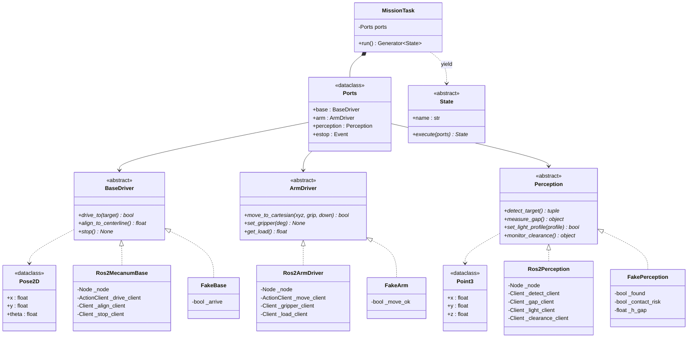
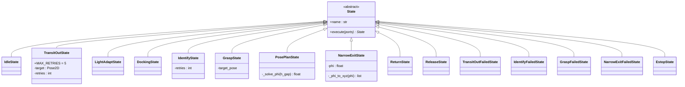
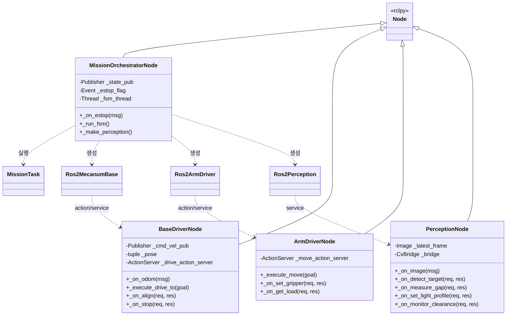

# Class Diagrams

Grippers의 클래스 구조입니다. **`main` 브랜치 구현 기준**이며, 아직 스텁인 부분은 다이어그램에 표시했습니다.

핵심 원칙은 하나입니다 — **`domain/` 은 ROS2를 모릅니다.** `rclpy`, `geometry_msgs`, `grippers_interfaces` 를 import하는 곳은 `domain/adapters/real/` 과 `ros2_ws/src/grippers_*` 뿐이고, 그 경계에서 `domain.values` 로 변환합니다.

- [Ports & Adapters](#ports--adapters)
- [FSM State 계층](#fsm-state-계층)
- [ROS2 노드 계층](#ros2-노드-계층)

---

## Ports & Adapters

| 계층 | 경로 | ROS2 의존 |
|---|---|---|
| Domain | `domain/task/`, `domain/values.py` | ❌ |
| Ports (ABC) | `domain/ports/` | ❌ |
| Real Adapters | `domain/adapters/real/` | ✅ **변환 경계** |
| Fake Adapters | `domain/adapters/fake/` | ❌ (CI에서 사용) |

`Ports` 는 포트 3종에 더해 **`estop` (threading.Event 유사 객체)** 를 들고 있습니다. 포트 ABC가 아니라 인터럽트 플래그입니다.

---

## FSM State 계층

`execute()` 가 **다음 State 인스턴스를 반환**하는 체인 구조입니다. 미션 종료 시 `None` 을 반환하고, 재시도는 상태를 변경하지 않고 **새 인스턴스**로 표현합니다.

정상 경로와 실패 전이는 [`hld.md` §6](hld.md#6-fsm-상태-전이) 을 참고하세요.

> **스텁 표시** — `PosePlanState._solve_phi()` 는 현재 `0.0` 고정 반환, `NarrowExitState._phi_to_xyz()` 는 `[0.2, 0.0, 0.15]` 고정 반환입니다. 자세 재조정 수식이 아직 코드에 없습니다. (#47)

---

## ROS2 노드 계층

| 노드 | 소유 자원 | 비고 |
|---|---|---|
| `mission_orchestrator` | 없음 (포트만 호출) | FSM은 **별도 데몬 스레드**, rclpy는 `MultiThreadedExecutor` |
| `base_driver` | `/cmd_vel` 발행, `/odom` 구독 | **`/cmd_vel` 발행 주체는 이 노드 하나뿐** |
| `arm_driver` | `soarm_lab.arm` (SO-ARM101 실물) | 새 IK 로직 없음, 라이브러리 래핑 |
| `perception` | 카메라 (`camera/color/image_raw`) | ⚠️ **비전 파이프라인 미구현** |

`base_driver` 는 새 모터 제어를 하지 않습니다. MentorPi의 `controller` / `odom_publisher_node` 가 만들어둔 `/cmd_vel` → `/odom` 경로를 재사용하고, 그 위에 목표 좌표까지의 비례 제어 루프와 `DriveTo` 액션 서버만 얹습니다.

> **안전 원칙** — `perception_node._on_monitor_clearance()` 는 실제 측정이 되기 전까지 항상 `contact_risk=True` (정지)를 반환합니다. "모르면 멈춘다"가 기본값입니다. `detect_target` / `measure_gap` 은 `found=False` / 기본값을 반환해 재시도를 유도합니다.

---

## 참고

| 문서 | 내용 |
|---|---|
| [`hld.md`](hld.md) | 인터페이스 명세, FSM 전이, 미결 사항 |
| [`sequences.md`](sequences.md) | 시퀀스 다이어그램 |
| [`architecture.puml`](architecture.puml) | 같은 구조의 PlantUML 버전 |
