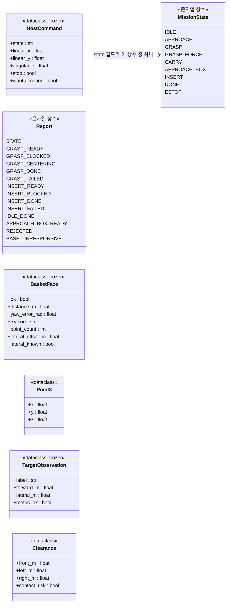
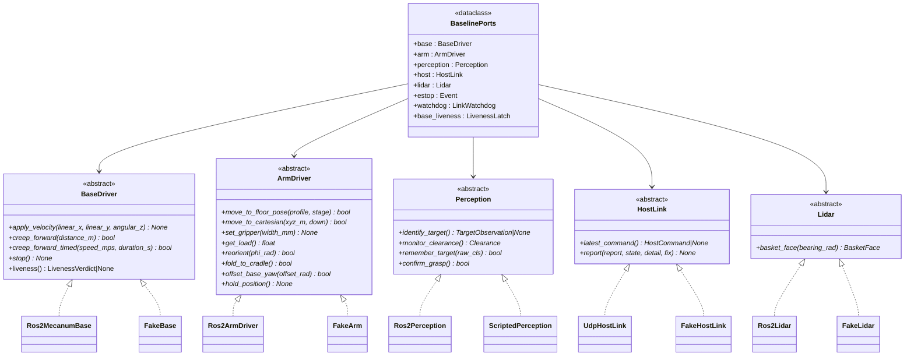
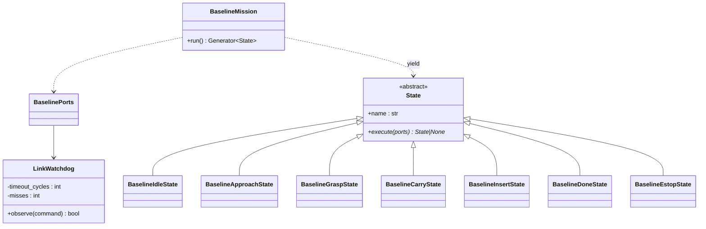
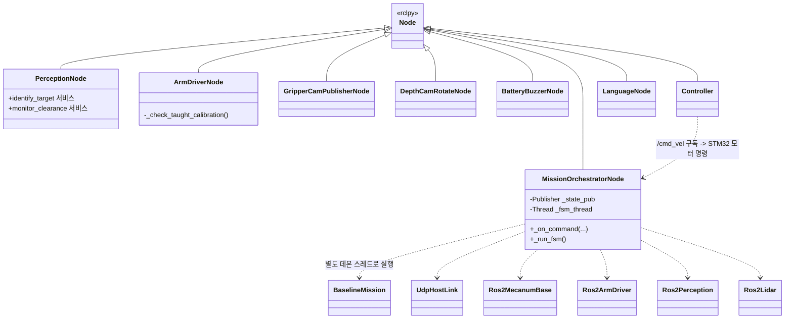

# Class Diagrams

> **상태: 실제 코드 기준으로 전면 재작성 (2026-09-04).** 이 문서가 이전에 그리던 "as-is/to-be"
> 구도(암실 반출 as-is, 장난감 정리 SCAN/SELECT to-be)는 **둘 다 채택되지 않았다.** 팀이
> 2026-08-26에 확정해 실제로 구현·배포한 것은 `domain/task/baseline_mission.py`의
> **Host 지시 실행형 FSM**이다 — 전이 그래프의 단일 소스는
> [`state_machine.md`](state_machine.md)이고, 이 문서는 그 밑을 받치는 값 객체·포트·
> 어댑터·ROS2 노드의 **클래스 구조**만 다룬다.
>
> `domain/values.py`·`domain/ports/perception.py`·`domain/ports/command_interpreter.py`에는
> 이전 SCAN/SELECT 설계가 쓰던 값 객체·포트가 **코드로 여전히 남아 있지만 baseline_mission
> 경로 어디서도 import되지 않는다** — grep으로 확인됨(2026-09-04). 이 문서 §5에서 무엇이
> 죽은 코드인지 밝힌다.

핵심 원칙은 그대로다 — **`domain/` 은 ROS2를 모른다.** `rclpy`, `geometry_msgs`,
`grippers_interfaces` 를 import하는 곳은 `domain/adapters/real/` 과 `ros2_ws/src/grippers_*` 뿐이고,
그 경계에서 `domain.values`/`domain.ports.baseline_ports` 자료형으로 변환한다.

- [1. 값 객체 — 실제 쓰는 것](#1-값-객체--실제-쓰는-것)
- [2. Ports & Adapters](#2-ports--adapters)
- [3. FSM State 계층](#3-fsm-state-계층)
- [4. ROS2 노드 계층](#4-ros2-노드-계층)
- [5. 죽은 코드 — 남아 있지만 baseline이 쓰지 않는 것](#5-죽은-코드--남아-있지만-baseline이-쓰지-않는-것)

---

## 1. 값 객체 — 실제 쓰는 것

`baseline_mission.py`가 실제로 주고받는 자료형은 두 파일에 나뉘어 있다 —
Host↔Pi 링크 자료형은 `domain/ports/baseline_ports.py`, Pi 내부 관측 자료형은
`domain/values.py`(일부)와 `domain/ports/perception.py`.

**좌표가 없다는 것이 이 자료형 집합의 핵심이다.** `HostCommand`에는 Pose도 waypoint도 없고,
Host→Pi로 오는 것은 상태 이름 하나와 속도 셋(`linear_x`/`linear_y`/`angular_z`)뿐이다
(`domain/ports/baseline_ports.py` — 팀 확정, 2026-08-26). `MissionState`·`Report`가
클래스가 아니라 **문자열 상수 모음**인 이유도 이 문서 초판(§1의 `ObjectClass`류 Enum)과
다르다 — 그대로 UDP+JSON과 `MissionState.msg`의 `string state`로 나가야 해서, Enum으로
두면 양쪽에서 직렬화 규약을 따로 맞춰야 한다(`baseline_ports.py` 주석).

`TargetObservation`·`BasketFace`는 Pi 자기 센서가 본 것만 담는다 — Host가 보내주지 않는
"지금 앞에 뭐가 있나"(뎁스캠)·"바구니 정면이 어디 있나"(라이다)를 Pi 스스로 관측해야
하기 때문이다(§2 참고).

**단위 규약은 여전히 필드명에 박혀 있다.** `_m`·`_rad`·`_mm`. `HostCommand`의 속도 필드만
예외적으로 접미사가 없는데, 이는 ROS `geometry_msgs/Twist` 관례(`linear.x` 등)를 그대로
따른 것이다.

---

## 2. Ports & Adapters

`baseline_mission.BaselinePorts`가 실제로 조립하는 포트는 **다섯 종 + 인터럽트 둘**이다.
이전 판(§2 "포트가 4종이 된 이유")의 `CommandInterpreter`는 이 다섯 종에 들어 있지 않다 —
자연어 명령이 baseline 경로에 존재하지 않기 때문이다(§5).

| 계층 | 경로 | ROS2 의존 |
|---|---|---|
| Domain | `domain/task/`, `domain/values.py`(일부) | ❌ |
| Ports (ABC) | `domain/ports/baseline_ports.py`, `base_driver.py`, `arm_driver.py`, `perception.py` | ❌ |
| Real Adapters | `domain/adapters/real/` | ✅ **변환 경계** |
| Fake Adapters | `domain/adapters/fake/` | ❌ (테스트·CI 전용) |

### 왜 좌표 있는 메서드가 사라졌나 (`BaseDriver`)

이전 판(§ "포트가 4종이 된 이유")이 그리던 `drive_to(target)`/`align_to_box(box)`는 전부
없다. 2026-08-26 팀 확정으로 좌표·경로는 전부 Host 소유가 됐고, Pi에 남은 것은 "받은
속도를 낸다"(`apply_velocity`)와 "멈춘다"(`stop`)뿐이다. `creep_forward*`만 예외인데,
이것도 좌표가 아니라 GRASP 파지 시퀀스 전용의 "정지 상태에서 정확히 이만큼만 밀어라"다
(`base_driver.py` 참고).

### `Perception`이 `scan_floor`/`find_box`가 아닌 이유

이전 판의 `scan_floor()`(목록 반환)·`find_box(color)`는 "Pi가 아레나 전체를 봐서 목표를
고른다"는 전제 위에 있었다. 실제 Perception 포트는 **이미 Host가 지시한 목표 하나**를
Pi 자기 뎁스 카메라로 확인만 한다 — `identify_target()`은 라벨 하나와 전방·좌우 거리만
낸다. `remember_target`/`confirm_grasp`은 "그때 거기 있던 게 지금 없다"로 파지 성공을
판정하는 독립 신호쌍이다(`perception.py` 참고, `state_machine.md` §3).

### `HostLink`가 신규 포트다

`CommandInterpreter`가 빠진 자리에 `HostLink`가 들어왔다 — 자연어 대신 Host가 UDP로
보내는 `HostCommand`를 받고 `Report` 상수로 응답하는 양방향 링크다. 좌표·목표 선정이
전부 Host로 넘어간 것과 짝을 이루는 변화다.

### `Lidar`도 신규 포트다

바구니 정면 판정(INSERT 전환 조건) 전용이다. 바닥 물체 회피에는 못 쓴다 — 라이다 평면이
바닥 위 140mm에서 11.3도 아래로 기울어 체스말 위를 지나간다(`lidar.py` 주석,
`grippers-sensor-tilt` 메모리와 일치).

---

## 3. FSM State 계층

전이 그래프는 **[`state_machine.md`](state_machine.md)** 가 단일 소스다. 여기서는
클래스 구조만 다룬다. 이전 판의 13개 State(`ScanState`~`RejectState`)는 전부 사라지고
**7개 State + 1 Ports 데이터클래스 + 2개 헬퍼(카운터) 클래스**로 대체됐다.

### 인스턴스 변수 제약이 사라진 자리

이전 판의 "State당 인스턴스 변수 2개 이하 → `MissionContext` 하나로 묶는다"는 제약과
`ctx` 패턴은 baseline에 없다. `MissionContext`(재시도 카운터·완료 목록을 담는 불변
값 객체) 자체를 baseline이 쓰지 않기 때문이다 — Pi FSM은 한 번에 물체 하나만 알고,
재시도 예산·완료 목록 같은 "여러 물체를 순회하는" 개념 자체가 없다
(`state_machine.md` §1 대비표). 대신 사이클을 건너 들고 다녀야 하는 두 값
(`LinkWatchdog`의 결측 횟수, `base_liveness`의 직전 상태)은 State가 아니라
**`BaselinePorts`가 직접 들고 있다** — State는 전이마다 새로 만들어지지만 이 둘은
미션 전체에 걸쳐 유지돼야 하기 때문이다(`baseline_mission.py` 주석).

`execute()`가 **다음 State 인스턴스(또는 종료 시 `None`)를 반환**하는 체인 구조는
이전 판과 같다. `BaselineDoneState.execute()`만 `None`을 반환한다.

---

## 4. ROS2 노드 계층

| 노드 | 패키지 | 소유 자원 | baseline 연결 |
|---|---|---|---|
| `mission_orchestrator` | `grippers_mission` | 없음(포트만 호출) | FSM 본체, `MultiThreadedExecutor` — E-STOP이 FSM 블로킹 중에도 즉시 들어와야 해서 |
| `perception` | `grippers_perception` | 뎁스 카메라 | `identify_target`/`monitor_clearance`/`remember_target`/`confirm_grasp` 서비스 |
| `arm_driver` | `grippers_arm` | SO-ARM101(Feetech STS3215 ×6) | `move_to_floor_pose`/`get_load` 등. **기동 시 교시 오프셋 대조**(`_check_taught_calibration`) — EEPROM이 다르면 `ArmCalibrationMismatchError`로 기동 자체를 거부 |
| `controller`(`Controller` 클래스) | `driver/controller`(MentorPi 벤더) | `/cmd_vel` 구독 → STM32 모터 명령 | **`/cmd_vel`에 실제로 쓰는 것은 이 노드다** — `Ros2MecanumBase`는 발행만 하고, 이 노드가 없으면 바퀴가 안 돈다(2026-09-08 RUNBOOK §3.5) |
| `gripper_cam_publisher` | `grippers_perception` | 그리퍼캠(USB) | **모니터링 전용** — GRASP 판정에 안 쓴다(2026-09-03, gripper-cam 시도 종료) |
| `depth_cam_rotate` | `grippers_perception` | — | 뎁스 이미지 회전 보정 |
| `battery_buzzer` | `grippers_mission` | STM32 부저 | 저전압 경고. **2026-09-03 알람 로직 자체를 제거**(오탐) — 노드는 남아 있으나 baseline이 알람을 안 낸다 |
| `language`(`LanguageNode`) | `grippers_language` | — | **baseline과 연결 안 됨** — `CommandInterpreter`/`LanguageAdapter`를 쓰는 코드가 어디에도 없음(§5) |

**`Ros2MecanumBase`가 `/cmd_vel`에 publish만 하고, `Controller`(`odom_publisher_node.py`)가
그걸 받아 STM32에 쓴다는 이 두 단계 분리**가 09-08 RUNBOOK의 "모터 컨트롤러를 먼저
띄워야 한다" 경고의 근거다 — `Controller`가 없으면 명령이 구독자 0으로 조용히 버려진다.

---

## 5. 죽은 코드 — 남아 있지만 baseline이 쓰지 않는 것

grep으로 확인(2026-09-04): 아래 값·포트·어댑터를 import하는 곳이
`domain/task/baseline_mission.py` 경로 어디에도 없다. 지우지 않은 이유는 문서에
남아 있지 않아 이 문서에서 확인할 수 없지만, **파지·판정 로직에 아무 영향이 없다**는
점은 이번 재작성으로 확인됐다.

| 이전 판이 다루던 것 | 실제 위치 | baseline에서 |
|---|---|---|
| `ObjectClass`, `Destination`(舊 `BoxColor`), `MissionMode`, `MissionSpec`, `MissionContext` | `domain/values.py` | 미사용 — GRASP 라벨은 문자열(`"queen"`/`"box"`/…)로 `baseline_mission._OBJECT_WIDTH_MM`에서 직접 처리 |
| `Detection`, `BoxObservation` | `domain/values.py` | 미사용 — `Perception.identify_target()`이 `TargetObservation` 하나만 반환 |
| `Perception.scan_floor`/`find_box`/`measure_opening` | `domain/ports/perception.py`에 문서 흔적만 있고 실제 클래스에는 없음 | 애초에 정의 자체가 없음 |
| `CommandInterpreter`, `ScriptedInterpreter`, `LanguageAdapter` | `domain/ports/command_interpreter.py`, `domain/adapters/fake/scripted_interpreter.py` | 포트·어댑터는 존재하나 `BaselinePorts`에 자리가 없어 인스턴스화되는 경로가 없음 |
| `LanguageNode`(ROS2) | `ros2_ws/src/grippers_language/` | 노드는 빌드되나 `mission_orchestrator_node`가 구독하지 않음 |
| `MissionTask`, 13개 舊 State(`ScanState` 등) | 문서에만 존재 — `domain/task/states.py` 자체가 저장소에 없음 | — |

**가장 큰 구조 변화는 [`state_machine.md`](state_machine.md) §5가 이미 기록했다** — Pi가
자율적으로 여러 물체를 스캔·선정·순회하던 설계에서, Host가 모든 지능을 갖고 Pi는
지시를 실행 + 자기 센서 판단만 보고하는 구조로 전환됐다.

---

## 참고

| 문서 | 내용 |
|---|---|
| [`state_machine.md`](state_machine.md) | **FSM 전이 단일 소스** |
| [`sequences.md`](sequences.md) | 시퀀스 다이어그램 |
| [`architecture.puml`](architecture.puml) | 같은 구조의 PlantUML 버전 |
| [`hld.md`](hld.md) | 인터페이스 명세, 미결 사항 |
