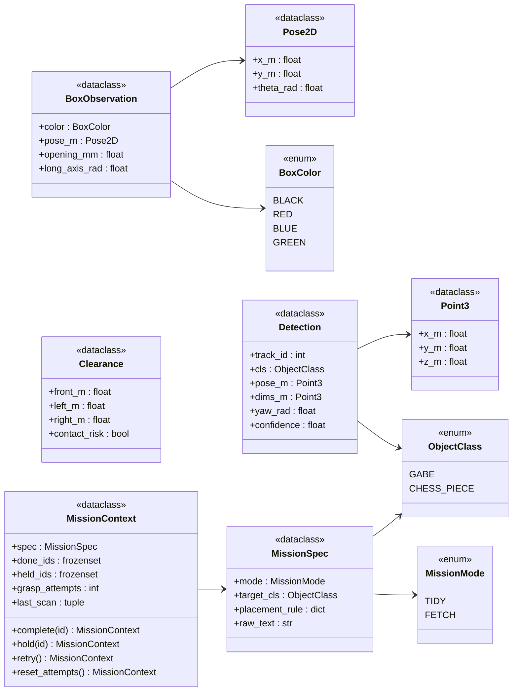
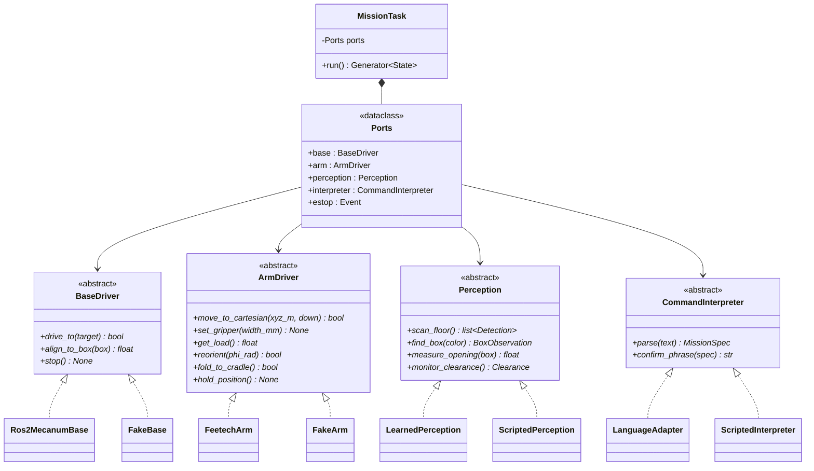
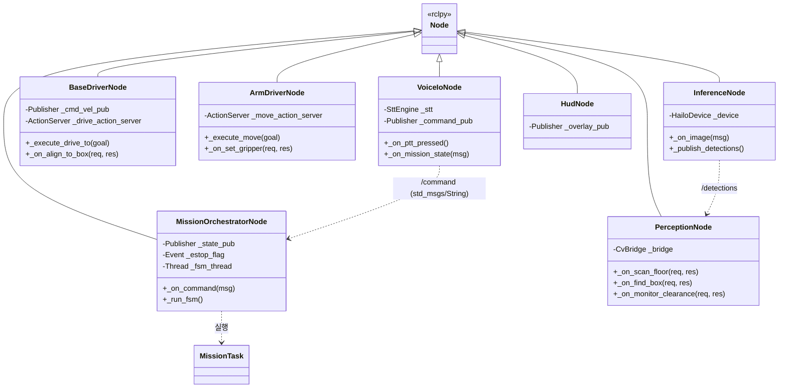

# Class Diagrams

> **읽는 법** — 이 문서는 두 층으로 되어 있습니다.
> **as-is** 는 현재 `main` 브랜치에 실제로 있는 코드, **to-be** 는 장난감 정리 주제 전환 목표입니다.
> to-be 시그니처는 **8/14 freeze 대상**이며 변경은 PR + 3인 합의로만 가능합니다.
> 아직 이 둘은 상당히 다릅니다 — [§5 마이그레이션](#5-마이그레이션-as-is--to-be) 참조.

핵심 원칙은 그대로입니다 — **`domain/` 은 ROS2를 모릅니다.** `rclpy`, `geometry_msgs`,
`grippers_interfaces` 를 import하는 곳은 `domain/adapters/real/` 과 `ros2_ws/src/grippers_*` 뿐이고,
그 경계에서 `domain.values` 로 변환합니다.

- [1. 값 객체](#1-값-객체)
- [2. Ports & Adapters](#2-ports--adapters)
- [3. FSM State 계층](#3-fsm-state-계층)
- [4. ROS2 노드 계층](#4-ros2-노드-계층)
- [5. 마이그레이션 (as-is → to-be)](#5-마이그레이션-as-is--to-be)

---

## 1. 값 객체

주제 전환으로 **가장 많이 늘어난 부분**입니다. 이전에는 대상이 1개였으므로 `detect_target()` 이
튜플 하나를 반환하면 충분했지만, 이제 `scan_floor()` 가 **목록을 반환**하므로 원소 타입이 필요합니다.



> **`ObjectClass` 는 배정된 상자와 1:1입니다.** 상자는 4개지만 **2개는 미배정**입니다.
> `GABE` 안에 정육면체·원기둥·육각기둥·팔각기둥이
> 전부 들어가고, 가베끼리는 구분하지 않습니다 — 같은 상자로 가므로 구분할 이유가 없습니다.
> 마찬가지로 `CHESS_PIECE` 는 기물 종류·색을 구분하지 않습니다.
> **상자를 결정하지 않는 정보는 클래스로 만들지 않는다**가 원칙입니다.

> **`dims_m` 는 단안 추정값입니다.** 모서리 고정 웹캠 + 바닥면 호모그래피로 산출하므로
> **바닥 평면 치수는 실측**이지만 높이(z)는 얻을 수 없습니다. 눕힌 물체는 길이·지름이 모두
> 투영에 나타나고, 세운 물체는 클래스 사전값으로 폴백합니다.

> **⚫ `BLACK` 은 LAB 탐색이 불가능합니다.** 색 성분(`a*` · `b*`)이 모두 0에 가까워
> 명도(`L*`) 임계값에만 의존하게 되며, 그림자와 구분되지 않습니다.
> **밝은 색 테두리 또는 ArUco 마커로 탐색 대상을 대체**해야 합니다 → README 인식 구성 절.

**단위 규약이 필드명에 박혀 있습니다.** `_m` · `_rad` · `_mm`. 이름만 보고 단위를 알 수 없으면
경계에서 변환 사고가 납니다. `opening_mm` 만 mm인 이유는 상자 입구를 mm로 실측하기 때문이고,
`_mm` 접미사는 **길이**에만 쓰며 각도에는 절대 쓰지 않습니다.

`MissionContext` 는 **불변**입니다. `complete()` · `hold()` · `retry()` · `reset_attempts()` 는
새 인스턴스를 반환하고, State가 이걸 다음 State 생성자에 넘깁니다. 재시도 카운터를 가변 필드로
두면 루프 안에서 누가 언제 증가시켰는지 추적이 안 됩니다.

`grasp_attempts` 만 스코프가 **대상 1개**입니다 — `SELECT` 가 새 대상을 고를 때
`reset_attempts()` 로 되돌립니다. 나머지 필드는 미션 전체 스코프입니다
([`state_machine.md` §4](state_machine.md#4-재진입-방지--처리-완료-목록)).

> **미결** — `placement_rule` 의 타입. `dict[ObjectClass, BoxColor]` 가 자연스럽지만
> ROS2 메시지로 넘길 때 dict가 없으므로 `MissionSpec.msg` 에서는 병렬 배열 2개로 평탄화해야 합니다.
> 배포판 확정(#1) 이후 결정.

---

## 2. Ports & Adapters



| 계층 | 경로 | ROS2 의존 |
|---|---|---|
| Domain | `domain/task/`, `domain/values.py` | ❌ |
| Ports (ABC) | `domain/ports/` | ❌ |
| Real Adapters | `domain/adapters/real/` | ✅ **변환 경계** |
| Fake Adapters | `domain/adapters/fake/` | ❌ (CI에서 사용) |

### 포트가 4종이 된 이유

`CommandInterpreter` 는 신규입니다. 이전 주제에서 명령은 미션 시작 시 한 번 들어오는
입력이었으므로 포트일 필요가 없었지만, 새 주제에서는 **자연어가 `placement_rule` 을 실제로 바꿉니다.**

```
"체스말은 검은 상자에 넣어줘"  →  placement_rule[CHESS_PIECE] = BLACK
```

미션 파라미터를 바꾸는 것은 도메인 로직이므로 포트 뒤에 있어야 하고, `ScriptedInterpreter` 로
Fake 대체가 되어야 CI에서 명령 문형 회귀 테스트가 돌아갑니다.

### 음성은 포트가 아닙니다

`voice_io` 노드가 STT 결과를 **기존 명령 토픽에 텍스트로 발행**할 뿐입니다.
도메인 코드는 0줄 바뀝니다. TTS는 `/mission/state` 를 구독합니다.

> Ports & Adapters의 실증 사례로 발표에서 쓸 수 있는 지점입니다 —
> "입력 채널을 하나 추가했는데 도메인 계층 diff가 0줄입니다."

### `set_gripper` 단위 변경 ⚠️

현행 코드는 `set_gripper(deg: float)` 입니다. **`set_gripper(width_mm: float)` 로 바꿔야 합니다.**

단위 규약(README §단위 규약)이 "개구 폭은 mm, 각도 아님"인데 코드가 도(°)를 받고 있어 규약 위반이고,
⌀45 mm 대상을 잡는 프로젝트에서 "몇 도 닫을까"보다 "몇 mm 벌릴까"가 도메인 언어입니다.
서보 각도 변환은 `FeetechArm` 어댑터 내부에서 캘리브레이션 테이블로 처리하세요.
**미결 #4 (엔드이펙터 개구 폭 실측)의 결과가 이 변환 테이블입니다.**

---

## 3. FSM State 계층

전이 그래프는 **[`state_machine.md`](state_machine.md)** 가 단일 소스입니다. 여기서는 클래스 구조만 다룹니다.

```mermaid
classDiagram
    direction TB

    class State {
        <<abstract>>
        +name : str
        +execute(ports)* State
    }

    class IdleState {
        -ctx : MissionContext
    }
    class ScanState {
        -ctx : MissionContext
        -MAX_RESCAN = 3
    }
    class SelectState {
        -ctx : MissionContext
        -detections : list~Detection~
        -_pick(detections) Detection
    }
    class ApproachState {
        -ctx : MissionContext
        -target : Detection
    }
    class GraspState {
        -ctx : MissionContext
        -target : Detection
        -MAX_GRASP_RETRY = 3
        -LOAD_THRESHOLD = 0.15
    }
    class TransportState {
        -ctx : MissionContext
        -target : Detection
    }
    class PosePlanState {
        -ctx : MissionContext
        -_solve_phi(dims_m, opening_mm) float
    }
    class InsertState {
        -ctx : MissionContext
        -phi_rad : float
    }
    class DeliverState {
        -ctx : MissionContext
        -target : Detection
    }
    class HandoverState {
        -ctx : MissionContext
    }
    class RejectState {
        -ctx : MissionContext
        -reason : str
    }
    class DoneState {
        -ctx : MissionContext
    }
    class EstopState

    State <|-- IdleState
    State <|-- ScanState
    State <|-- SelectState
    State <|-- ApproachState
    State <|-- GraspState
    State <|-- TransportState
    State <|-- PosePlanState
    State <|-- InsertState
    State <|-- DeliverState
    State <|-- HandoverState
    State <|-- RejectState
    State <|-- DoneState
    State <|-- EstopState
```



`execute()` 가 **다음 State 인스턴스를 반환**하는 체인 구조는 그대로입니다.
`DoneState.execute()` 만 `None` 을 반환하고, 나머지는 실패해도 `ScanState` 를 반환합니다.

### 인스턴스 변수 2개 제약과 `ctx`

코드 리뷰 제약 "클래스당 인스턴스 변수 2개 이하"를 지키려면 루프에서 넘겨야 할 상태
(모드 · 배치 규칙 · 처리 완료 목록 · 재시도 횟수)를 개별 필드로 둘 수 없습니다.
**`ctx` 하나에 묶어서 각 State는 `ctx` + 작업 대상 1개, 최대 2개**로 맞춥니다.

`MissionContext` 자체는 값 객체(dataclass)이므로 이 제약의 대상이 아닙니다 —
제약은 **행위를 가진 클래스**의 결합도를 낮추기 위한 것입니다.

### `_solve_phi` — 보류 (대상 클래스 미정)

```
H_proj(φ) = L·|cos φ| + w·|sin φ|  ≤  W_open − margin
→ φ ≥ 0.83 rad (48°)   — W_open = 0.40 m 기준
```

> **⚠️ 부등호 방향이 이전과 반대입니다.** 이전 주제는 낮은 개구부 **밑을 지나느라 눕혔고**
> (`φ ≲ 27°`), 지금은 좁은 입구에 **넣느라 세웁니다** (`φ ≥ 48°`). `sin`/`cos` 위치도 바뀝니다.
> 이전 코드의 `_solve_phi` 를 복사해 오면 부호가 틀립니다.

해 구간이 없으면 `RejectState` 를 반환합니다. **이 반환 경로가 유즈케이스 2 그 자체입니다** —
"못 넣습니다"라고 판단하는 능력이 여기 한 줄로 표현됩니다.

`margin` 은 이 프로젝트에서 **유일하게 정직한 학습 적용 지점**입니다 (추정 오차 ↔ 성공률
트레이드오프에 닫힌 해가 없음). 나머지는 전부 닫힌 형태 해입니다. 미결 #7.

---

## 4. ROS2 노드 계층



| 노드 | 소유 자원 | 비고 |
|---|---|---|
| `mission_orchestrator` | 없음 (포트만 호출) | FSM은 **별도 데몬 스레드**, rclpy는 `MultiThreadedExecutor` |
| `perception` | 카메라 | 기하 변환 · 상자 색 탐색(LAB) · 클리어런스 |
| `inference` | **Hailo-10H (AI HAT+ 2)** | 검출 추론 전담. 하드웨어 소유가 분리 근거 |
| `base_driver` | `/cmd_vel` 발행, `/odom` 구독 | **`/cmd_vel` 발행 주체는 이 노드 하나뿐** |
| `arm_driver` | SO-ARM101 (Feetech STS3215 ×6) | 3S LiPo 전원 도메인 |
| `voice_io` | **USB 마이크 · 스피커** | Pi 5에 3.5 mm 잭 없음 → USB 필수 |
| `hud` | 없음 | rviz `MarkerArray` 오버레이 발행 |

**분할 기준은 "동시에 도는가 / 하드웨어를 소유하는가"입니다.** 기능 축이 아닙니다.
`perception` 과 `inference` 를 나눈 것도 기능이 달라서가 아니라 `inference` 가 가속기를
독점하기 때문입니다.

> **AI HAT+ 2 성능 예산 주의** — 40 TOPS는 INT4 LLM/VLM 기준입니다.
> 비전 처리량은 26 TOPS(Hailo-8)급으로 잡으세요. 40을 예산에 쓰면 M2에서 프레임레이트가 안 나옵니다.

### 안전 기본값

`monitor_clearance()` 는 실제 측정이 되기 전까지 **항상 `contact_risk=True` (정지)** 를 반환합니다.
"모르면 멈춘다"가 기본값입니다. `scan_floor()` 는 빈 목록을 반환해 `DONE` 으로 빠지게 하고,
`find_box()` 는 `None` 을 반환해 보류 등록을 유도합니다.

---

## 5. 마이그레이션 (as-is → to-be)

현재 `main` 과 이 문서의 차이입니다. **각 항목이 PR 단위입니다.**

| # | 파일 | 변경 | 규모 |
|---|---|---|---|
| 1 | `domain/values.py` | `Detection` · `BoxObservation` · `Clearance` · `MissionSpec` · `MissionContext` · enum 3종 추가, 필드명에 `_m`/`_rad` 접미사 | **대** |
| 2 | `domain/ports/perception.py` | `detect_target`/`measure_gap`/`set_light_profile` 삭제 → `scan_floor`/`find_box`/`measure_opening` | **대** |
| 3 | `domain/ports/base_driver.py` | `align_to_centerline()` → `align_to_box(box)` | 소 |
| 4 | `domain/ports/arm_driver.py` | `set_gripper(deg)` → `set_gripper(width_mm)`, `reorient`/`fold_to_cradle`/`hold_position` 추가 | 중 |
| 5 | `domain/ports/command_interpreter.py` | **신규 파일** | 중 |
| 6 | `domain/task/states.py` | 전면 재작성 (상태 15개 → 13개, 루프 구조) | **대** |
| 7 | `domain/task/mission_task.py` | `Ports` 에 `interpreter` 추가 | 소 |
| 8 | `domain/adapters/fake/*` | 신규 시그니처 대응, `ScriptedInterpreter` 추가 | 중 |
| 9 | `domain/adapters/real/*` | 신규 시그니처 대응 | 중 |
| 10 | `tests/` | 무한 루프 방지 테스트 신규 | 중 |

**순서 주의** — 1 → 2·3·4·5 → 8 → 6 → 7 → 9 → 10.
값 객체가 먼저 들어가지 않으면 포트 시그니처를 쓸 수 없고, Fake가 먼저 들어가지 않으면
`states.py` 재작성 중에 CI가 계속 빨간불입니다.

**#2 는 배포판 확정(미결 #1) 전에는 머지하지 마세요.** `scan_floor()` 가 목록을 반환하므로
`grippers_interfaces` 에 `Detection.msg` / `DetectionArray.msg` 가 필요하고,
Humble(3.10)과 Jazzy(3.12)는 타입 해시가 달라 통신이 안 됩니다.

---

## 참고

| 문서 | 내용 |
|---|---|
| [`state_machine.md`](state_machine.md) | **FSM 전이 단일 소스** |
| [`sequences.md`](sequences.md) | 시퀀스 다이어그램 |
| [`architecture.puml`](architecture.puml) | 같은 구조의 PlantUML 버전 |
| [`hld.md`](hld.md) | 인터페이스 명세, 미결 사항 |
