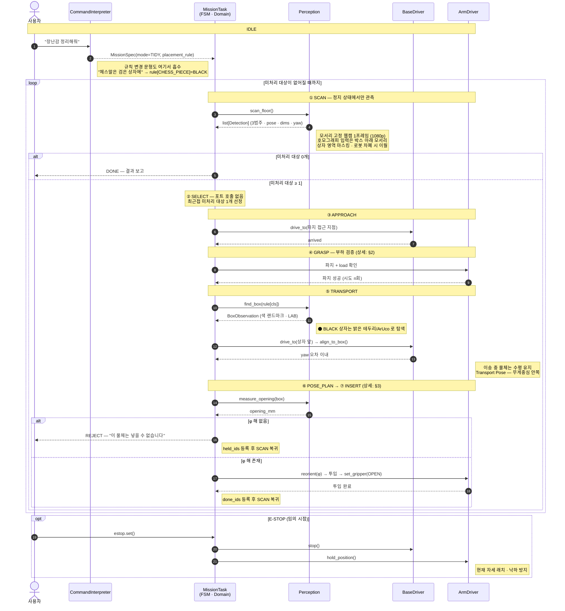
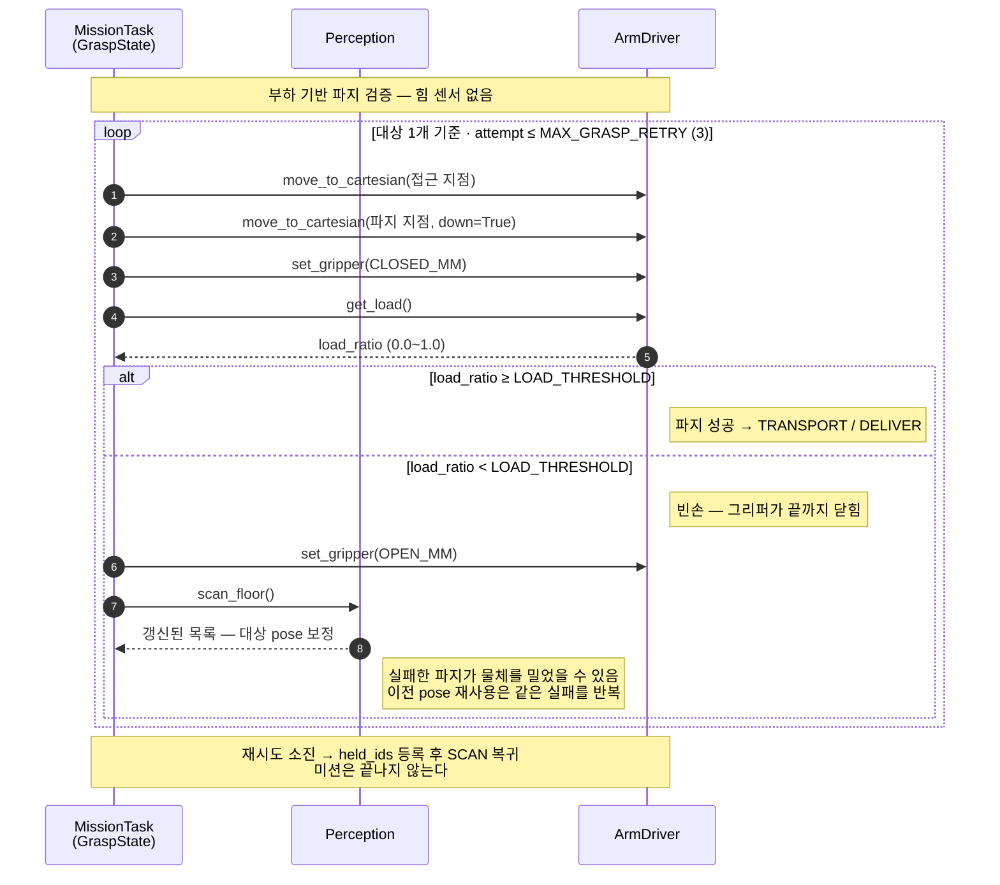
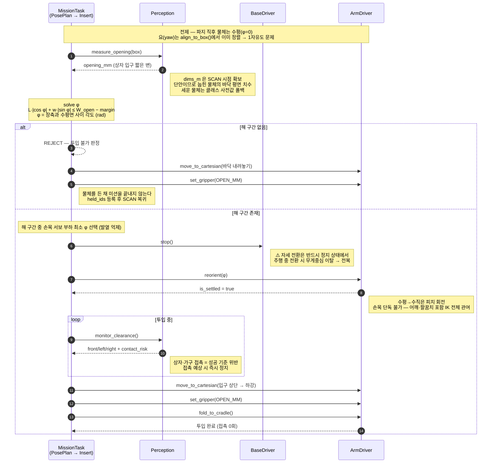
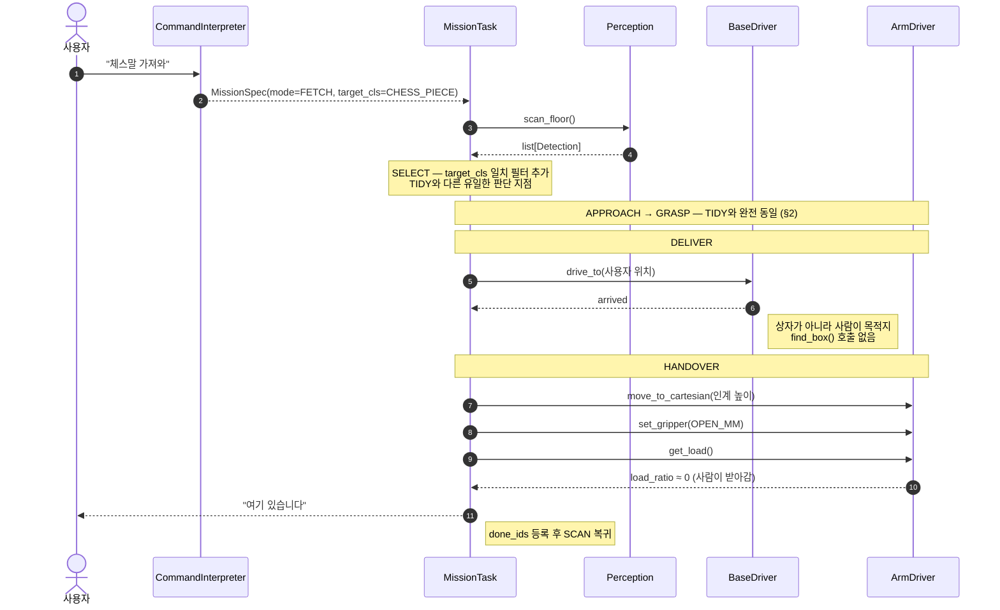
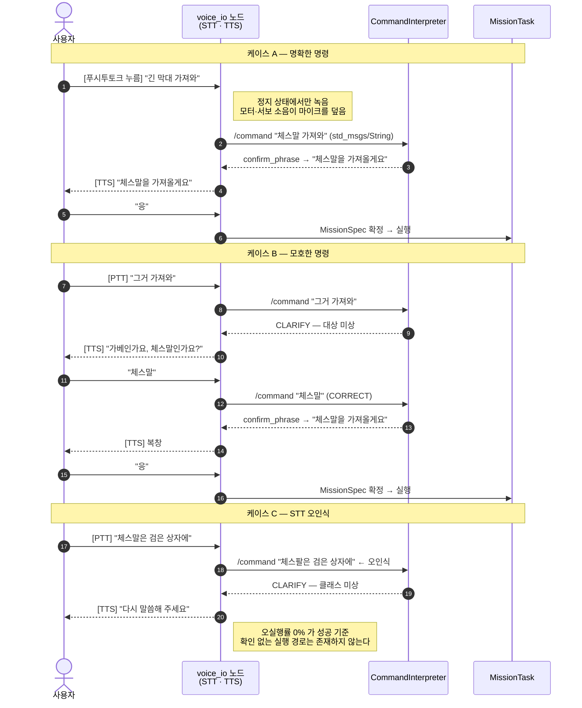

# Sequence Diagrams

> **상태: to-be 설계 (8/14 freeze 대상).** 현재 `main` 코드는 아직 이전 주제 기준입니다.

모든 상호작용은 도메인(`MissionTask`)과 **포트** 사이에서만 일어납니다.
ROS2 노드, Feetech 서보 SDK, OpenCV, Hailo 런타임은 다이어그램에 등장하지 않습니다 —
어댑터 뒤에 숨어 있기 때문입니다. 다이어그램에 `rclpy` 가 보인다면 그건 설계가 샌 것입니다.

- [1. TIDY 전체 루프](#1-tidy-전체-루프)
- [2. 파지 검증 및 자동 재시도](#2-파지-검증-및-자동-재시도)
- [3. 상자 투입 자세 재조정 (⏸ 보류)](#3-상자-투입-자세-재조정--보류)
- [4. FETCH 분기](#4-fetch-분기)
- [5. 음성 명령 — 복창과 되묻기](#5-음성-명령--복창과-되묻기)

---

## 1. TIDY 전체 루프

바닥에 흩어진 N개를 종류별 색 상자에 넣는 기본 미션입니다.
**루프가 핵심**이므로 개별 사이클보다 사이클이 반복되는 구조에 주목하세요.



> **관측은 정지 상태에서만** 합니다. 주행 중 모션 블러와 진동으로 검출 신뢰도가 떨어지고,
> 이는 음성을 정지 상태에서만 녹음하는 것과 같은 원칙입니다 — **자기 소음·자기 진동 배제.**

---

## 2. 파지 검증 및 자동 재시도

그리퍼를 닫은 뒤 **서보 부하값으로 물체 유무를 판정**합니다.
별도 힘/토크 센서 없이 폐루프를 구성하는 것이 핵심입니다.



| 항목 | 내용 |
|---|---|
| 감지 방식 | 그리퍼 서보(id6) 부하 비율 `load_ratio` |
| 값의 범위 | **0.0~1.0 정규화 비율.** 서보 원시값(STS3215 `PRESENT_LOAD` = 0~1023)을 `abs(raw)/1023` 으로 바꾸는 것은 `arm_driver_node` 의 몫입니다 — 서보 각도 변환과 같은 이유입니다(`class_diagram.md` §2). 부호(0x400 비트)는 방향인데 실측에서 일관되지 않아(같은 '빈 채'가 −88 로도 +124 로도) 버립니다 |
| 임계값 | **`LOAD_THRESHOLD = 0.04`** — 실측(2026-08-18, n=25, 정착 후) 두 분포 사이. 아래 표 참조 |
| 정착 대기 | **`GRASP_SETTLE_SEC = 1.5`** (노드). 정착 전에는 빈 채와 물체가 모두 포화값(±500)이라 구분이 불가능합니다 |
| 재시도 상한 | `MAX_GRASP_RETRY = 3` — **대상 1개당**. `SELECT` 가 새 대상을 고를 때 예산을 되돌립니다 (`state_machine.md` §3) |
| 실패 시 동작 | 개방 → **재스캔** → 보정된 pose로 재시도 |
| 소진 시 | `held_ids` 등록 → `SCAN` 복귀 (**미션 계속**) |

> **선형 FSM과의 결정적 차이가 마지막 줄입니다.** 이전에는 `GraspFailedState` 가 `None` 을 반환해
> 미션이 종료됐습니다. 지금은 실패한 물체를 보류하고 다음 물체로 갑니다 — **유즈케이스 3.**

### 부하 임계값 실측 (2026-08-18, n=25)

정착 2초 후 · 절대값 기준. 정규화는 `raw / 1023`.

| 상황 | raw | 정규화 |
|---|---|---|
| 빈 채 / 파지 실패(놓침) | 28, 32 | 0.027 ~ 0.031 |
| 체스말(나이트·룩) | 48 ~ 124 | 0.047 ~ 0.121 |
| 가베(정육면체) | 140 (5/5 일관) | 0.137 |
| 체스말(퀸, 유선형이라 불안정) | 32(놓침) 또는 160 ~ 168 | 0.031 / 0.156 ~ 0.164 |

**빈 채 최대 0.031 < `LOAD_THRESHOLD` = 0.04 < 파지 성공 최소 0.047.**
⚠️ 여유가 크지 않습니다 — raw 기준 32 대 48로 **16틱** 차이입니다. 파지 대상 클래스가
추가되면 재측정해야 합니다.

> **이전 값 `0.15` 는 어떤 물체도 넘지 못했습니다** — 가베조차 0.137 로 미달이라 실기에서
> 파지 판정이 항상 실패했습니다. 여기에 real 어댑터가 정규화하지 않은 원시값(−88, 124)을
> 돌려주고 Fake 는 0~1 값을 돌려주던 계약 분기가 겹쳐, **CI는 통과하는데 실기만 실패하는**
> 상태였습니다.

### 정착 시간 실측

닫힘 명령 후 시간별 부하:

| 경과 | 부하 | 판정 가능? |
|---|---|---|
| 0.26 ~ 0.51s | 500 (포화) | ❌ 이동 중 — 빈 채/물체 동일 |
| 0.77s | 거의 안정 | △ |
| 1.03s 이후 | 완전 고정 (10초까지 한 틱도 변화 없음) | ✅ |

`set_gripper` 가 위치를 명령한 뒤 `GRASP_SETTLE_SEC` 만큼 기다린 다음 응답합니다.
**타이밍 지식은 노드에 둡니다** — `GraspState` 에 `sleep` 을 넣으면 도메인이 서보 물리를
알게 됩니다. `GraspState` 는 `set_gripper()` 응답을 쓰지 않고 `get_load()` 를 따로 부르지만,
`set_gripper` 가 정착까지 붙들고 있으므로 그 다음 호출이 정착 후 값을 읽습니다.

---

## 3. 상자 투입 자세 재조정 (⏸ 보류)

긴 막대(L=0.50 m)를 좁은 상자 입구(W_open=0.40 m)에 넣으려면 **세워야** 합니다.
프로젝트에서 유일하게 닫힌 형태 해가 있는 기하 계획이자, 시연의 하이라이트입니다.



### 자세 계획

```
H_proj(φ) = L·|cos φ| + w·|sin φ|   ≤   W_open − margin

  L      = 0.50 m   막대 길이 (추정값, SCAN에서 측정)
  w      = 0.045 m  지름 (추정값)
  W_open = 0.40 m   상자 입구 짧은 변 (미결 #8 — 발주 후 실측)
  margin = 0.03 m   안전 여유 (미결 #7 — 고정 / 학습)
  φ      = 장축과 수평면 사이 각도 (rad), 파지 직후 0°

→ φ ≥ 0.83 rad (48°)
```

| W_open | 최소 φ |
|---|---|
| 0.35 m | 55.5° |
| 0.40 m | 47.7° |
| 0.45 m | 41.8° |

> **⚠️ 이전 주제와 부등호가 반대입니다.** 암실 시나리오는 낮은 개구부 **밑을 지나느라 눕혔고**
> (`sin`/`cos` 위치가 반대, `φ ≲ 27°`), 지금은 좁은 입구에 **넣느라 세웁니다.**
> 수식 계열은 같지만 코드를 복사하면 부호가 틀립니다.

> [!NOTE]
> **이 시퀀스는 현재 보류 상태입니다.** 긴 물체가 정리 대상에서 제외되어 자세 재조정을
> 실행할 클래스가 없습니다. 가베·체스말은 모두 `φ=0` 으로 통과합니다.
> 미배정 상자에 긴 물체를 배정하면 즉시 되살아나므로 시퀀스는 그대로 보존합니다.

---

## 4. FETCH 분기

TIDY와 **같은 하드웨어·같은 포트·같은 파지 로직**을 씁니다. 파지 이후 목적지 결정에서만 갈라집니다.



**분기점은 `GraspState.execute()` 의 마지막 한 줄입니다.**

```python
return TransportState(...) if self.ctx.spec.mode is MissionMode.TIDY else DeliverState(...)
```

> 두 모드가 공유하는 코드량이 이렇게 큰 것은 설계 의도입니다.
> 모드가 늘어도 파지 로직은 한 곳에만 있습니다.

---

## 5. 음성 명령 — 복창과 되묻기

**도메인 코드는 0줄 바뀝니다.** `voice_io` 노드가 기존 명령 토픽에 텍스트를 발행할 뿐입니다.



| 항목 | 결정 | 이유 |
|---|---|---|
| 푸시투토크 | ✅ 채택 | 로봇 소음이 마이크를 덮음, 시연장 오인식 방지 |
| 웨이크워드 상시 대기 | ❌ 미채택 | 위와 동일 + 시연 통제 |
| 녹음 시점 | **정지 상태에서만** | 자기 소음 배제 (관측과 동일 원칙) |
| 실행 전 복창 | ✅ 필수 | STT는 반드시 틀림 |
| 텍스트 폴백 | ✅ 유지 | 음성만 되는 상태를 만들지 않음 |

> **비전공자가 가장 크게 반응하는 장면은 로봇이 되묻는 순간입니다.**
> 기존 `CLARIFY` → `CORRECT` 문형이 그대로 음성 대화가 되므로,
> 명령 해석 로직을 새로 만드는 게 아니라 입출력 채널만 붙이면 됩니다.

---

## 참고

| 문서 | 내용 |
|---|---|
| [`state_machine.md`](state_machine.md) | **FSM 전이 단일 소스** |
| [`class_diagram.md`](class_diagram.md) | 포트 시그니처, 값 객체 |
