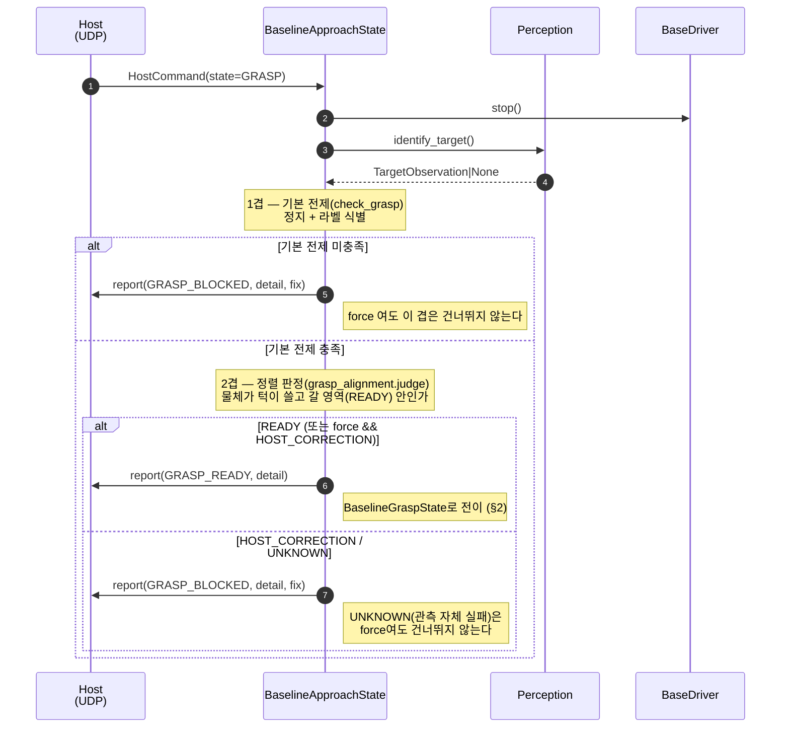
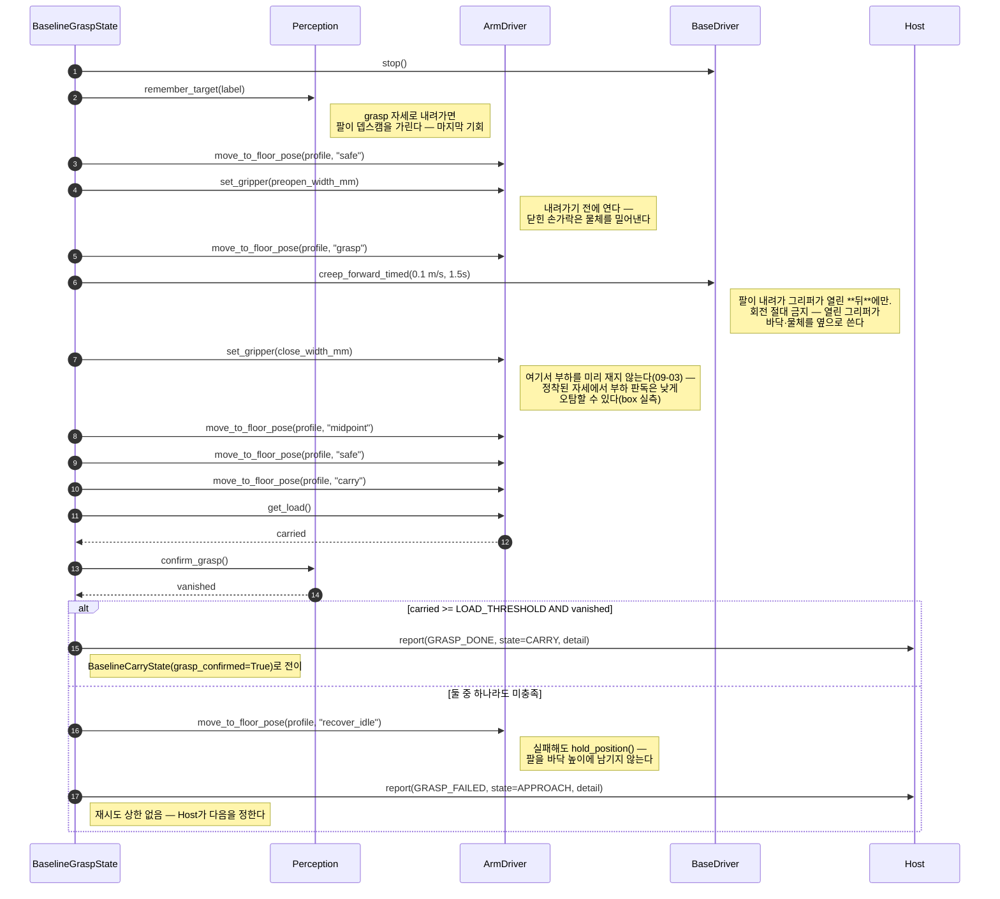
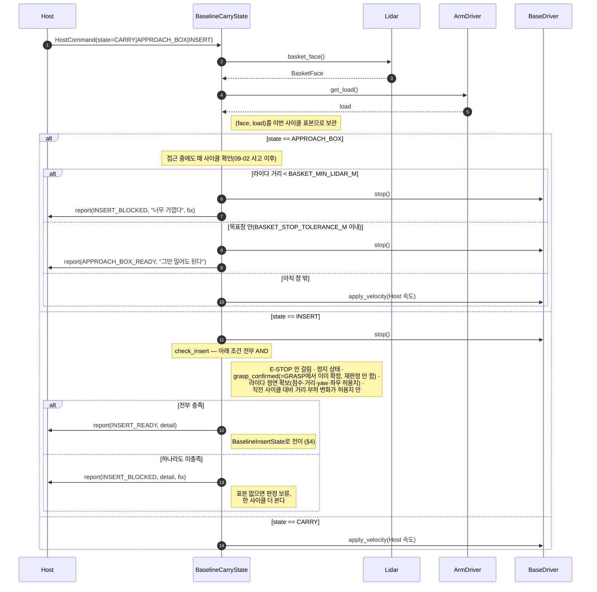
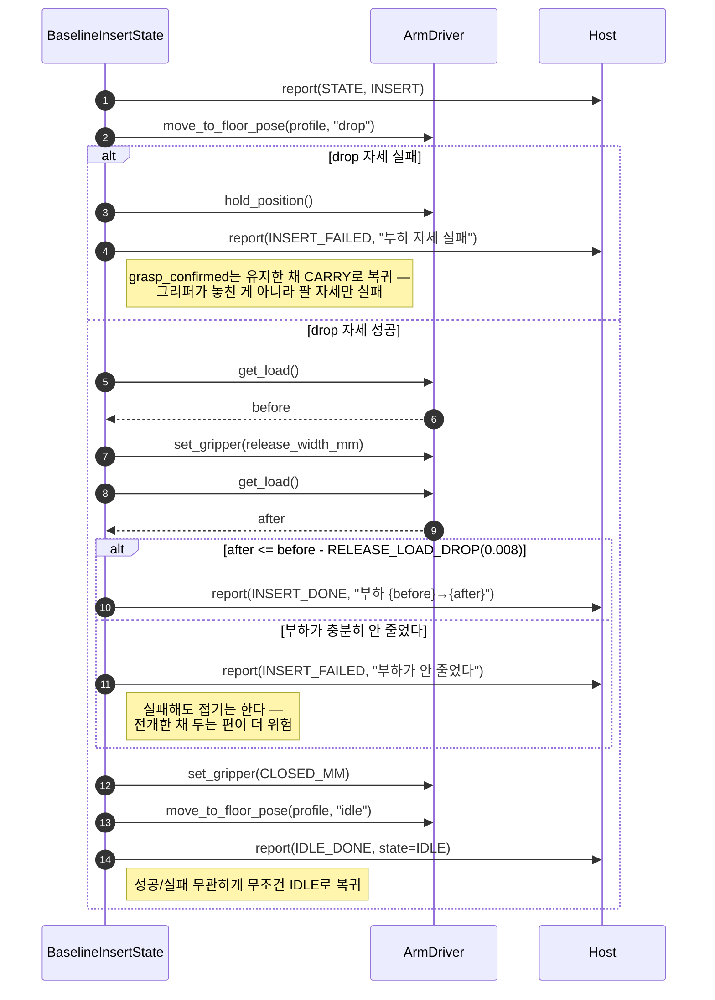
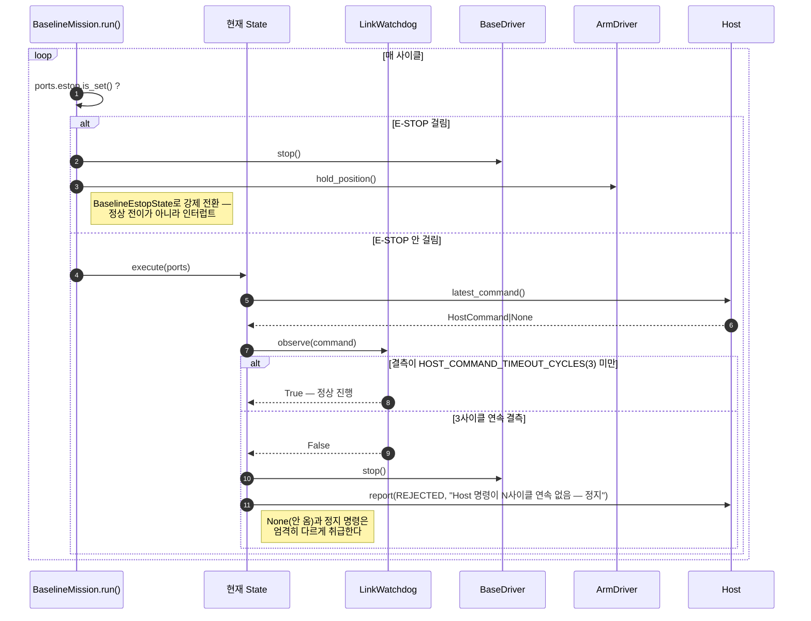

# Sequence Diagrams

> **상태: 실제 코드 기준으로 전면 재작성 (2026-09-04).** 이 문서가 이전에 그리던 TIDY/FETCH
> 루프(자연어 명령 → `CommandInterpreter` → `scan_floor`/`SELECT` → `TRANSPORT`/`POSE_PLAN` →
> `DELIVER`/`HANDOVER`, 8/14 freeze 목표)는 **채택되지 않았다.** 실제로 팀이 확정해 구현한
> 것은 `domain/task/baseline_mission.py`의 Host 지시 실행형 FSM이다. 전이 그래프의 단일
> 소스는 [`state_machine.md`](state_machine.md)이고, 이 문서는 그 상태들 **내부에서** 포트를
> 어떤 순서로 부르는지만 다룬다.

모든 상호작용은 도메인(`BaselineMission`)과 **포트**(`BaselinePorts`: `host`·`base`·`arm`·
`perception`·`lidar`) 사이에서만 일어난다. ROS2 노드, Feetech 서보 SDK, UDP 소켓은
다이어그램에 등장하지 않는다 — 어댑터 뒤에 숨어 있기 때문이다.

- [1. APPROACH — GRASP 조건 판정](#1-approach--grasp-조건-판정)
- [2. GRASP — 파지 시퀀스 (execute 1회로 끝까지)](#2-grasp--파지-시퀀스-execute-1회로-끝까지)
- [3. CARRY — INSERT 조건 판정](#3-carry--insert-조건-판정)
- [4. INSERT — 투하 시퀀스](#4-insert--투하-시퀀스)
- [5. 공통 인터럽트 — E-STOP · LinkWatchdog](#5-공통-인터럽트--e-stop--linkwatchdog)

---

## 1. APPROACH — GRASP 조건 판정

Host가 `state=GRASP`(또는 `GRASP_FORCE`)를 보내는 순간 시작된다. 판정은 두 겹이고,
어느 하나라도 막히면 **그 자리에 머물며** Host에 보정값을 실어 보낸다 — Pi가 스스로
자세를 고치지 않는다.

**이 판정 한 번에 약 1.7초가 든다**(오검출을 거르는 5프레임 합의 × 프레임당 CPU 추론
0.3초). 그동안 Host 명령을 읽지도 보고하지도 않는다 — 워치독은 "명령이 안 온 것"과
"안 읽은 것"을 구분하므로 여기서는 안 걸리지만, **Host 쪽 타임아웃은 이보다 넉넉해야
한다**(`baseline_mission.py` 주석).

---

## 2. GRASP — 파지 시퀀스 (execute 1회로 끝까지)

`BaselineGraspState.execute()` 한 번 안에서 순서대로 진행한다. Host 명령을 중간에 읽지
않는다 — 이 상태에 있는 동안 Host는 다음 지시를 낼 수 없다.

**AND 판정의 이력이 중요하다** — 2026-08-26~09-01엔 AND, 09-01 rook 뎁스 오탐으로 OR로
완화, 09-03 star/box가 반대 방향(부하만 낮게 오탐)을 내면서 다시 AND로 돌아왔다. 두 신호
모두 근접 상황에서 개별적으로 흔들릴 수 있다는 뜻이라, 어느 한쪽만 믿는 설계는 이미 두
번 실패했다(`baseline_mission.py` GRASP 판정부 주석 전문 참고).

---

## 3. CARRY — INSERT 조건 판정

CARRY는 매 사이클 라이다와 부하를 떠 둔다 — INSERT 판정이 "직전 사이클 대비 안정적인가"를
보려면 비교할 표본이 이미 있어야 왕복이 한 번 줄기 때문이다.

**`grasp_confirmed`를 여기서 raw 부하로 다시 재지 않는다.** GRASP가 CARRY 진입 시점에
이미 내린 판정(§2)을 그대로 믿는다 — box처럼 부하가 계속 낮게 읽히는 물체에서 재판정이
영원히 막히는 사고가 2026-09-03에 있었다(`baseline_mission.py` 주석).

---

## 4. INSERT — 투하 시퀀스

바닥 파지 높이로 내려가지 않는다. 실측 DROP 자세로 직접 전개한 뒤 그리퍼를 열고,
**부하 변화량**으로 놓임을 판정한다 — 별도 힘 센서가 없다.

**`RELEASE_LOAD_DROP = 0.008`은 실측 2건(둘 다 실제 성공, 감소폭 0.0313·0.0117)에서
역산한 임시치다** — 실패(안 떨어짐) 사례가 아직 실측된 적이 없어 정확한 경계는 여전히
미실측이다. 옛 문턱 0.015는 2026-09-03 queen의 실제 성공(감소폭 0.0117)을 실패로
오판했다(`baseline_mission.py` `BaselineInsertState` docstring).

---

## 5. 공통 인터럽트 — E-STOP · LinkWatchdog

전이 그래프에는 등장하지 않는(`state_machine.md` §2 참고) 두 인터럽트다. 어느 State의
`execute()` 안에서도 같은 방식으로 작동한다.

---

## 참고

| 문서 | 내용 |
|---|---|
| [`state_machine.md`](state_machine.md) | **FSM 전이 단일 소스** |
| [`class_diagram.md`](class_diagram.md) | 포트 시그니처, 값 객체, ROS2 노드 계층 |
| [`architecture.puml`](architecture.puml) | 같은 구조의 PlantUML 버전 |
