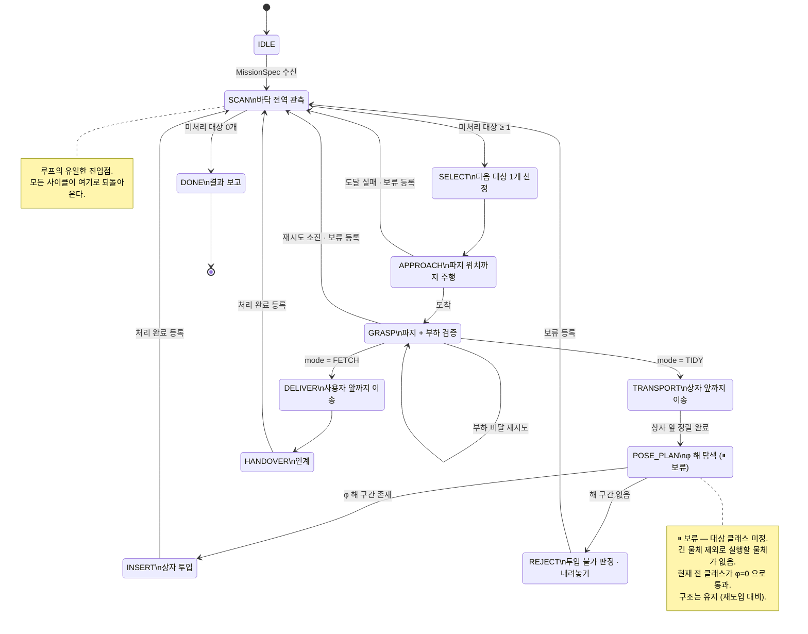

# State Machine

> **상태: to-be 설계 (8/14 freeze 대상).** 현재 `domain/task/states.py` 는 아직 이전 주제(암실 반출)
> 기준의 선형 10단계 FSM입니다. 이 문서는 장난감 정리 주제로의 전환 목표를 정의하며,
> 코드와의 차이는 [§5 as-is 대비표](#5-as-is-대비표)에 명시했습니다.

FSM 상태 전이의 **단일 소스**입니다. `hld.md` · `class_diagram.md` · `sequences.md` 는
전이 그래프를 중복 정의하지 말고 이 문서를 참조하세요.

- [1. 핵심 — 루프 구조](#1-핵심--루프-구조)
- [2. 전이 그래프](#2-전이-그래프)
- [3. 상태별 계약](#3-상태별-계약)
- [4. 재진입 방지 — 처리 완료 목록](#4-재진입-방지--처리-완료-목록)
- [5. as-is 대비표](#5-as-is-대비표)

---

## 1. 핵심 — 루프 구조

이전 주제의 FSM은 **선형**이었습니다. 한 번 실행하면 끝났고, 어느 단계에서 실패하든 미션이 종료됐습니다.

새 FSM은 **`SCAN` 으로 되돌아오는 루프**입니다. 이 차이가 프로젝트의 성격을 바꿉니다.

| | 선형 FSM (이전) | 루프 FSM (현재) |
|---|---|---|
| 대상 | 1개, 위치 사전 고지 | N개, 매 사이클 재관측 |
| 실패 | 미션 종료 | 다음 물체로 진행 |
| 종료 조건 | 마지막 단계 도달 | **관측 결과 남은 대상 없음** |
| 상태 공간 | 알고 있음 | 로봇 자신의 행동으로 변함 |

> **왜 루프가 정당화 근거인가** — 정리 과제는 목표 상태가 목록으로 주어지지 않습니다.
> 로봇이 물체 하나를 상자에 넣으면 바닥 상태가 바뀌고, 그 결과를 다시 관측해야 다음 행동을
> 결정할 수 있습니다. 선형 FSM으로는 "대본 실행"과 구분되지 않지만, 루프는 **관측 → 판단 → 행동**이
> 매 사이클 닫힌다는 것을 구조로 보여줍니다.

---

## 2. 전이 그래프



**E-STOP 은 전이 그래프에 넣지 않습니다.** 어느 상태에서든 `ports.estop.is_set()` 이 참이면
`MissionTask.run()` 이 다음 `execute()` 호출 전에 `EstopState` 로 갈아치우는 **인터럽트**이지,
정상 전이가 아닙니다. 그래프에 그리면 모든 노드에서 화살표가 나가 가독성만 해칩니다.

---

## 3. 상태별 계약

| 상태 | 호출하는 포트 | 성공 시 다음 | 실패 시 다음 |
|---|---|---|---|
| `IDLE` | `interpreter.parse()` | `SCAN` | 대기 유지 — `raw_text` 없음 · **해석 실패(`None`)** |
| `SCAN` | `perception.scan_floor()` | 대상 有 → `SELECT` / 無 → `DONE` | 재스캔 (n < 3) |
| `SELECT` | — (순수 판단) | `APPROACH` | `DONE` |
| `APPROACH` | `base.drive_to()` | `GRASP` | `SCAN` (보류) |
| `GRASP` | `arm.move_to_cartesian()` · `set_gripper()` · `get_load()` | `TRANSPORT` / `DELIVER` | 자기 자신 → `SCAN` |
| `TRANSPORT` | `perception.find_box()` · `base.drive_to()` · `base.align_to_box()` | `POSE_PLAN` | `SCAN` (보류) — 상자 미발견 · 주행 실패 · **정렬 오차 초과** |
| `POSE_PLAN` | `perception.measure_opening()` | `INSERT` | `REJECT` |
| `INSERT` | `arm.reorient()` · `move_to_cartesian()` · `set_gripper()` | `SCAN` (완료) | `SCAN` (보류) |
| `DELIVER` | `base.drive_to()` | `HANDOVER` | `SCAN` (보류) |
| `HANDOVER` | `arm.set_gripper()` · `get_load()` | `SCAN` (완료) | 대기 |
| `REJECT` | `arm.move_to_cartesian()` · `set_gripper()` | `SCAN` (보류) | `SCAN` |
| `DONE` | — | `None` (종료) | — |

### `IDLE` 의 대기 조건

`parse()` 는 등록되지 않은 문형에 **`None`** 을 돌려줍니다 (`command_interpreter.py` 포트 계약,
real 구현도 `understood=False` 면 같습니다). 이때 **미션은 시작되지 않고 `IDLE` 을 유지**합니다 —
`raw_text` 가 비어 있을 때와 같은 자리입니다. "해석 실패" 상태를 따로 만들지 않는 이유는
로봇이 할 일이 양쪽 모두 동일하기 때문입니다: 다음 명령을 기다립니다.

> **`MissionContext(spec=None)` 을 만들어 넘기면 안 됩니다.** `SCAN` 은 `spec` 을 읽지 않아
> 그대로 통과하고, `SELECT` 가 `spec.placement_rule` 을 읽는 순간 `AttributeError` 로
> **FSM 스레드가 죽습니다.** Fake가 `ValueError` 를 던지던 동안에는 예외가 `IDLE` 에서 즉시
> 터져 나가 이 경로가 보이지 않았습니다 — Fake를 계약(`None`)에 맞춘 PR #138 이 드러냈고,
> real 구현도 같은 값을 돌려주므로 **실기에도 있던 결함**입니다.

### `SELECT` 의 선정 기준

순수 판단 상태입니다 — 포트를 호출하지 않고 `SCAN` 결과만으로 결정합니다. 테스트가 쉬운 이유이기도 합니다.

```
1. 보류/완료 목록에 없을 것
2. placement_rule 에 목적지가 정의되어 있을 것
3. (FETCH 모드) spec.target_class 와 일치할 것
4. 위 조건을 만족하는 것 중 base_link 로부터 최단 거리
```

**선정과 동시에 `grasp_attempts` 를 0으로 리셋합니다.** 재시도 예산은 **대상 1개 기준**이며
미션 전체 누적이 아닙니다 (§4 참조).

> **사전 필터는 넣지 않습니다.** `dims` 만으로 φ 해가 없다는 걸 파지 전에 알 수도 있지만,
> 그러면 유즈케이스 2(투입 불가 판정 후 거부)가 "치수 비교 한 줄"로 축소됩니다.
> 실측(`measure_opening()`) 기반으로 `POSE_PLAN` 에서 판정하는 쪽이 검증하는 능력이 실제로 있고,
> 시연에서도 로봇이 시도한 뒤 판단하는 장면이 나옵니다.

### `GRASP` 재시도

재시도는 상태 변경이 아니라 **새 인스턴스 반환**으로 표현합니다 (현행 코드 관례 유지).

```python
# SelectState — 새 대상을 잡을 때마다 예산을 되돌린다
def execute(self, ports):
    target = self._pick(self.detections)
    if target is None:
        return DoneState(self.ctx)
    return ApproachState(self.ctx.reset_attempts(), target)


# GraspState — 예산 안에서만 재시도한다
def execute(self, ports):
    ...
    if ports.arm.get_load() < LOAD_THRESHOLD:
        if self.ctx.grasp_attempts >= MAX_GRASP_RETRY:
            return ScanState(self.ctx.hold(self.target.track_id))
        ports.arm.set_gripper(OPEN_MM)
        return GraspState(self.ctx.retry(), self.target)
    ...
```

> **`GraspState` 에서 리셋하면 안 됩니다.** `GRASP` 는 재시도할 때마다 자기 자신을 새로
> 만들므로, 여기서 되돌리면 카운터가 영원히 0에 머물러 무한 재시도가 됩니다.
> 되돌리는 자리는 **대상이 바뀌는 유일한 지점인 `SELECT`** 하나입니다.

> **리셋이 없으면 두 번째 물체부터 재시도가 0회가 됩니다.** `grasp_attempts` 가 미션 전체
> 누적이 되어, 첫 물체가 예산을 소진하면 이후 물체는 **첫 시도 실패 = 즉시 영구 보류**입니다.
> as-is(암실 반출)는 물체 1개 · 선형 FSM이라 "미션 누적"과 "대상별"이 같은 값이었지만,
> 루프 FSM에서는 갈라집니다. `failure_definition.md` §3의 "재시도 후 성공은 실패가 아니다"가
> 두 번째 물체부터 성립하지 않게 되므로, **측정(M4 · 20 인스턴스)이 통째로 무효가 됩니다.**

### `TRANSPORT` 의 정렬 판정

`align_to_box()` 는 정렬 후 **yaw 오차(rad)** 를 반환합니다. 이 값은 **판정 대상**이며,
`ALIGN_TOLERANCE_RAD` 를 넘으면 상자 앞에 서지 못한 것이므로 `POSE_PLAN` 으로 진행하지 않고
대상을 보류 등록한 뒤 `SCAN` 으로 복귀합니다 ([`hld.md` §6.4 #10](hld.md#64-구현과-설계의-차이--해소-필요)).

```python
# TransportState — 부호는 정렬 방향일 뿐이라 크기만 본다
yaw_error_rad = ports.base.align_to_box(box)
if abs(yaw_error_rad) > ALIGN_TOLERANCE_RAD:
    return ScanState(self.ctx.hold(self.target.track_id))
return PosePlanState(self.ctx, self.target, box)
```

> **`math.isinf()` 로 좁히면 안 됩니다.** 포트가 정렬 실패를
> `ALIGN_FAILED_YAW_ERROR_RAD`(무한대)로 표현하는 것은 **어떤 임계값과 비교해도 실패로
> 남기 위해서**이지, 무한대만 검사하라는 뜻이 아닙니다. 그렇게 좁히면 '정렬은 됐지만 오차가
> 큰' 경우가 그대로 투입까지 흘러가, 포트가 두 상황을 다른 값으로 구분해 돌려주는 이유가
> 사라집니다.

`ALIGN_TOLERANCE_RAD` 는 **미실측 상수**입니다 (`states.py` 미실측 상수 블록, 현재 0.05 rad ≈ 2.9°
자리 표시자). 실제 값은 상자 입구 여유폭과 투입 지점 IK 오차로 결정되므로 미결 #4·#7 실측과
함께 잡아야 합니다.

---

## 4. 재진입 방지 — 처리 완료 목록

**루프 구조의 최대 리스크는 무한 루프입니다.** 상자에 넣은 물체를 다시 검출하거나,
파지에 실패한 물체를 계속 재선택하면 미션이 끝나지 않습니다.

`MissionContext` 가 사이클을 건너 상태를 나릅니다. **스코프가 항목마다 다릅니다.**

| 항목 | 스코프 | 등록·갱신 시점 | 의미 |
|---|---|---|---|
| `done_ids` | 미션 | `INSERT` / `HANDOVER` 성공 | 다시 선택하지 않음 |
| `held_ids` | 미션 | `APPROACH` / `GRASP` / `TRANSPORT` 실패, `REJECT` | 이번 미션에서 제외 |
| `grasp_attempts` | **대상 1개** | `GRASP` 실패 시 +1 · **`SELECT` 에서 0으로 리셋** | 남은 재시도 예산 |
| `last_scan` | 미션 | `SCAN` 진입 시 | 무변화 감지 비교 기준 — **후보 `track_id` 집합**의 연속 관측 이력 |

> **`grasp_attempts` 만 스코프가 다릅니다.** 미션 누적으로 두면 첫 물체가 예산을 소진한 뒤
> 나머지 물체가 전부 첫 시도에서 영구 보류됩니다. 리셋 자리는 §3 `GRASP` 재시도 참조.

추가 방어선 2종:

- **상자 영역 마스킹** — `scan_floor()` 가 상자 내부 영역의 검출을 필터링
- **`SCAN` 무변화 감지** — 진전이 없으면 `DONE`. 비교 대상은 `scan_floor()` 결과 전체가 아니라
  **`SELECT` 가 실제로 고를 수 있는 후보의 `track_id` 집합**이며, 그 집합이
  `SCAN_NO_CHANGE_LIMIT`(= 2) 사이클 연속 동일할 때 발동합니다 (이슈 #131 에서 정정).

### `SCAN` 무변화 감지 — 비교 대상이 후보 집합인 이유

관측 목록 전체를 값 비교하던 이전 구현은 **두 방향으로 동시에 어긋나 있었습니다.**

| 환경 | 이전 구현의 증상 |
|---|---|
| Fake · 테스트 | **과잉 발동.** 보류된 물체도 바닥에는 그대로 남아 있어 다음 사이클의 관측 목록이 같아집니다 — 진전이 가능한데도 `DONE` 으로 끊겨, 물체 3개 중 2·3번이 한 번도 선택되지 않았습니다 |
| 실기 | **절대 발동 안 함.** `Detection` 이 `pose_m`·`confidence` 까지 값 비교라, 카메라 노이즈가 있는 이상 두 프레임이 완전히 일치할 수 없습니다 — 2차 방어선이 사실상 없었습니다 |

후보 집합 비교는 양쪽을 동시에 해소합니다. 물체가 보류·완료되면 후보가 줄어 **진전으로 정상
인식**되고, `track_id` 는 정수라 **float 노이즈에 흔들리지 않습니다.**

- 후보 산출은 `SELECT` 의 선정 기준 [§3](#select-의-선정-기준) 1~3번과 **동일한 필터**를 씁니다.
  `domain/task/states.py` 의 `select_candidates()` 한 곳에 두고 `SCAN`·`SELECT` 가 함께
  참조합니다 — 복사본이 갈라지면 `SCAN` 이 `SELECT` 와 다른 세계를 보게 되고 그게 재발 경로입니다.
- **후보 0개는 무변화 감지가 처리하지 않습니다.** `SELECT` 가 `DONE` 으로 보내는 1차 방어선의
  몫입니다. 2차 방어선이 잡아야 하는 건 "후보는 있는데 진전이 없다"이므로, **같은 후보 집합이
  K 사이클 연속 관측될 때** 발동하는 형태여야 합니다.
- `K` 는 `SCAN_NO_CHANGE_LIMIT` 상수입니다. 2 = 직전 사이클과 같으면 즉시 발동(이전과 같은 민감도).
  실기 관측이 흔들려 후보 집합이 한 사이클씩 깜빡이면 늘리는 쪽으로 조정합니다.
- `last_scan` 은 **연속으로 같게 관측된 후보 집합의 이력**(`tuple[frozenset[int], ...]`)을 담습니다.
  집합이 바뀌면 길이 1로 되돌아가고, 길이가 `K` 에 닿으면 발동합니다. 필드명은 관측 목록을 담던
  시절의 것이지만 [freeze 대상](class_diagram.md)이라 그대로 두고 담는 값의 의미만 바꿨습니다.

> **도메인 테스트 필수 항목입니다.** `ScriptedPerception` 이 매번 같은 목록을 반환하도록 설정하고,
> `MissionTask.run()` 이 유한 스텝 안에 종료되는지 검증하세요.
> 하드웨어 없이 CI에서 잡히는 버그이고, 실기로 잡으면 반나절이 날아갑니다.
>
> **다만 "끝났다"만 보면 부족합니다.** 물체 N개 시나리오에서 **몇 개가 실제로 시도됐는지**까지
> 세야 합니다. 위 두 결함(재시도 스코프 · 무변화 감지)은 모두 미션을 **조기 종료**시키므로,
> 종료 여부만 검증하는 테스트는 전부 초록불이 납니다.
>
> **그리고 `ScriptedPerception(script=...)` 로 사이클마다 바닥을 바꿔 주면 안 됩니다.** 보류된
> 물체는 실기에서도 바닥에 남으므로 **정적 장면(`detections=`)이 정상 입력**이고, `script=` 로
> 장면을 바꾸는 건 무변화 감지를 우회해 결함이 남은 채로 초록불을 내는 길입니다.
> `tests/test_mission_task.py` §3이 이 세 갈래를 각각 고정합니다 — 정적 장면에서 대상별
> `APPROACH`·`GRASP` 횟수, 후보 집합이 K 사이클 연속 동일할 때의 유한 종료,
> 후보 0개일 때 `SELECT` 가 끝내는 1차 방어선.

---

## 5. as-is 대비표

| 이전 상태 | 처리 | 새 상태 |
|---|---|---|
| `IDLE` | 유지 | `IDLE` (`MissionSpec` 수신 추가) |
| `TRANSIT_OUT` | 개명·축소 | `APPROACH` |
| `LIGHT_ADAPT` | **삭제** | — (조명 도메인 전환 없음) |
| `DOCKING` | 흡수 | `TRANSPORT` 내 `align_to_box()` |
| `IDENTIFY` | 분리 | `SCAN` (다중) + `SELECT` (선정) |
| `GRASP` | 유지 | `GRASP` (부하 재시도 명시) |
| `POSE_PLAN` | 유지·이동 | `POSE_PLAN` (`TRANSPORT` 뒤로) |
| `NARROW_EXIT` | 의미 반전 | `INSERT` (통과 → 투입) |
| `RETURN` | **삭제** | — (루프가 대체) |
| `RELEASE` | 분화 | `INSERT` / `HANDOVER` |
| — | 신규 | `SCAN` · `SELECT` · `TRANSPORT` · `DELIVER` · `REJECT` · `DONE` |
| `*FailedState` 4종 | **삭제** | 실패는 종료가 아니라 `SCAN` 복귀 + 보류 등록 |
| `EstopState` | 유지 | `EstopState` |

`*FailedState` 4종이 사라지는 게 가장 큰 구조 변화입니다. 선형 FSM에서 실패는 흡수 상태였지만,
루프 FSM에서 실패는 **`SCAN` 으로 돌아가면서 대상을 보류 목록에 넣는 것**입니다.
`GraspFailedState` 처럼 `None` 을 반환해 미션을 끝내는 상태는 더 이상 존재하지 않습니다.

---

## 참고

| 문서 | 내용 |
|---|---|
| [`class_diagram.md`](class_diagram.md) | State 클래스 계층, 포트 시그니처 |
| [`sequences.md`](sequences.md) | 상태 내부의 포트 호출 순서 |
| [`hld.md`](hld.md) | 인터페이스 명세, 미결 사항 |
