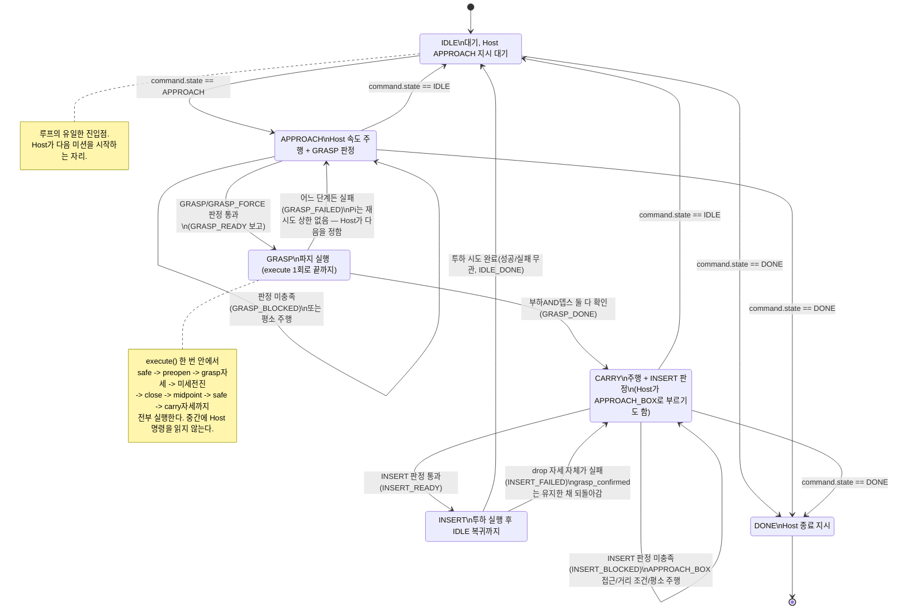

# State Machine

> **상태: 구현 반영 완료 (2026-09-03 갱신).** 이 문서가 기술하던 `SCAN`/`SELECT`/`TRANSPORT`/
> `DELIVER`/`HANDOVER`/`REJECT` 루프 FSM("장난감 정리, Pi 자율 다중 물체 처리")은 **채택되지
> 않았다.** 실제로 팀이 확정해 구현한 것은 `domain/task/baseline_mission.py`의 **Host 지시
> 실행형 FSM**이다 — Pi가 스스로 대상을 고르고 경로를 도는 것이 아니라, **Host(관제 콘솔)가
> 좌표·목표·경로를 전부 갖고 Pi는 받은 state와 속도를 실행할 뿐**이다. 아래 §5에 왜, 언제
> 이 방향으로 갈렸는지 정리했다.

FSM 상태 전이의 **단일 소스**입니다. `hld.md` · `class_diagram.md` · `sequences.md` 는
전이 그래프를 중복 정의하지 말고 이 문서를 참조하세요.

> ✅ `class_diagram.md` · `sequences.md` · `hld.md` · `error_budget.md` · `architecture.puml`도
> 2026-09-04에 이 갱신을 반영했습니다 — 전이 그래프 자체는 여전히 이 문서가 단일 소스입니다.

- [1. 핵심 — 설계 철학](#1-핵심--설계-철학)
- [2. 전이 그래프](#2-전이-그래프)
- [3. 상태별 계약](#3-상태별-계약)
- [4. 상태와 무관한 공통 규칙](#4-상태와-무관한-공통-규칙)
- [5. as-is 대비표 — 왜 SCAN/SELECT 루프가 폐기됐나](#5-as-is-대비표--왜-scanselect-루프가-폐기됐나)

---

## 1. 핵심 — 설계 철학

이 문서가 이전에 그리던 루프 FSM은 **Pi가 자율적으로** 바닥 전체를 스캔하고, 다음 대상을
스스로 고르고, 실패하면 스스로 다음 물체로 넘어가는 설계였다. 실제로 팀이 확정한 것은
정반대 방향이다.

**Host가 물체 좌표, 차량 좌표·방향, 경로 계산, 차량 제어 명령을 전부 소유한다.** Pi의 FSM은
**받은 명령을 실행하고, 자기 센서로만 알 수 있는 것을 판단해 보고할 뿐**이다. 그래서 여기에는
목표 선정도, 경로 계산도, 좌표 변환도, `SCAN`/`SELECT` 같은 자율 탐색 상태도 없다.

| | 이 문서가 이전에 그리던 것 | 실제 구현(`baseline_mission.py`) |
|---|---|---|
| 목표 선정 | Pi가 `SCAN`+`SELECT`로 자율 선정 | **Host**가 아레나 전체를 보고 선정, Pi에는 좌표조차 안 옴 |
| 경로/이동 | Pi가 `base.drive_to()`로 자율 주행 | Host가 매 사이클 속도(`linear_x/y`, `angular_z`)를 보내고 Pi는 그대로 낸다 |
| 대상 개수 | N개, 루프로 순회 | Pi FSM은 **한 번에 한 물체**만 안다(`label` 하나) — 다음 물체로 넘어가는 것도 Host가 새 GRASP 지시를 보내야 일어난다 |
| 실패 처리 | Pi가 스스로 보류 등록 후 다음 대상 진행 | Pi는 재시도 상한 없이 그냥 `APPROACH`로 돌아가 **Host의 다음 지시를 기다린다** — 다시 시도할지 포기할지는 Host 판단 |
| Pi가 상태를 스스로 바꾸는 경우 | 매 상태(SCAN 판단, SELECT 판단, 무변화 감지 등) | 딱 둘 — GRASP/INSERT를 **실행한 뒤** 결과에 따라 다음 상태로 갈 때, 조건 미충족으로 **제자리에 머무를** 때 |

`latest_command()`가 `None`이면 "정지"가 아니라 "모른다"로 취급한다 — Host가 말을 멈추면
차량도 멈춘다(`LinkWatchdog`, §4).

---

## 2. 전이 그래프



**E-STOP은 전이 그래프에 넣지 않는다.** 어느 상태에서든 `ports.estop.is_set()`이 참이면
`BaselineMission.run()`이 다음 `execute()` 호출 전에 `BaselineEstopState`로 갈아치우는
**인터럽트**이지 정상 전이가 아니다(§4).

---

## 3. 상태별 계약

| 상태 | 무엇을 하나 | 다음 상태를 정하는 것 |
|---|---|---|
| `IDLE` | 대기, 보고만 | Host의 `command.state` |
| `APPROACH` | Host 속도 주행 + GRASP/GRASP_FORCE 판정(2겹) | 판정 통과 여부는 Pi, 그 외엔 Host |
| `GRASP` | **execute() 1회로 시퀀스 전체 실행** — Host 명령을 안 읽음 | **Pi 자신** (부하+뎁스 최종 판정) |
| `CARRY` | Host 속도 주행 + INSERT 판정 | 판정 통과 여부는 Pi, 그 외엔 Host |
| `INSERT` | **execute() 1회로 투하 실행** — 성공/실패 무관 IDLE로 감 | **Pi 자신** (drop 자세 성공 여부만 분기) |
| `DONE` | 정지, 보고 | — (종료) |
| `ESTOP` | 정지 + 팔 붙잡기 | 최우선 인터럽트, 모든 상태를 덮어씀 |

### `APPROACH`의 GRASP 판정 — 두 겹

1. **기본 전제**(`preconditions.check_grasp`): 차체 정지 + Pi 자기 뎁스캠이 라벨 인식.
   미충족이면 `GRASP_BLOCKED` 보고 후 그대로 `APPROACH`에 머문다.
2. **정렬 판정**(`grasp_alignment.judge`): 물체가 턱이 쓸고 갈 영역(`READY`) 안인지.
   `HOST_CORRECTION`(영역 밖)이면 보정값과 함께 `GRASP_BLOCKED`, `UNKNOWN`(관측 실패)도
   진행하지 않는다.

`GRASP_FORCE` 명령은 **2번(정렬 창)만** 건너뛴다 — 1번(기본 전제)은 강제로도 지킨다. Host가
재정렬을 충분히 반복했는데도 계속 영역 밖이면, 잔여 오차가 파지 가능한 수준까지 좁혀졌다고
보고 한 번 강제로 내려가는 경로다.

### `GRASP` — Pi가 스스로 다음 상태를 정하는 두 지점 중 하나

`execute()` 한 번 안에서 순서대로 진행하고, 어느 단계든 실패하면 즉시 `_failed()`로 빠진다
(팔을 `recover_idle`로 올린 뒤 `GRASP_FAILED` + `APPROACH`).

```
safe 자세 → 그리퍼 preopen → grasp 자세 → (팔 내려간 뒤에만) 미세 전진
→ 그리퍼 close → midpoint → safe → carry 자세
```

**부하는 이 과정 중 전혀 확인하지 않는다**(2026-09-03) — 서보가 목표 자세에 정착하면 실제로
물고 있어도 부하가 낮게 읽히는 오탐이 반복 확인돼, 중간 부하 게이트를 전부 없앴다. carry
자세까지 도달한 뒤 **딱 한 번, AND로** 최종 판정한다: `부하 ≥ LOAD_THRESHOLD` 이고 뎁스캠이
물체 사라짐을 확인 — 둘 다 있어야 `GRASP_DONE` → `CARRY`(`grasp_confirmed=True`).

> 이 AND는 2026-08-26~09-01엔 AND였다가, 09-01 rook 뎁스 오탐으로 OR로 완화됐고,
> 09-03 star/box가 반대 방향(부하만 낮게 오탐)을 내면서 다시 AND로 돌아왔다 — 코드
> 안 판정부 코멘트(`baseline_mission.py`)에 전체 이력이 남아 있다.

### `CARRY`의 INSERT 판정

`_judge_insert`(`preconditions.check_insert`)가 전부 통과해야 `INSERT_READY` → `INSERT`:

- E-STOP 안 걸림, 차체 정지
- **`grasp_confirmed`가 True** — GRASP가 CARRY 진입 때 이미 내린 판정을 그대로 믿는다.
  raw 부하를 여기서 다시 재지 않는다(2026-09-03 이전엔 재쟀는데, box처럼 파지에 성공해도
  부하가 계속 낮게 읽히는 물체에서 이 재판정이 영원히 막히는 사고가 있었다)
- 라이다가 바구니 정면을 잡음, 거리·yaw·좌우 오프셋·점 개수가 각각 허용치 안
- 직전 사이클 대비 거리 변화·부하 하락이 허용치 안(표본이 없으면 한 사이클 더 봄)

`APPROACH_BOX` 접근 중에도 매 사이클 라이다를 봐서, Host 계획 거리를 다 밀기 전에 이미
너무 가깝거나 이미 목표창 안이면 더 밀지 않고 보고한다(2026-09-02, ArUco 데드레커닝 오차로
계획을 그대로 다 밀면 늦게 발견하는 사고 방지).

### `INSERT` — Pi가 스스로 다음 상태를 정하는 두 지점 중 하나

drop 자세 실패 시엔 `grasp_confirmed`를 유지한 채 `CARRY`로 되돌아간다(그리퍼가 놓친 게
아니라 팔 자세만 실패한 것이므로 판정을 리셋할 이유가 없다). drop 자세가 성공하면 그리퍼를
열고 부하 감소량(`RELEASE_LOAD_DROP`)으로 놓임을 판정하되, **성공/실패 무관하게** 그리퍼를
닫고 `idle`로 접은 뒤 무조건 `IDLE`로 돌아간다 — "바구니 안에 들어갔는가"까지는 Pi가 모르고,
그건 오버헤드로 보는 Host의 판단이다.

---

## 4. 상태와 무관한 공통 규칙

1. **ESTOP 최우선** — `BaselineMission.run()`이 매 사이클 상태 실행 전에 먼저 검사한다.
   걸려 있으면 다른 어떤 상태든 무시하고 `ESTOP`(정지 + 팔 붙잡기)으로 강제 전환한다.
2. **LinkWatchdog** — Host 명령이 `HOST_COMMAND_TIMEOUT_CYCLES`(3사이클) 연속으로 안 오면
   링크 끊김으로 보고 정지 + `REJECTED`. `None`(안 옴)과 "정지 명령"은 엄격히 다른 의미다.
3. **base liveness 보고** — 상태와 무관하게 매 사이클 구동계 응답성을 확인하고, 상태가
   **바뀔 때만**(고장 1회, 복구 1회) `BASE_UNRESPONSIVE`를 보고한다.
4. **명령 검증(`resolve_motion`)** — 회전과 병진이 섞인 것처럼 물리적으로 말이 안 되는 명령은
   실행 대신 정지 + `REJECTED` + 이유를 Host에 돌려준다.
5. **`grasp_confirmed`는 CARRY→INSERT→(실패 시)CARRY를 오가며 계속 들고 다니는 값**이다 —
   GRASP가 CARRY 진입 시점에 한 번만 내리고, 이후 어디서도 raw 부하로 다시 재판정하지 않는다.
6. **GRASP 판정 중(`_judge_grasp`) 약 1.7초는 Host 명령을 읽지도 보고하지도 않는다** —
   워치독엔 안 걸리지만(명령이 "안 온" 게 아니라 "안 읽은" 것), Host 쪽 타임아웃은 이보다
   넉넉해야 한다.

---

## 5. as-is 대비표 — 왜 SCAN/SELECT 루프가 폐기됐나

| 이 문서(구) 상태 | 처리 | 실제 구현 |
|---|---|---|
| `IDLE` | 유지 | `IDLE` (Host `command.state == APPROACH` 수신으로 전이) |
| `SCAN` | **삭제** | — Pi는 자기 좌표계로 바닥 전체를 스캔하지 않는다. 목표는 Host가 이미 정해서 GRASP로 지시한다 |
| `SELECT` | **삭제** | — 대상 선정은 아레나 전체를 보는 Host의 일. Pi에는 좌표 자체가 없다 |
| `APPROACH` | 유지·성격 변경 | `APPROACH` — "Pi가 목표까지 자율 주행"이 아니라 "Host가 보낸 속도를 그대로 내며 GRASP 판정 대기" |
| `GRASP` | 유지·판정 변경 | `GRASP` — 재시도는 Pi가 스스로 안 함(재시도 예산 개념 자체가 없음). 실패하면 그냥 `APPROACH`로 돌아가 Host의 다음 지시를 기다린다 |
| `TRANSPORT` | **삭제·흡수** | `CARRY`가 이 역할을 겸한다(Host가 `APPROACH_BOX`로 불러도 같은 상태) |
| `POSE_PLAN` | **삭제** | — φ 해 탐색 자체가 폐기. INSERT 조건은 라이다 정면·거리·yaw·좌우·안정성 판정으로 대체 |
| `INSERT` | 유지·의미 유지 | `INSERT` — 그대로 투입 |
| `DELIVER` / `HANDOVER` | **삭제** | — "사용자에게 인계"하는 FETCH 모드 자체가 이 미션 범위에 없다. 전부 상자 투입(TIDY)만 한다 |
| `REJECT` | **삭제** | — 투입 불가 사전 판정이 없다. 대신 GRASP/INSERT 실패 시 그냥 재시도 대기 상태(`APPROACH`/`CARRY`)로 돌아간다 |
| `DONE` | 유지 | `DONE` — Host 종료 지시 |
| `EstopState` | 유지 | `BaselineEstopState` — 그대로 인터럽트 |

**가장 큰 구조 변화**: 이 문서가 그리던 설계는 **Pi가 자율적으로 여러 물체를 스캔·선정·순회**하는
로봇이었다. 실제로 팀이 택한 것은 **Host가 모든 지능(좌표·목표·경로)을 갖고 Pi는 그 지시를
실행 + 자기 센서 판단만 보고하는** 구조다 — `SCAN`/`SELECT`/`TRANSPORT`/`POSE_PLAN`/
`DELIVER`/`HANDOVER`/`REJECT` 전부가 이 방향 전환으로 사라졌다. 언제 이 전환이 일어났는지는
별도 이슈/PR 이력으로 추적되지 않아 정확한 날짜는 이 문서만으로 확인할 수 없다 — 확인되는
것은 `domain/task/baseline_mission.py` 자체가 "팀 확정, 2026-08-26"으로 명시돼 있고, 그
시점부터 이 문서(구 설계)가 가리키던 `domain/task/states.py`가 더는 존재하지 않는다는 점이다.

---

## 참고

| 문서 | 내용 | 갱신 상태 |
|---|---|---|
| [`class_diagram.md`](class_diagram.md) | State 클래스 계층, 포트 시그니처 | ✅ 갱신됨(2026-09-04) |
| [`sequences.md`](sequences.md) | 상태 내부의 포트 호출 순서 | ✅ 갱신됨(2026-09-04) |
| [`hld.md`](hld.md) | 인터페이스 명세, 미결 사항 | ✅ 갱신됨(2026-09-04) |
| [`error_budget.md`](error_budget.md) | 판정 문턱값 실측 | ✅ 갱신됨(2026-09-04) |
| [`architecture.puml`](architecture.puml) | 같은 구조의 PlantUML 버전 | ✅ 갱신됨(2026-09-04) |
| [`domain/task/baseline_mission.py`](../../domain/task/baseline_mission.py) | 이 문서가 기술하는 실제 코드 | ✅ 이 문서의 근거 |
