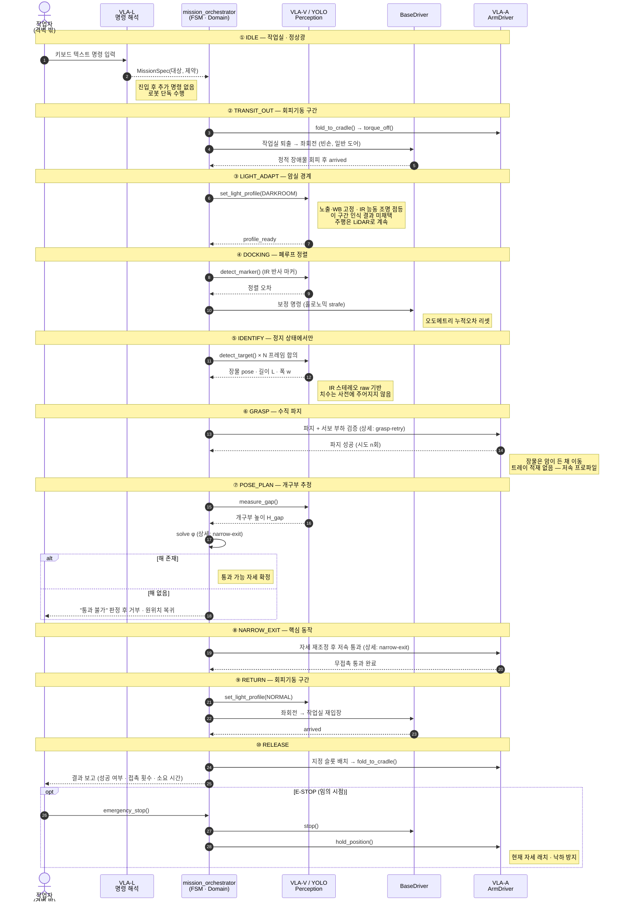
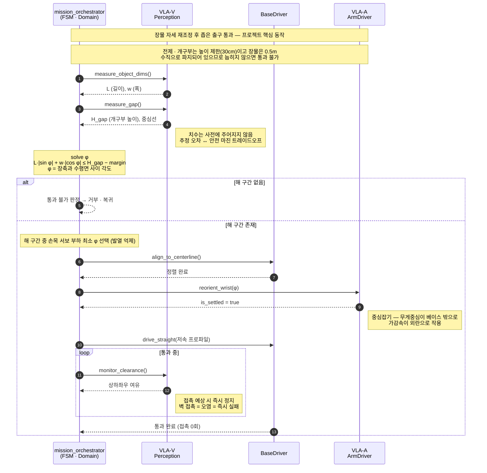

# Sequence Diagrams

Gripper의 미션 흐름과 핵심 기능별 상세 시퀀스입니다.

모든 상호작용은 도메인(`MissionTask`)과 **포트** 사이에서만 일어납니다. ROS2 노드, Feetech 서보 SDK, OpenCV는 다이어그램에 등장하지 않습니다 — 어댑터 뒤에 숨어 있기 때문입니다.

- [전체 미션 흐름](#전체-미션-흐름)
- [파지 검증 및 자동 재시도](#파지-검증-및-자동-재시도)
- [장축 물체 협로 통과](#장축-물체-협로-통과)

---

## 전체 미션 흐름

일반 환경(Station B) ↔ 제한 조명 구역(Station A) 왕복 회수 미션의 단계별 흐름입니다. 상세가 필요한 구간은 아래 개별 다이어그램으로 분리했습니다.



---

## 파지 검증 및 자동 재시도

그리퍼를 닫은 뒤 **서보 부하값으로 물체 유무를 판정**합니다. 별도의 힘/토크 센서 없이 폐루프를 구성하는 것이 핵심입니다.

```mermaid
sequenceDiagram
    autonumber
    participant T as MissionTask<br/>(Domain)
    participant P as Perception
    participant TF as TransformProvider
    participant A as ArmDriver

    Note over T,A: 부하 기반 파지 검증 및 자동 재시도

    loop attempt ≤ MAX_RETRY
        T->>TF: transform(target → arm_base)
        TF-->>T: PoseInFrame(target, arm_base)
        T->>A: move_to_cartesian(approach)
        T->>A: move_to_cartesian(grasp, top-down)
        T->>A: set_gripper(CLOSED)
        T->>A: load()
        A-->>T: load_ratio

        alt load_ratio ≥ 임계값
            Note right of A: 파지 성공 → 루프 탈출
        else load_ratio < 임계값
            Note right of A: 파지 실패
            T->>A: set_gripper(OPEN)
            T->>P: detect_targets()
            P-->>T: 보정된 target
        end
    end

    Note over T,A: 별도 힘 센서 없이 서보 부하만으로 폐루프 구성
```



**설계 의도**

| 항목 | 내용 |
|---|---|
| 감지 방식 | 그리퍼 서보 부하 비율 (`load_ratio`) |
| 임계값 | *1주차 실측 후 확정* |
| 재시도 상한 | `MAX_RETRY` — 초과 시 상위 상태로 실패 보고 |
| 실패 시 동작 | 그리퍼 개방 → 재인식 → 목표 자세 보정 |

---

## 장축 물체 협로 통과

긴 물체를 든 채 좁은 통로를 지날 때, 그리퍼 요(yaw) 회전으로 진행 방향 투영 폭을 줄입니다.



**자세 계획**

```
W_proj(θ) = L·|sin θ| + w·|cos θ|   ≤   D_gap − margin

  L      : 물체 길이
  w      : 물체 폭
  θ      : 진행축 대비 물체 요 각도
  D_gap  : 통로 유효 폭
  margin : 안전 여유
```

해 구간이 여러 개일 경우, **손목 서보 부하가 최소가 되는 θ** 를 선택합니다. 장시간 유지 시 발열을 억제하기 위함입니다.

> [!NOTE]
> 이 기능은 Target 등급입니다. 접촉 0회가 성공 기준이며, 통과 중 여유 거리를 상시 감시합니다.
