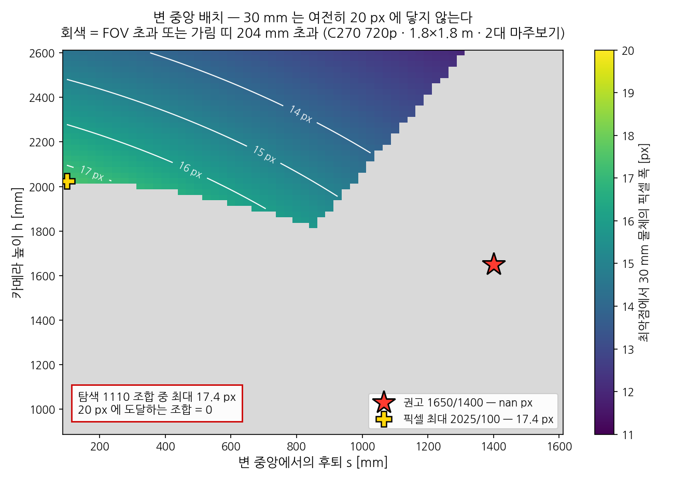
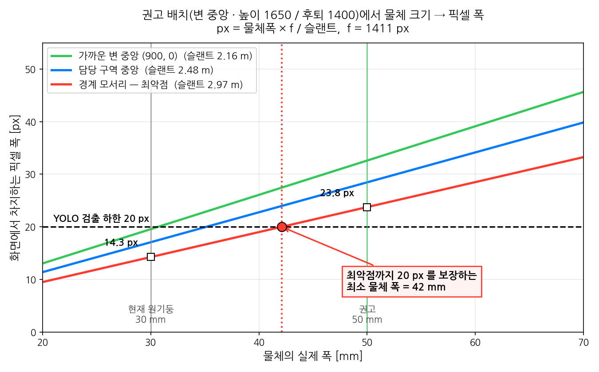
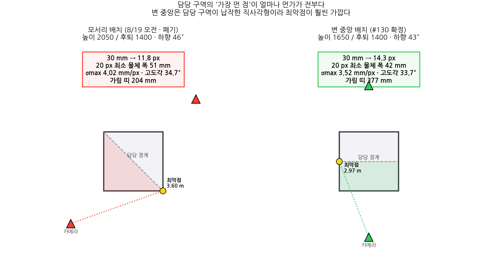

# A2 · 지면 호모그래피 실측 절차

Gate A 의 `A1-c` · `A1-d` · `A2` 를 한 세트로 처리하는 도구다.
**웹캠이 물려 있는 PC 에서 실행한다.** 저장소를 clone 한 다음 이 디렉터리에서 돌리면 된다.

```bash
pip install opencv-python numpy
cd tools/a2
```

---

## 0. 무엇을 재는가

깊이 센서 없이 **바닥 평면 한 장을 이미지 좌표 → 월드 좌표로 사상**하는 3×3 행렬을 구하고,
그 정확도가 기준을 만족하는지 본다.

| | |
|---|---|
| 판정 기준 | 기지 위치 물체 좌표 **오차 ≤ 20 mm** (issue #91 DoD) |
| 이게 통과하면 | 깊이 센서 없이 위치 추정이 성립함이 실측으로 증명된다 |
| 실패하면 | 즉시 대체안을 논의해야 한다. 미루면 M2 전체가 흔들린다 |

> [!IMPORTANT]
> **지시점은 바운딩박스 아래쪽 모서리(바닥 접지선)다.**
> 호모그래피는 바닥 평면만 사상한다. 물체 중심을 찍으면 물체 높이만큼 밀린다.
> 고도각이 낮을수록 이 오차가 커진다 — 확정 배치의 최악점에서 1 px 이 3.52 mm 다(§4).

---

## 1. 좌표 규약 — 두 카메라가 같은 원점을 쓴다

```
   Y
   ↑
   │                    ▲ B (900, 3200)
   │  (0, 1800) ┌───────────────┐ (1800, 1800)
   │            │   B 담당      │
   │            ├───────────────┤  ← 담당 경계 y = 900
   │            │   A 담당      │
   │  (0, 0)    └───────────────┘ (1800, 0)
   │                    ▲ A (900, -1400)
   └──────────────────────────────→ X      (단위 mm)
```

**카메라는 마주보는 두 "변 중앙" 바깥에 선다** (#130 확정 — "박스 전·후면 각 1대").
모서리가 아니다 — 모서리에 두면 담당 구역이 삼각형이 되어 최악점이 멀어진다(§4·§6).

좌표는 A 가 `(900, -1400)`, B 가 `(900, 3200)`, 높이 1650 mm 다.
**x = 900 을 정확히 맞추는 것이 높이보다 중요하다** (§4 주의).

A 는 `y ∈ [0, 900]`, B 는 `y ∈ [900, 1800]` 을 담당하고 경계는 둘 다 본다.

원점과 축을 **A · B 카메라가 반드시 공유해야 한다.** 각자 다른 원점을 쓰면
두 시야를 합칠 때 물체 하나가 두 개로 보이고, `track_id` 재부여도 성립하지 않는다.

바닥에 테이프로 원점과 X 축을 표시해 두고 시작하는 것이 가장 확실하다.

---

## 2. 실행 순서

### ① 카메라를 찾는다

```bash
python a2_homography.py devices
```

쓸 수 있는 백엔드와 인덱스 조합 중 **실제로 프레임이 나오는 것만** 추려서 보여준다.
마지막 줄의 권장 명령을 그대로 복사해 쓰면 된다.

아무것도 안 나오면 OpenCV 문제가 아니라 접근 권한 쪽이다.

- 다른 앱(Teams · Zoom · 카메라 앱)이 점유 중인지
- Windows: 설정 → 개인 정보 및 보안 → 카메라 에서 **"데스크톱 앱이 카메라에 액세스"** 까지 켜기
- Linux: `ls /dev/video*` 와 `video` 그룹 권한

### ② 파라미터를 고정한다 (A1-c)

```bash
python a2_homography.py lock --cam 0 --backend V4L2 --cam-id A
```

오토포커스 · 오토화이트밸런스 · 자동노출을 끄고, **30초 동안 실제로 고정되는지** 본다.

> [!WARNING]
> 속성값만 보면 카메라가 조용히 재노출·재초점하는 것을 못 잡는다.
> 이 도구는 값과 함께 **평균 밝기와 라플라시안 분산(선명도)** 을 같이 재서,
> 값은 고정돼 보이는데 화면이 움직이면 FAIL 을 낸다.
> 미지원 속성(`-1` 반환)도 고정 성공으로 세지 않는다.

FAIL 이 나면 고정초점·수동노출 모델로 교체해야 한다.
Linux 라면 `v4l2-ctl` 로 직접 끄는 것도 방법이다.

```bash
v4l2-ctl -d /dev/video0 --list-ctrls
v4l2-ctl -d /dev/video0 --set-ctrl=focus_automatic_continuous=0
v4l2-ctl -d /dev/video0 --set-ctrl=white_balance_automatic=0
v4l2-ctl -d /dev/video0 --set-ctrl=auto_exposure=1
```

### ③ 기준 프레임을 찍는다

```bash
python a2_homography.py shoot --cam 0 --cam-id A
```

`SPACE` 로 저장한다. **이 시점 이후 카메라를 절대 건드리지 않는다.**
고정이 흔들리면 호모그래피 전제 자체가 무너진다.

### ④ 호모그래피를 구한다

```bash
python a2_homography.py calib --cam-id A --make-template   # CSV 뼈대 생성
# base_points_A.csv 를 실측값(mm)으로 수정
python a2_homography.py calib --cam-id A
```

> [!IMPORTANT]
> **작업 공간 네 모서리를 다 쓰려고 하지 마라.** 권고 배치에서 프레임 위쪽이 지면에 닿는
> 곳은 `y ≈ 1155 mm` 다. 반대편 절반(y = 1800 쪽)은 애초에 **프레임 밖**이다.

`--make-template` 이 만들어 주는 기지점은 **자기 담당 절반의 네 귀퉁이**다.

```
A:  (0, 0)  (1800, 0)  (1800, 900)  (0, 900)
B:  (0, 1800)  (1800, 1800)  (1800, 900)  (0, 900)
```

담당 구역이 직사각형이라 기지점이 화면에 고르게 퍼진다 — 호모그래피 조건수가 좋아진다.
월드 프레임을 묶는 것은 "같은 점을 공유하는 것"이 아니라 **두 카메라가 같은 줄자 원점과
같은 X 축을 쓰는 것**이다. 원점만 같으면 기지점이 달라도 두 호모그래피는 같은 좌표계로 푼다.
(경계 두 점은 어차피 A·B 가 함께 보므로, 이 값이 서로 맞는지가 좋은 교차 검산이 된다.)

기지점 잔차 RMS 가 크면 클릭이나 줄자 실측이 틀린 것이다. 여기서 이미 크면 검증은 볼 것도 없다.

### ⑤ 오차를 판정한다

```bash
python a2_homography.py verify --cam-id A --make-template
# verify_points_A.csv 를 실제 배치 좌표로 수정
python a2_homography.py verify --cam-id A
```

템플릿은 **해당 카메라 담당 절반 + 경계**로 생성된다.
**경계 모서리 `(0, 900)` · `(1800, 900)` 을 반드시 포함한다** — 고도각이 가장 낮은 최악 조건이 거기다.

### ⑥ B 카메라 반복

②~⑤ 를 `--cam-id B` 로 다시 한다. 산출물 파일명이 자동으로 분리된다.

### ⑦ 가림 케이스

```bash
python a2_homography.py occlude --make-template
# occlusion.csv 의 detected 열을 채운 뒤
python a2_homography.py occlude
```

`both_cams` 항목은 **한쪽이 가려져도 반대쪽이 잡는지** 보는 것이다.
마주 보는 배치의 핵심 이점이라 반드시 재야 한다.

### ⑧ 리포트

```bash
python a2_homography.py report
gh issue comment 91 --body-file a2_report.md
```

A · B 를 합쳐 하나의 마크다운을 만든다.
**한쪽만 측정했으면 A2 미완료로 표시된다** — 두 대가 다 통과해야 게이트가 열린다.

---

## 3. 산출물

| 파일 | 내용 |
|---|---|
| `a1c_lock_{A,B}.json` | A1-c 증적 — 속성 고정 + 영상 안정성 |
| `a2_homography_{A,B}.json` | 호모그래피 행렬 · 기지점 잔차 |
| `a2_verify_{A,B}.json` | 검증점 오차 |
| `a2_verify_overlay_{A,B}.png` | 오차 시각화 |
| `a2_occlusion.json` | 가림 검출률 |
| `a2_report.md` | #91 에 붙일 결과 |

측정 원본(CSV · PNG · JSON)은 **커밋하지 않는다.** 결과 수치만 이슈와
`docs/ops/measurements.md` 에 남긴다.

---

## 4. 픽셀 민감도 — 왜 20 mm 가 빠듯한가

C270 ×2 · **마주보는 두 변 중앙 · 높이 1650 mm · 후퇴 1400 mm · 하향 42.8°** ·
작업 공간 1.8 × 1.8 m · `f = 1411 px` 기준이다.
(#130 확정. 표는 `python tools/a2/coverage_analysis.py` 로 언제든 다시 만든다.)

> [!IMPORTANT]
> **높이 1650 은 삼각대 최대치라 고정값이다.** 조절할 수 있는 건 후퇴뿐이고,
> 후퇴를 줄이면 가로가 잘린다(최소 1150 mm). 1400 은 가로에 7.6% 여유를 둔 값이다.

`σmax` 는 이미지→월드 사상 야코비안의 **최대 특이값**, 즉 클릭 1 px 이 최악 방향으로
어긋났을 때의 월드 오차다. 괄호 안은 해석 근사 `slant / (f · sin θ)` 다.

| 지점 | 슬랜트 | 고도각 | **σmax (mm/px)** | 3 px 최악 | 30 mm 물체 | 50 mm 물체 |
|---|---|---|---|---|---|---|
| 가까운 변 중앙 | 2.16 m | 49.7° | **1.98** (2.01) | 5.9 mm | 19.6 px | 32.7 px |
| 가까운 변 모서리 | 2.34 m | 44.8° | **2.16** (2.36) | 6.5 mm | 18.1 px | 30.2 px |
| 담당 구역 중앙 | 2.48 m | 41.7° | **2.64** (2.64) | 7.9 mm | 17.1 px | 28.5 px |
| 경계 중앙 | 2.83 m | 35.7° | **3.39** (3.44) | 10.2 mm | 15.0 px | 25.0 px |
| **경계 모서리 (최악점)** | **2.97 m** | **33.7°** | **3.52** (3.79) | **10.6 mm** | **14.3 px** | **23.8 px** |

프레이밍은 `max|u| = 591 / 640`, `max|v| = 176 / 360` 이다. 가로가 빠듯한 쪽인데,
**카메라가 폭 1800 mm 를 통째로 담아야 하기 때문**이다. 이게 이 배치의 지배 제약이다.

> [!CAUTION]
> **좌우를 정확히 변의 중앙(x = 900)에 두어야 한다.** 50 mm 어긋나면 `max|u|` 가
> 591 → 624 로 뛰고, 100 mm 면 657 로 **프레임을 넘는다.** 높이보다 이쪽이 예민하다.

> [!CAUTION]
> **30 mm 물체는 최악점에서 14.3 px 로, 검출 하한 20 px 에 못 미친다.**
> 배치로는 못 고친다 — 전수 탐색해도 최대 17.4 px 다(`fig1_placement_sweep.png`).
> 20 px 을 보장하는 최소 폭은 **42 mm**, 여유를 보아 **50 mm** 를 권고한다(23.8 px).
> → #149 D1

> [!NOTE]
> 위치 정확도는 최악점 3 px 이 10.6 mm 로 기준 20 mm 안이지만 여유가 절반뿐이다.
> 높이를 1900 으로 올릴 수 있으면 σmax 가 3.52 → 2.59 로 떨어진다(#149 D3).

> [!NOTE]
> **왜 두 대인가.** 한 대로 1.8 × 1.8 전체를 담는 것 자체는 가능하다. 그러나 그때 먼 모서리는
> 슬랜트가 크게 늘어 30 mm 가 11 px 대로 떨어지고 가림도 한 방향에서만 생긴다.
> **화각이 아니라 해상도와 가림 때문에** 두 대를 쓴다.

---

## 5. A1-d · 2대 동시 스트리밍

깊이 카메라와 무관하게 `usb_coexist.py` 가 #90 을 그대로 닫아 준다.

```bash
python usb_coexist.py probe
python usb_coexist.py run --cams 0,2 --seconds 60
python usb_coexist.py report
```

MJPG 요청이 실제로 먹혔는지 매번 확인한다 — 드라이버가 조용히 YUYV 로 되돌리면
1080p30 한 대가 약 1.5 Gbps 를 먹어 두 대 동시가 무너진다.

Pi 5 에서는 **공식 5 V/5 A 어댑터일 때만** USB 주변장치에 1.6 A 를 준다.
그 외에는 600 mA 로 제한되며, 증상은 "대역폭 부족"이 아니라
**장치가 재열거되며 스트림이 끊기는 것**이다. `probe` 가 이걸 먼저 잡는다.

---

## 6. 배치 근거 자료

`python tools/a2/coverage_analysis.py` 로 재생성한다. 값이 바뀌면 그림도 같이 갱신할 것.

| 그림 | 무엇을 보이는가 |
|---|---|
|  | 변 중앙 배치에서도 30 mm 는 20 px 에 못 닿는다 (탐색 1110 조합, 최대 17.4 px) |
|  | 확정 배치에서 물체 폭 42 mm 가 검출 하한과 만나는 지점 |
|  | 모서리 배치와 변 중앙 배치의 차이 |

읽는 법 셋을 짚어 둔다.

**① 검출(픽셀 폭)과 정확도(σmax)는 서로 다른 병목이다.**
확정 배치에서 정확도는 최악점 3 px = 10.6 mm 로 기준 20 mm 안이다. 남은 문제는 물체가 작다는 것이다.

**② 지배 제약은 "한 대가 폭 1800 mm 를 통째로 담아야 한다"는 것이다.**
그래서 카메라를 몇 대로 늘려도 가로 해상도는 거의 안 좋아진다 —
네 변에 4대를 두어도 30 mm 는 18.7 px 로 여전히 하한 아래다.

**③ 높이 1650 은 삼각대 한계라 고정이고, 그 대가가 가림이다.**
가벽 가림 띠 377 mm · 상자(0.4 m) 뒤 그림자 최대 790 mm 다.
거치를 1900 mm 까지 올릴 수 있으면 각각 203 · 537 mm 로 줄고 σmax 도 3.52 → 2.59 가 된다.
대신 하향각이 42.8° → 55.5° 라 **삼각대 헤드가 그만큼 꺾여야 한다**(#149 D3).
